# Corners cleanup

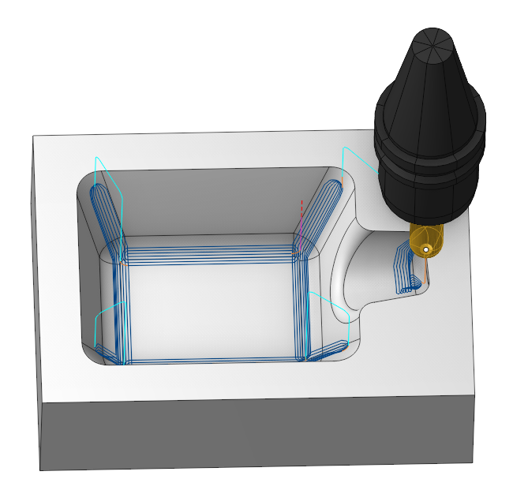

## Application Area:

It iis an operation from the rest machining group. It takes the diameter of the previous tool as a parameter and generates passes where the previous tool would leave unmachined material.

### Job Assignment:

<strong>Machining Surfaces.</strong> The passes are generated only on places where the tool contacts the machining surfaces. If the machining surfaces are missing, the toolpath is generated within the whole part.

<strong>Job Zone.</strong> Job zones are used to define the part areas that have to be machined by roughing and finishing milling operations. [Details](10151.md)

<strong>Restrict Zone.</strong> In addition to <strong>Job Zones</strong> in system you can use <strong>Restrict Zones</strong> to specify the workpiece areas that have not to be machined in the current operation. [Details](10152.md).

<strong><strong>Tilt Curve.</strong></strong> This is t he curve that the tool axis vector aims at when setting <strong><strong>5 Axis Conversion</strong></strong> specification <strong>Through Curve.</strong>

<strong>Properties.</strong> Displays the properties of an element. It is possible to add the stock. You can also call this menu by double clicking on an item in the list.

<strong>Delete.</strong> Removes an item from the list.

<strong>Restrictions.</strong> It allows you to restrict areas that should not be machined. [Details](101231.md)

### Strategy:

#### Strategy:

This group of parameters allows the user to achieve a required toolpath:

Click here to expand..

<strong>Toolpath Direction.</strong>

Click here to expand..

<strong>Along.</strong> The system generates the passes along the inner corners.

<strong>Across.</strong> The system generates the passes across the inner corners.

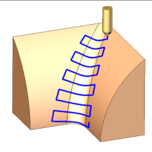

<strong>Combined.</strong> The system generates the along passes for shallow areas, and generates the across passes for steep areas.

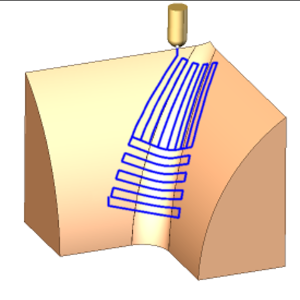

<strong>Step.</strong> The maximum allowed width of cut.

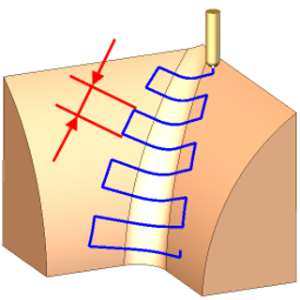

<strong>Bitagency Angle.</strong> This parameter is used to limit the edges detect by the operation. It is the angle between two points where the part's surfaces and the tool's cutting edges simultaneously make contact. The tool will operate within zone inside this angle.

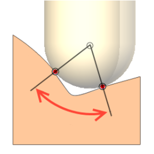

<strong>Previous Tool Diameter.</strong> Diameter of a sphericall mill used for rest material calculation.

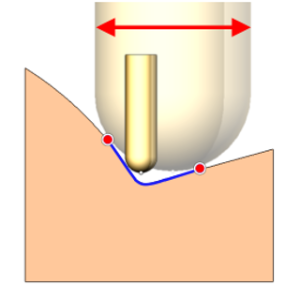

<strong>Max Cut Depth.</strong> The maximal allowable depth of cut.

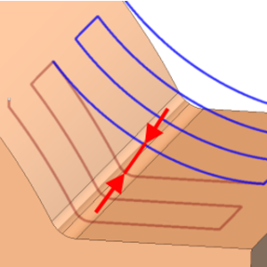

<strong>Min Cut Depth.</strong> The minimal allowable depth of cut.

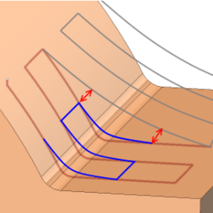

<strong>Roughing.</strong> Check the box to enabled the roughing passes.

Click here to expand..

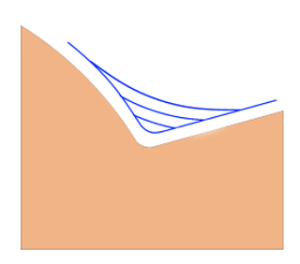

<strong>Roughing Step.</strong> The distance between roughing passes

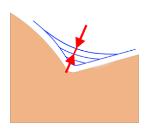

<strong>Unite Type.</strong> Controls the sequence of toolpath passes during the roughing process.

<strong>By Levels.</strong> Each level undergoes machining in every region before the operation advances to the subsequent level.

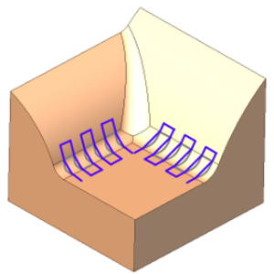

<strong>By Regions.</strong> The tool fully processes one region before advancing to machine the next region.

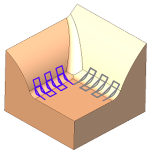

<strong>By Strings.</strong> The tool completes machining all levels of a string before moving on to the next string.

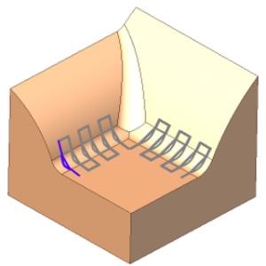

<strong>Along Linking Type.</strong> This parameter appears if the machining strategy includes along passes.

Click here to expand..

<strong>Spiral</strong>. The tool machines a single region following a continuous spiral toolpath.

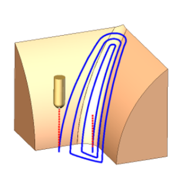

<strong>Linear</strong>. The tool processes a single region by making passes that follow the corner line, with links between each pass.

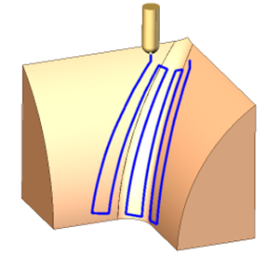

<strong>Steep/shallow split angle.</strong> This parameter appears when the strategy of combined passes is selected, and demarcates steep from shallow regions.

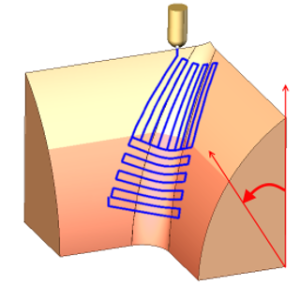

#### Milling type:

Сan be assigned in almost all operations, except for the curve machining operations. This allows the user to control the required milling type (climb or conventional) during the toolpath calculation process. This parameter group works similarly to the <strong>Waterline roughing operation.</strong> [Details](736.md)

#### Sorting:

Controls the sequence of toolpath passes during the surface machining.

#### Connection:

The parameter controls the consolidation of toolpaths for several regions if possible.

Click here to expand..

<strong>Constant Z.</strong> Passes are connected preferably in a plane.

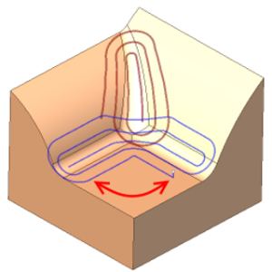

<strong>Angular.</strong> Passes are connected preferably by the smoothest angle.

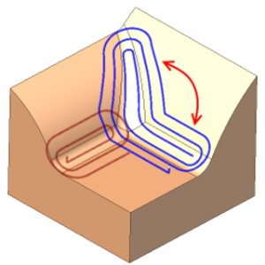

<strong>Off</strong>. Every region is machined separately.

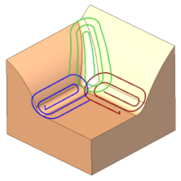

#### Machining Levels:

It defines the range along tool axis for the machining. [Details](10153.md). Specify the <strong>Bottom Level</strong> as in the <strong>Waterline Roughing operation</strong>. [Details](736.md)

#### 5 axis conversion:

Controls tool axis orientation. [Details](10141.md). The principal parameters of this function are the same as in the <strong>5D Surfacing operation</strong>. [Details](10135.md)

#### Trimming:

Allows for the skipping of surfaces not intended for machining and allows for the extension of the toolpath. The parameters of <strong>Trimming</strong> are the same as in the <strong>Waterline Roughing operation</strong>. [Details](736.md)

### Parameters:

This tab contains the main parameters for controlling the part, workpiece, fixture and other items, which allow you to change the trajectory. [Details](100112.md)

### Links/Leads:

In the Links/Leads tab, you define the parameters for rapid movements. These movements include tool approach from the tool change position, engage to the start of the working stroke, retraction after the final cutting motion, transitions between working passes, and return to the tool change point. You can configure the sequence of movements along the coordinates, the trajectory of these motions, and the magnitude of displacements.

Click here to expand..

<strong>Сonsists of:</strong>

<strong>Approach/Return.</strong> This group of parameters manages the tool movements from the tool change position to the start of the engage toolpathes, and back. [Details](100116.md).

<strong>Links.</strong> Defines the rules governing Entry/Exit links and links between work moves. [Details](100130.md).

<strong>Leads.</strong> Allows you to add additional engage and retract to the working moves using their feed. [Details](100136.md).

<strong>Safe motions.</strong> Defines the type of <strong>Safety Surface</strong> and the distance from the workpiece to it. This surface facilitates transitions between the processed surfaces or tool paths, and the first stage of approach or return occurs toward it. [Details](100117.md).

<strong>Advanced links settings.</strong> This group of parameters specifies the features of trajectory formation for primarily five-axis operations, considering optimal movements of rotational axes. [Details](100118.md).

<strong>Distances.</strong> Distances used in Links rules [Details](100140.md).

### Feeds/Speeds:

Using this dialogue the user can define the spindle rotation speed; the rapid feed value and the feed values for different areas of the toolpath. Spindle rotation speed can be defined as either the rotations per minute or the cutting speed. The defining value will be underlined. The second value will be recalculated relative to the defining value, with regard to the tool diameter. [Details](100142.md)

### Transformations:

Parameter's kit of operation, which allow to execute converting of coordinates for calculated within operation the trajectory of the tool. [Details](10168.md).

### Part:

A Part is a group of geometrical elements that defines the space to check for gouges. [Details](330.md)

### Workpiece:

A workpiece model of an operation defines the material to be machined. [Details](738.md)

### Fixtures:

As the Fixtures the fixing aids such as chucks, grips, clamps, etc., and the restriction areas of any other nature are usually specified. [Details](10283.md)
