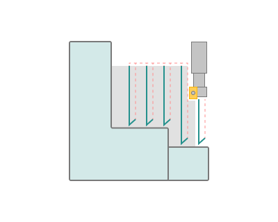
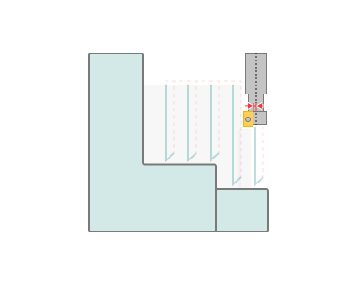
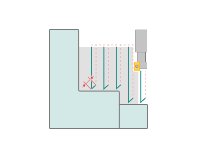
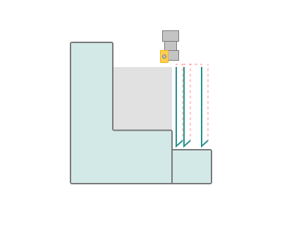

# Plunge roughing

## Application area:

This option is available on the <strong>Parameters</strong> tab in the <strong>Roughing waterline</strong> operation. [Details](736.md)

Plunge roughing option generates vertical passes from Roughing Waterline, Plane and Pocketing operations result. This option requires a tool that is designed to handle axial cutting.

<strong>Core radius.</strong> Size of the central non-cutting part of the tool.

<strong>Step.</strong> Step between passes.

<strong>Pull back distance.</strong> Distance the tool pulls back away from the model.

<strong>Additional pass.</strong> Creates an additional pass if can't process the item on the current pass. This function is useful when plunge option cannot process corner areas. Step will be ignored for additional passes.

<strong>Feed distance.</strong> Distance where vertical motion switch to work feed.

