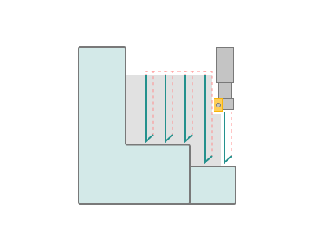
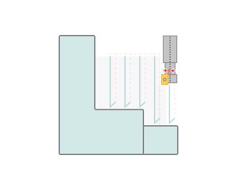
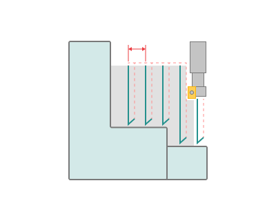
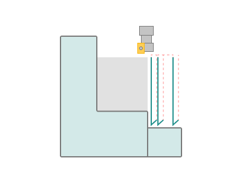
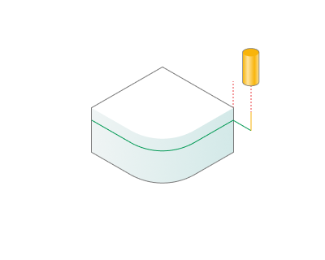

# プランジ荒加工

## 適用分野:

このオプションは、<strong>ウォーターライン荒加工</strong><strong>オペレーション</strong>の<strong>パラメータ</strong>タブで使用できます。[詳細を見る](736.md)

プランジ荒加工を有効にすると、ウォーターライン荒加工、平面加工、およびポケット加工のツールパスをもとに、垂直方向の切削パスを生成します。このオプションを使用するには、軸方向切削に対応した工具が必要です。

<strong>コア半径</strong> 工具の中心非切削部分の半径

<strong>ステップ</strong> パス間のピッチ距離

<strong>プルバック距離</strong> 工具がモデルから離れる距離

<strong>追加パス</strong>

現在のパスで加工できない場合、追加パスを作成します。

この機能は、プランジオプションでコーナー部分を加工できない場合に便利です。

追加パスの場合、ステップは無視されます。

<strong>送り距離</strong>

垂直移動から加工送りに切り替わる工具軸方向の距離

