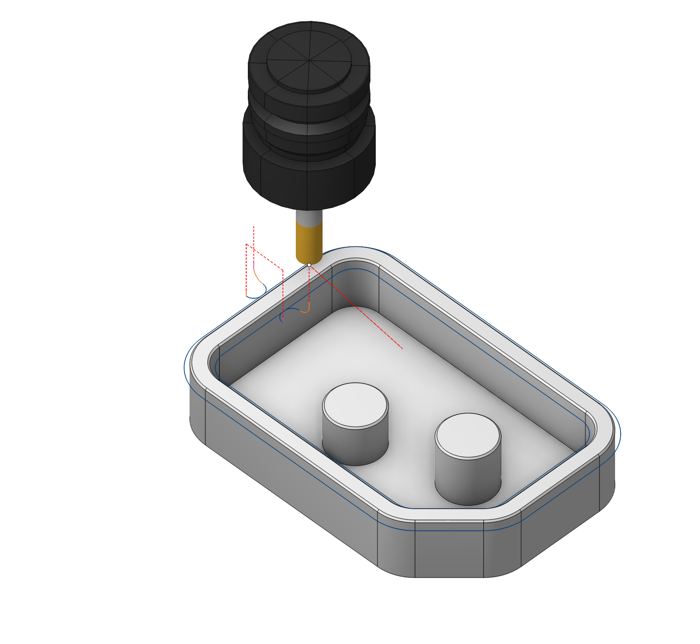
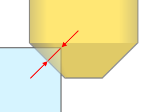
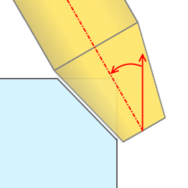
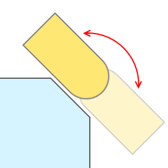
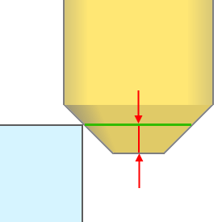
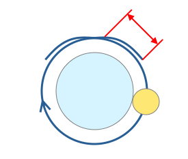
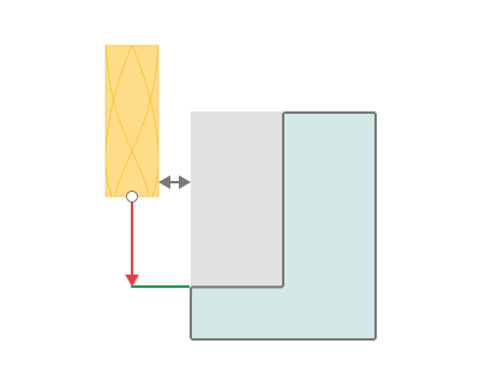
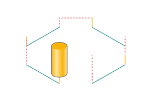

# Chamfering

## Application area:

The operation generates a toolpath for chamfer removal using cylindrical end, conical, and spherical mills. It is most commonly used as a final step to form the chamfers and fillets specified in the 3D model, to blunt sharp edges, or to remove burrs along the edges of the part.

### Setup:

The <strong>Setup</strong> tab is used to configure the primary parameters of the project. This can involve the positioning of the part on the equipment, the coordinate system of the part, and more. [Details](1022.md)

### Job assignment:

<strong>Add</strong> <strong>sharp</strong> <strong>edge</strong><strong>.</strong> This feature enables the creation of a chamfer removal toolpath based on the edges of the 3D model. When selecting a surface instead of edges, it instantly adds all the surface's sharp edges into the <strong>Job assignment</strong>.

<strong>Add</strong> <strong>face</strong><strong>.</strong> This feature enables processing of existing chamfers on a 3D model by selecting surfaces designed as chamfers.

<strong>Recognize</strong><strong>.</strong> This feature enables automatic recognition and addition of chamfers into the <strong>Job assignment</strong>. The system classifies recognized elements into four types: <strong>sharp edges, CAD chamfers, fillets, and hole chamfers.</strong>

<strong>Properties</strong><strong>.</strong> Displays the properties of an element. It is possible to add the stock. You can also call this menu by double clicking on an item in the list.

<strong>Delete.</strong> Removes an item from the list.

<strong>Restrictions.</strong> It allows you to restrict areas that should not be machined. [Details](101231.md)

### Strategy:

#### Strategy.

This is the set of parameters that define the geometric features of the machining process.

Click here to expand..

<strong>Chamfer depth.</strong> Specifies the blunting depth for sharp edges. If a "CAD Chamfer" is being processed, the tool follows the chamfer's surface.

<strong>Incline</strong> <strong>tool</strong><strong>.</strong> This feature allows tilting the tool to remove the chamfer with the tool's side edge.

<strong>Inverse</strong> <strong>tool</strong> <strong>axis</strong> <strong>direction</strong><strong>.</strong> This parameter enables the inversion of the tool axis vector direction. You can also reach this objective by altering the side through the direction arrow in the graphical window, thus the tool axis direction shifts for every curve on its own.

<strong>Tool contact point.</strong> This is the point on the tool that should primarily engage with the geometric elements specified in the operation's <strong>Job assignment</strong>. The contact point is determined by the distance from the tool tip. User can also adjust it interactively in the graphical window.

<strong>Overlap.</strong> This feature enables toolpath extension in closed chamfers to prevent burrs at the junction.

<strong>Safe distance.</strong> Specifies the least acceptable distance between the tool's non-cutting section and the workpiece to avoid unintended contact with the workpiece elements. It matters in chamfering operations within recesses, pockets, and similar areas.

#### Milling type.

Сan be assigned in almost all operations, except for the curve machining operations. This allows the user to control the required milling type (climb or conventional) during the toolpath calculation process. This parameter group works similarly to the <strong>Waterline roughing operation.</strong> [Details](736.md)

Click here to expand..

<strong>Curve direction.</strong> The tool's feed direction matches the <strong>Job assignment</strong> vector direction.

#### Sorting.

Controls the sequence of toolpath passes during the surface machining.

Click here to expand..

<strong>Idle moves minimization.</strong> The order of the profiles machining is sorted to minimize the idle motions.

 

### Parameters:

This tab contains the main parameters for controlling the part, workpiece, fixture and other items, which allow you to change the trajectory. [Details](100112.md)

### Links/Leads:

In the Links/Leads tab, you define the parameters for rapid movements. These movements include tool approach from the tool change position, engage to the start of the working stroke, retraction after the final cutting motion, transitions between working passes, and return to the tool change point. You can configure the sequence of movements along the coordinates, the trajectory of these motions, and the magnitude of displacements.

Click here to expand..

<strong>Сonsists of:</strong>

<strong>Approach/Return.</strong> This group of parameters manages the tool movements from the tool change position to the start of the engage toolpathes, and back. [Details](100116.md).

<strong>Links.</strong> Defines the rules governing Entry/Exit links and links between work moves. [Details](100130.md).

<strong>Leads.</strong> Allows you to add additional engage and retract to the working moves using their feed. [Details](100136.md).

<strong>Safe motions.</strong> Defines the type of <strong>Safety Surface</strong> and the distance from the workpiece to it. This surface facilitates transitions between the processed surfaces or tool paths, and the first stage of approach or return occurs toward it. [Details](100117.md).

<strong>Advanced links settings.</strong> This group of parameters specifies the features of trajectory formation for primarily five-axis operations, considering optimal movements of rotational axes. [Details](100118.md).

<strong>Distances.</strong> Distances used in Links rules [Details](100140.md).

### Feeds/Speeds:

Using this dialogue the user can define the spindle rotation speed; the rapid feed value and the feed values for different areas of the toolpath. Spindle rotation speed can be defined as either the rotations per minute or the cutting speed. The defining value will be underlined. The second value will be recalculated relative to the defining value, with regard to the tool diameter. [Details](100142.md)

### Transformations:

Parameter's kit of operation, which allow to execute converting of coordinates for calculated within operation the trajectory of the tool. [Details](10168.md)

### Part:

A Part is a group of geometrical elements that defines the space to check for gouges. [Details](330.md)

### Workpiece:

A workpiece model of an operation defines the material to be machined. [Details](738.md)

### Fixtures:

As the Fixtures the fixing aids such as chucks, grips, clamps, etc., and the restriction areas of any other nature are usually specified. [Details](10283.md)
