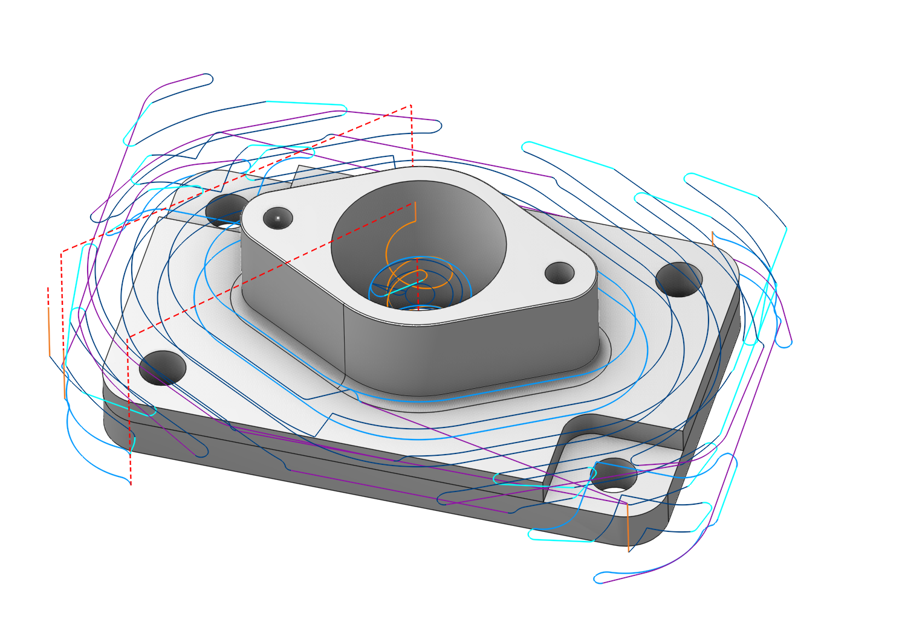
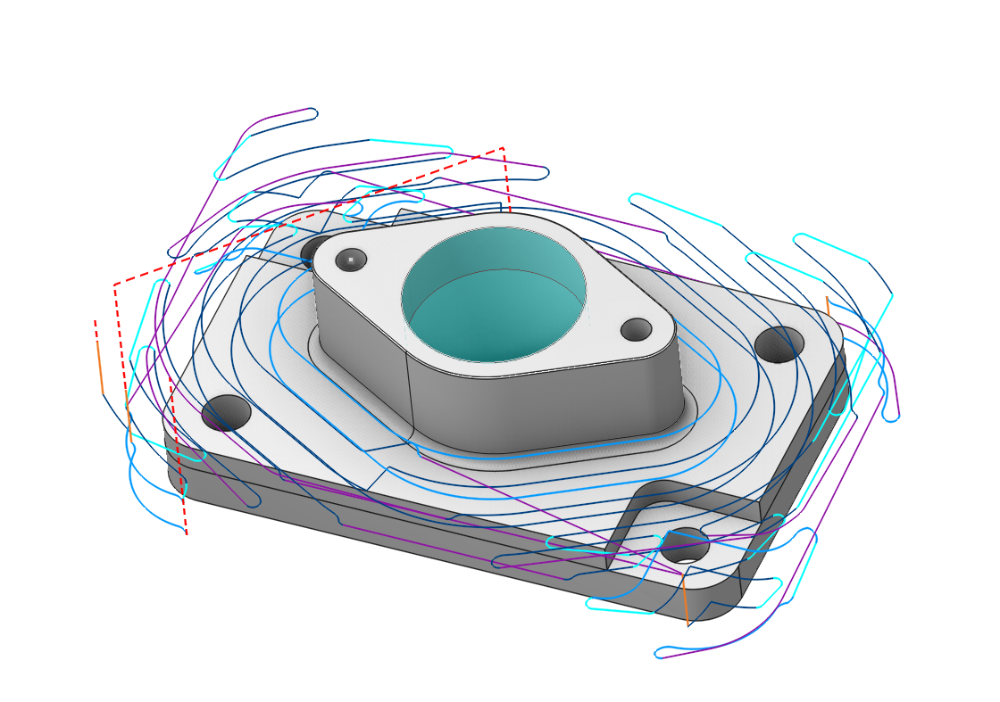
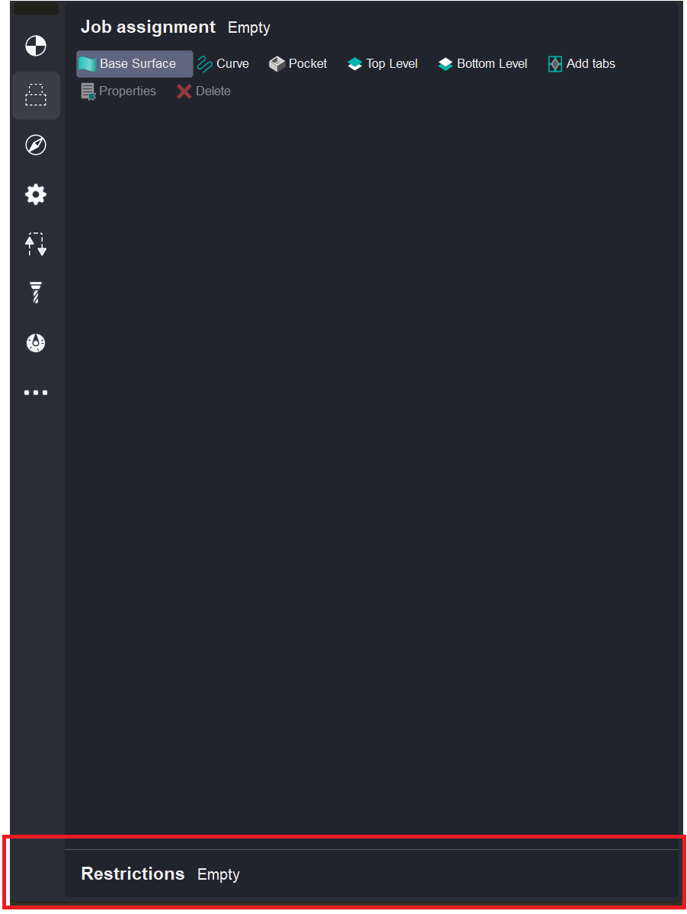

# Restrictions

 

## Application Area:

It allows you to restrict areas that should not be machined. A distinguishing feature compared to fixtures ([Details](10283.md)) is that these constraints are applied within the scope of a single operation, whereas fixtures are utilized across the entire Setup stage ([Details](1024.md)).

### Defining restrictions

It is located at the bottom of the Job assignment. Double-clicking it expands this menu for easier geometry definition. Double-clicking it again collapses the section.

Methods for determining the restrictions are indicated here. [Details](294.md)

### Visibility

Visibility is controlled by turning on and off the visibility of the Job assignment visibility.
