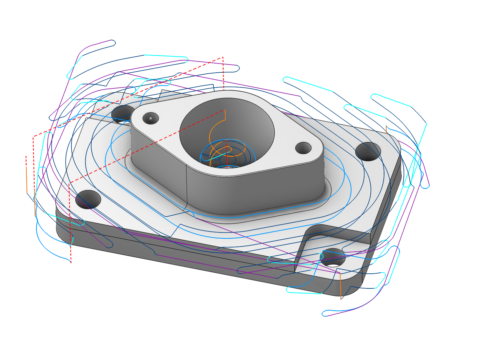
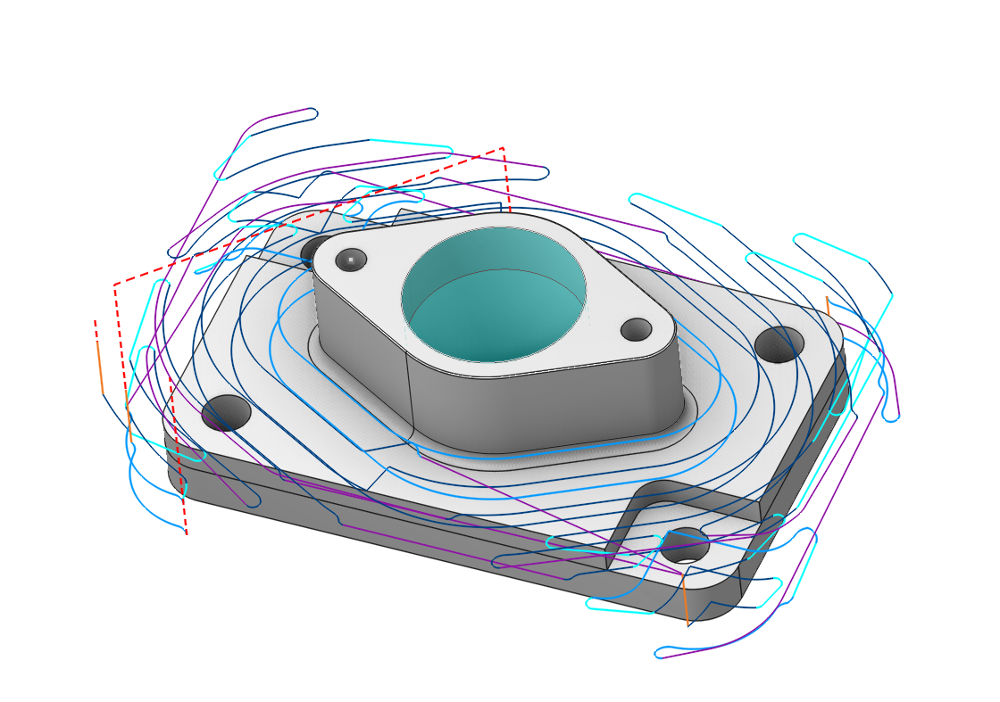
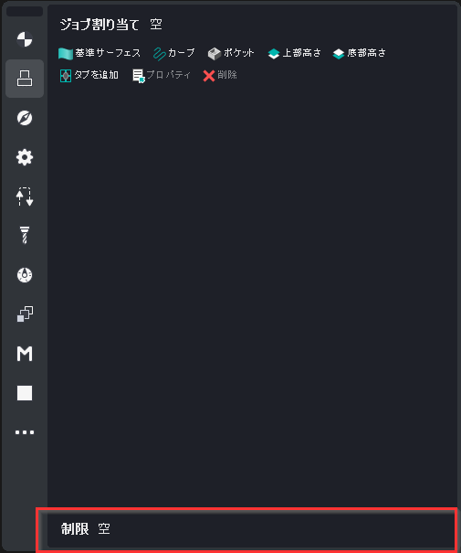

# 制限領域

 

## 適用分野：

加工対象外の領域を制限することが可能です。 <strong>治具</strong> ([詳細を見る](10283.md)) と比べて違う特徴は、治具が<strong>セットアップステージ</strong> ([詳細を見る](1024.md)) 全体にわたって利用されるのに対して、これらの制約は単一の操作の範囲内で適用されるということです。

これはジョブ割り当ての下部に配置されています。ダブルクリックするとこのメニューが表示され、形状の定義が簡単になります。再度ダブルクリックすると、セクションが折りたたまれます。

<strong>制限の設定方法は、こちらに記載されています。</strong>[詳細を見る](294.md)

<strong>表示は、ジョブ割り当ての表示設定のオン/オフによって制御されます。</strong>
