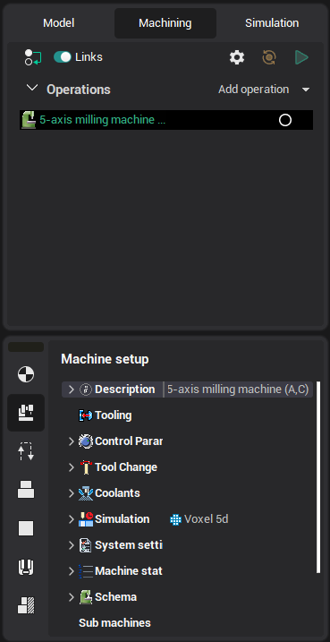
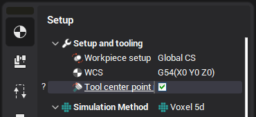

# 5 axis machining

CAM system can generate toolpath for 5 axis milling machines based on the machine kinematics and the parameters of the used control. CAM system virtually supports any machine-control configuration. The generated toolpath contains commands for positioning the XYZ axes of the machine (GOTO, CIRCLE, etc) and the commands for positioning the machine rotary axes (MULTIGOTO). Generally for the most controls the rotary coordinates are the actual positions of the corresponding machine axes, while the XYZ coordinates are the coordinates of the tooling point relative to some workpiece coordinate system. The main difference between 5 axis controls is in the way the controls update the tooling point and the workpiece coordinate system after repositioning of rotary axes.

Most controls have two modes for the five axis machining. Those are the default "3 axis" mode and "Tool Center Point Management (TCPM)" mode. The controls behave differently in these modes. Anyway the behavior of the control is composed of the three options.

1. Does the tooling point rotate together with the tool head rotation or it stays fixed.

2. Does the workpiece zero point (G54) rotate together with the rotary table or it stays fixed.

3. Does the axes of the workpiece coordinate system rotate with the rotary table or they stay fixed.

In CAM system both of the options are available in the machine configuration file under the ControlData section and in the machine properties inspector under the Control Parameters section.

The options are as follows.

1. TCPM mode is available option make the tool center point management option available in continuous five axis milling operations.

When enabled the tool center point management option forces CAM system to enclosure the work passes of the generated toolpath with the INTERP 5AXIS ON, INTERP 5AXIS OFF commands, and to generate the CLDATA of the work passes with regard to the options set under the TCPM 5Axis compensation mode section.

2. TCPM mode default state option specifies the default state of the TCPM mode option in five axis milling operations.

3. Indexed 5Axis compensation mode group contains the set of five axis compensation options for the default "3 Axis" mode of work of the control.

4. TCPM 5Axis compensation mode group contains the of the five axis compensation options for the TCPM mode of the control.

5. 5 Axis tooling point compensation option is responsible for the rotation of the tooling point together with the rotary head.

6. 5 Axis workpiece zero point compensation option is responsible for the rotation of the workpiece zero point rotation to them with the rotary table.

7. 5 Axis coordinate system compensation option is responsible for the rotation of the coordinate axes of the workpiece coordinate system together with the rotary table.

Most of modern controls have the TCPM mode available, and in this mode all the three 5 axis compensation options are enabled. This makes possible the generation of the five axis toolpath independent on the machine kinematics, the workpiece setup and the tool length.

However in the default "3 Axis" mode most of controls have all the three 5 axis compensation options disabled. That makes them behave as regular 3 axis controls knowing nothing about the machine kinematics. In order to make possible the generation of an indexed 3+2 toolpath those controls require mandatory use of local coordinate systems (Heidenhain Plane function, CYCLE 19). For more information refer to the [Tool orientation](260.md) topic.

Advanced axes limits control feature available for multiaxis operations.
