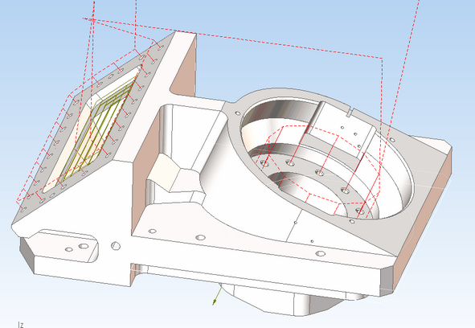

# Indexed 5-axes milling

All 2D and 3D operation can be used for the indexed machining on the 4 and 5-axes machining centers. It needs to define the [positions of the rotary axes](260.md) or the [local coordinate system](726.md).

Advanced axes limits control feature available for multiaxis operations.
