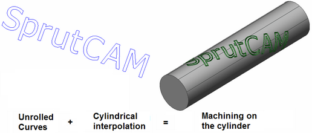
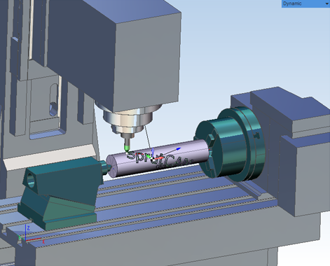

# Rotary machining using cylindrical interpolation

`2D contouring`, `2.5D walls machining` and `2.5D pocketing` operations can generate the tool path for the continuous 4-axis milling. In this case it is needed the [Cylindrical interpolation](10082.md) to be used.

