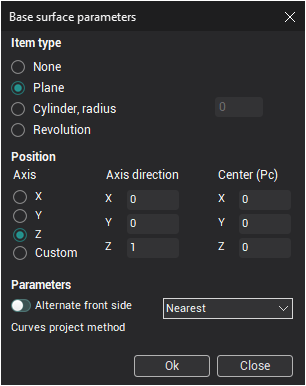

# 4-axis milling with engraving and pocketing operations

[Engraving](810.md) and [pocketing](256.md) operations allow to define the job assignment as the set of the closed contours. Everyone of it defines the **Pocket** or the **Boss** of the model.

Besides, it is possible to set the **Base surface** in the current operations, on which one of the defined contours will be projected. The base surface is a plane, cylinder or the solid of revolution.

The contours of the job assignment can define the boss and pockets directly on the base surface or to be an unrolled curves of it. In contrast to the [Cylindrical interpolation](10082.md) the machine can not have the rotary axis that rotates the workpiece.
