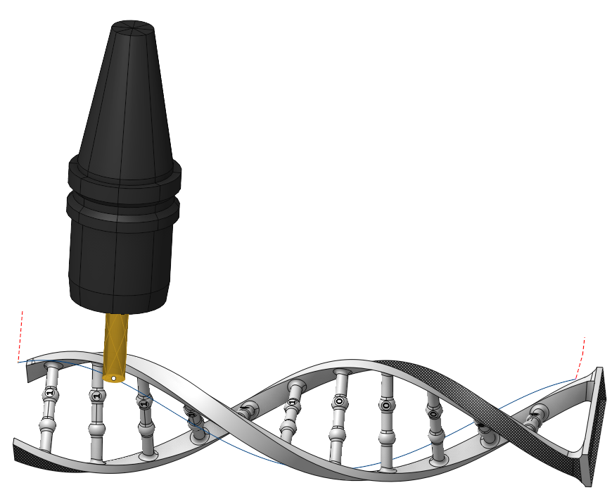
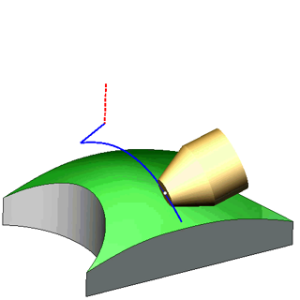
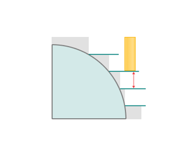
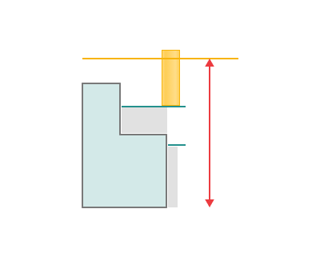
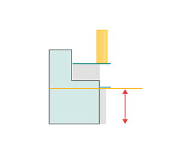
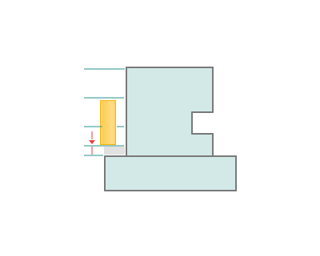

# 5D contour and 6D contour

## Application area:

This operation generates a continuous 5-axis toolpath for any spatial curves, It allows for both a single toolpath construction along a chosen curve and passes along several isoparametric lines of a selected surface, as well as conducting multi-level processing along a specified curve. It offers a wide selection of tool orientation strategies, adjustable automatically or manually by editing vectors at each point along the curve.

For the curves specified in the <strong>Job Assignment</strong>, user can modify the tool orientation vectors at each point, change the tool's movement direction along the curve, alter the machining side, compensate for the tool radius, select the interpolation method for changing the tool orientation vector from point to point, and set the stock.

### Job assignment:

<strong>Edge/Curve on Surface. Job assignment</strong> is formed with the edges of the part or any curves. The tool's current orientation determines vectors at the curve points.. The tool contact point will move along the specified curve based on the curve properties and the chosen tool orientation strategy. [Details](10131.md)

<strong>5D Curve.</strong> The system generates the 5-axis tool path as the projection of the arbitrary curves on the part surface. In this case the tool contact point will move in touch with the surface. The passes can be shifted from the curve by the stock or by the levels. The tool axis is located perpendicular to the surface. [Details](10131.md)

<strong>Drive Faces</strong>. One can u se them for creating work passes along isoparametric lines. The isoparametric curves of the surfaces depends on its way of creation and reflect the topology of the surface. Different fillets can be machined this way very well. [Details](10130.md)

<strong>Recognize elements.</strong> It allows recognizing the following constructive elements: Circle, Rectangle, Rounded Rectangle, Slot, Hexagon, and Keyhole. [Details](100152.md)

<strong>Properties.</strong> Displays the properties of an element. It is possible to add the stock. You can also call this menu by double clicking on an item in the list.

<strong>Delete.</strong> Removes an item from the list.

<strong>Restrictions.</strong> It allows you to restrict areas that should not be machined. [Details](101231.md)

### Strategy:

#### Tool contact point.

Tool Contact Point (TCP) is a specific location on a cutting tool that defines the primary interaction point between the tool and the workpiece surface or geometric entities during machining operations.

The parameters of this group are the same as in the <strong>5D Surfacing operation</strong>. [Details.](10135.md)

#### Tool Orientation:

Controls tool axis orientation. The principal parameters of this function are the same as in the <strong>5D Surfacing operation</strong>. [Details.](10135.md)

Click here to expand..

<strong>Incline Shape Tool.</strong> Tilts the tool so its working side touches the machining surface during toolpath traversal.

#### Limit Rotation Angles:

This option specifies the limit values of the tool's angular position relative to the axes. The parameters of <strong>Limit Rotation Angles</strong> are the same as in the <strong>5D Surfacing operation.</strong> [Details](10135.md).

#### Passes:

You can create additional work passes relative to the specified curves. The passes shifts in the direction normal to the surface. If the <strong>Flank</strong> tool orientation is selected, you can choose the direction of the shifts.

Click here to expand..

<strong>Step</strong>. Material removed in one pass between the <strong>Top</strong> and <strong>Bottom Levels</strong>. You can specify the <strong>Step</strong> both as the thickness in length units or the percent of the tool diameter as well as the passes count.

Top Level. Defines the maximal stock measured from the specified curve that must be removed by the rough passes.

Bottom Level. Defines the distance from the machined surface to the last pass. If the value is positive, the tool will follow a path outside the workpiece material at the specified distance. If the value is negative, the tool will cut the part material at the specified depth.

<strong>Z Cleanup.</strong> The function adds a new pass at the distance specified in the parameter from the <strong>Bottom Level</strong>.

<strong>Direction.</strong> With the <strong>Flank</strong> tool orientation strategy active, you can select the direction for laying out rough passes.

<strong>Along Surface Normal.</strong> The layout of passes follows the direction normal to the surface.

<strong>Along Tool Axis.</strong> The layout of passes follows the vector of tool axis.

#### Corners smoothing:

When there is a sudden change of the tool direction, the milling control performs deceleration before starting the turn, and then accelerates again. This fact can lead to vibrations and high tool and milling machine wear. The problem can be solved if the toolpath has very few or no breaks. For this reason, in the system there is the toolpath smoothing function using the defined radius for machining inner or outer corners of the model. The principal parameters of this function are the same as in the <strong>2D Contouring operation</strong>. [Details.](404.md)

#### Continous axial shifting:

With the <strong>Flank</strong> tool orientation strategy is in use, you can create a toolpath with smooth changes in the tool's axial displacement along the path relative to the specified curve.

Click here to expand..

<strong>Start Shift Value.</strong> It is t he tool's axial displacement at the start of the toolpath.

<strong>End Shift Value.</strong> It is t he tool's axial displacement at the end of the toolpath.

#### Machining from inside.

The parameter allows you to process the internal surfaces of the part (project the trajectory onto the internal surfaces of the part). This parameter group works similarly to the <strong>5D Surfacing operation. In the section Job zone.</strong> [Details](10135.md)

#### Sorting:

Controls the sequence of toolpath passes during the surface machining.

Click here to expand..

<strong>Toolpath uniting mode.</strong> Controls the order of pass execution in the multi-pass machining of different profiles on the part. Parameters of this feature are the same as in the <strong>2D Contouring operation</strong>. [Details.](404.md)

<strong>Idling minimization.</strong> The order of the profiles machining is sorted to minimize the idle motions. Parameters of this feature are the same as in the <strong>2D Contouring operation</strong>. [Details.](404.md)

<strong>Milling type.</strong> Сan be assigned in almost all operations, except for the curve machining operations. This allows the user to control the required milling type (climb or conventional) during the toolpath calculation process. The parameters of the <strong>Milling Type</strong> are the same as in the <strong>Waterline Roughing</strong> <strong>operation</strong>. [Details.](736.md)

#### Project toolpath onto the part with offset:

Determines the method of toolpath creation relative to the surface of the part. Parameters of this feature are the same as in the <strong>Startegy</strong> tab, in the <strong>Transformations</strong> item of the <strong>2D Contouring operation</strong>. [Details.](404.md)

#### Trimming:

Allows for the skipping of surfaces not intended for machining and allows for the extension of the toolpath. The parameters of <strong>Trimming</strong> are the same as in the <strong>Waterline Roughing operation</strong>. [Details.](736.md)

### Parameters:

This tab contains the main parameters for controlling the part, workpiece, fixture and other items, which allow you to change the trajectory. [Details](100112.md)

### Links/Leads:

In the Links/Leads tab, you define the parameters for rapid movements. These movements include tool approach from the tool change position, engage to the start of the working stroke, retraction after the final cutting motion, transitions between working passes, and return to the tool change point. You can configure the sequence of movements along the coordinates, the trajectory of these motions, and the magnitude of displacements.

Click here to expand..

<strong>Сonsists of:</strong>

<strong>Approach/Return.</strong> This group of parameters manages the tool movements from the tool change position to the start of the engage toolpathes, and back. [Details](100116.md).

<strong>Links.</strong> Defines the rules governing Entry/Exit links and links between work moves. [Details](100130.md).

<strong>Leads.</strong> Allows you to add additional engage and retract to the working moves using their feed. [Details](100136.md).

<strong>Safe motions.</strong> Defines the type of <strong>Safety Surface</strong> and the distance from the workpiece to it. This surface facilitates transitions between the processed surfaces or tool paths, and the first stage of approach or return occurs toward it. [Details](100117.md).

<strong>Advanced links settings.</strong> This group of parameters specifies the features of trajectory formation for primarily five-axis operations, considering optimal movements of rotational axes. [Details](100118.md).

<strong>Distances.</strong> Distances used in Links rules [Details](100140.md).

### Feeds/Speeds:

Using this dialogue the user can define the spindle rotation speed; the rapid feed value and the feed values for different areas of the toolpath. Spindle rotation speed can be defined as either the rotations per minute or the cutting speed. The defining value will be underlined. The second value will be recalculated relative to the defining value, with regard to the tool diameter. [Details](100142.md)

### Transformations:

Parameter's kit of operation, which allow to execute converting of coordinates for calculated within operation the trajectory of the tool. [Details](10168.md)

### Part:

A Part is a group of geometrical elements that defines the space to check for gouges. [Details](330.md)

### Workpiece:

A workpiece model of an operation defines the material to be machined. [Details](738.md)

### Fixtures:

As the Fixtures the fixing aids such as chucks, grips, clamps, etc., and the restriction areas of any other nature are usually specified. [Details](10283.md)
