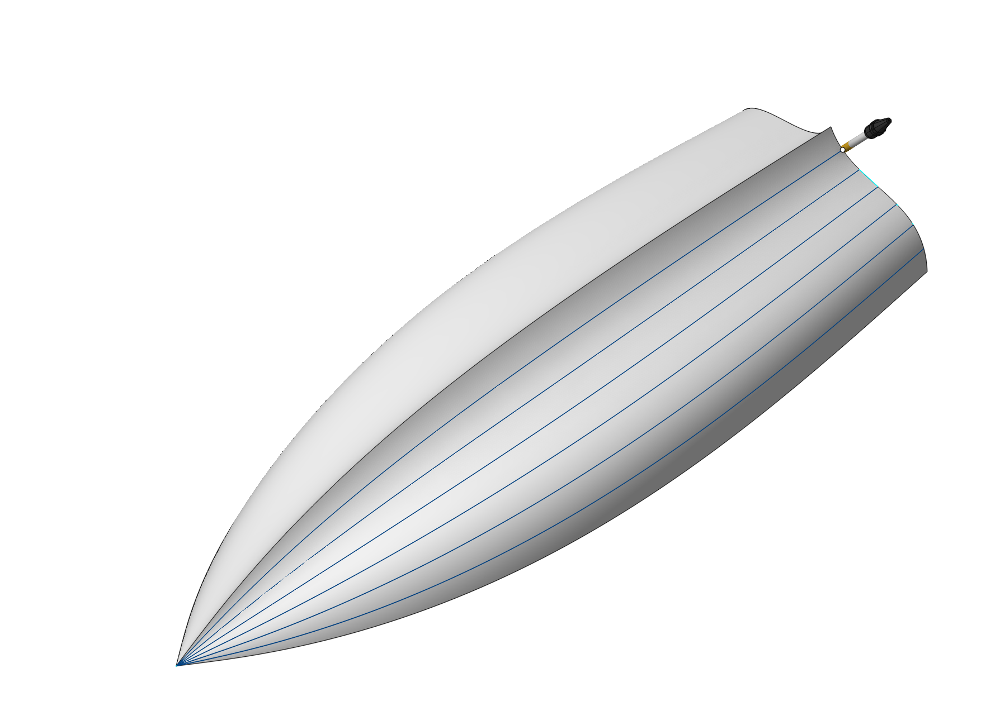
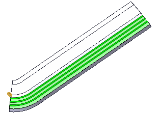
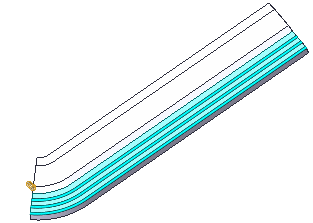
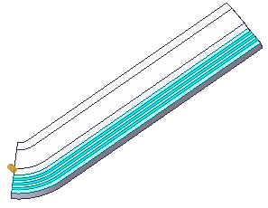

# Parameters of Drive Faces

## Application Area:

You can u se <strong>Drive Faces</strong> for creating work passes along isoparametric lines. The isoparametric curves of the surfaces depends on its way of creation. Frequently they reflect the topology of the surface and so is very useful for machining as work passes. Different fillets can be machined this way very well. Include surfaces in the <strong>Job Assignment</strong> of the <strong>6D Contouring</strong> operation if you plan to use their isoparametric lines. To do it, it's necessary to select the desired surfaces and click the Drive faces button. If some faces with the analogous parameterization are selected and added to the list by one click on the Drive faces button then they will be machined together.

## Item Properties:

### Base Info:

<strong>Name</strong>. Specify a name for the item's appearance in the <strong>Job Assignment</strong> list.

<strong>Stock</strong>. This feature allows to shift both rough and finishing passes from the machined surface by the specified value. If the value is positive, the tool will follow a path outside the workpiece material at the specified distance. If the value is negative, the tool will cut the part material at the specified depth.

<strong>Selected Count.</strong> The number of selected items.

### Drive Face's Parameters:

<strong>Alternate Streamline.</strong> This feature changes the passes direction to the orthogonal ones.

<strong>Alternate Front Side.</strong> This feature changes the machined side of surface to the back one

<strong>Step Method.</strong> You can select a method for setting distances between isoparametric curves.

<strong>Number</strong>. Input in the text field the number of isoparametric lines within the <strong>Drive Face</strong>.

<strong>Distance</strong>. Input in the text field the distance between the isoparametric lines.

<strong>Scallop</strong>. Input in the text field the desired value of scallop.

<strong>Curve Distribution</strong>. This option controls the way CAM system produces isoparametric curves on the <strong>Drive Face</strong>:

Click here to expand..

From Start. The first curve is placed on the left edge of the surface and other curves are arranged to the right of the first one.

From End. The first curve is placed on the right edge of the surface and other curves are arranged to the left of the first one.

From Center. The first curve is placed in the middle of the surface, other curves are arranged to the left and to the right of it.

Auto. Curve placing method is defined by CAM system based on the machining method and tool axis orientation.

### Item Stuff.

It is the list of model's constructive eliments in the item.

<strong>Delete.</strong> You can delete the selected constructive eliment from the item.

<strong>Clear</strong>. You can delete all the constructive eliment from the item.
