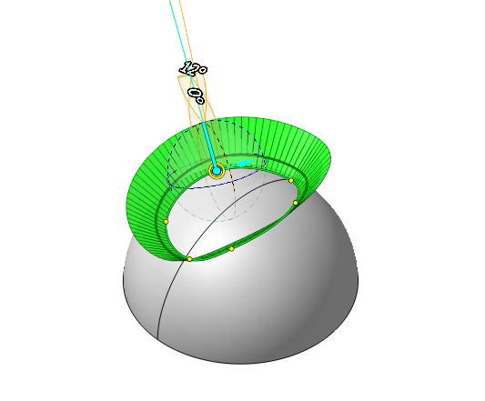
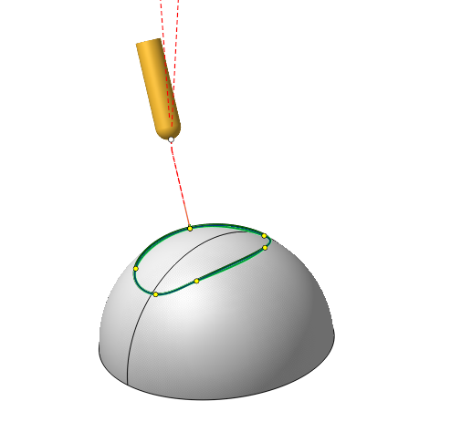
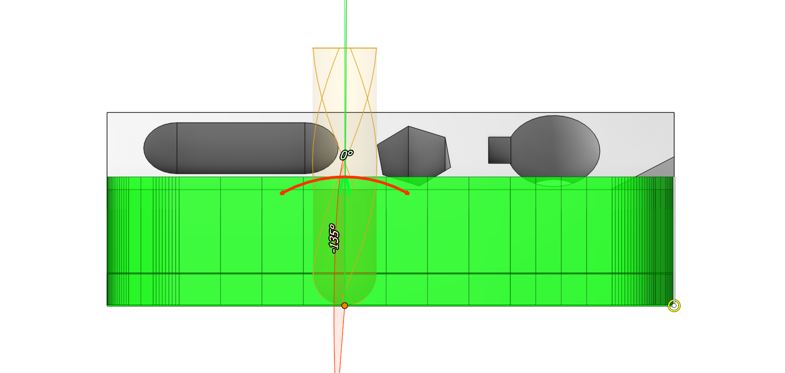
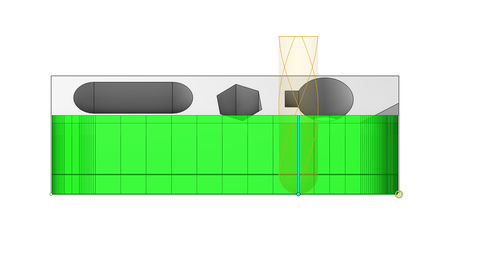
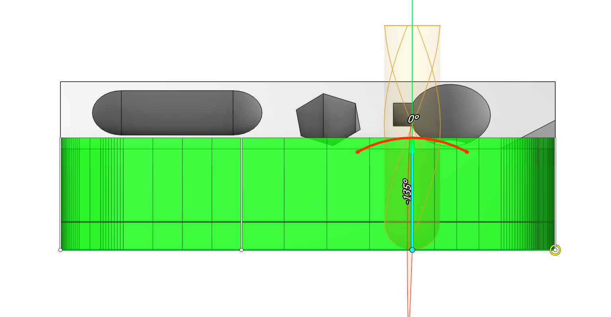
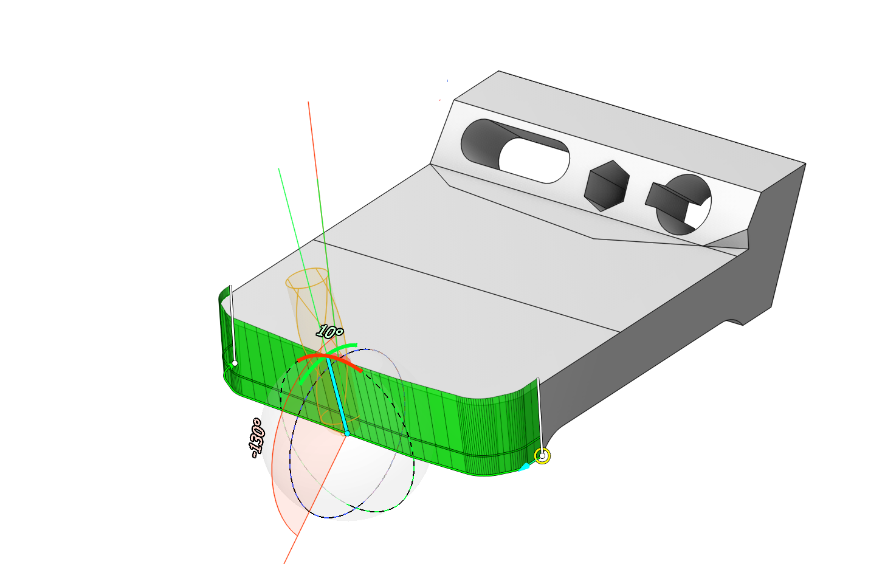
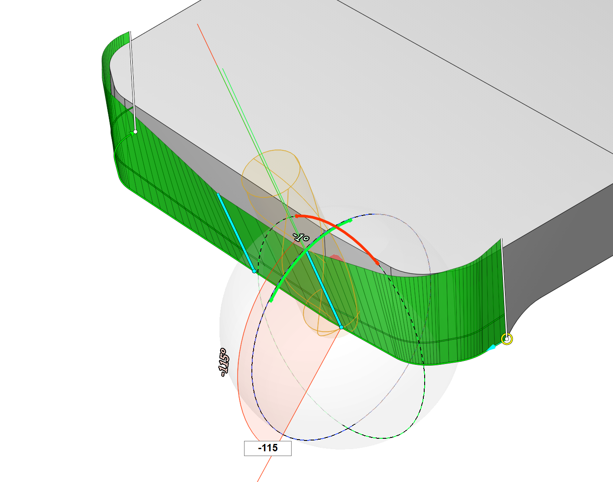
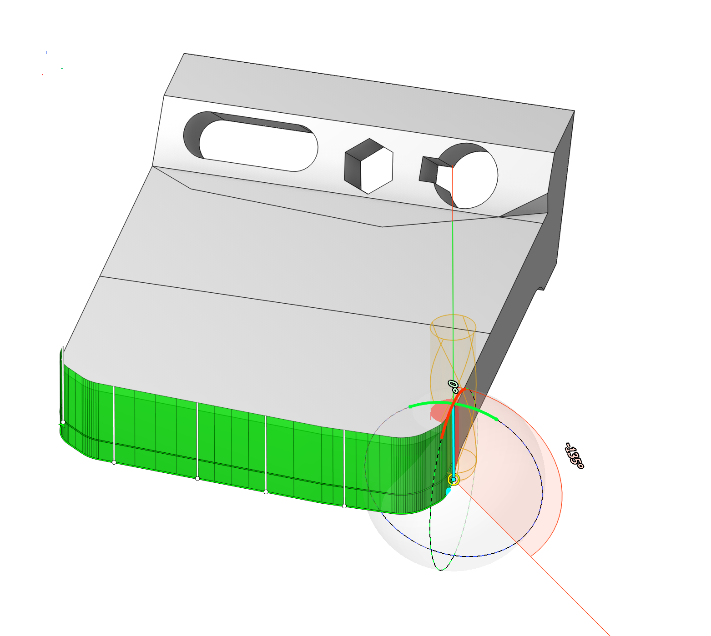
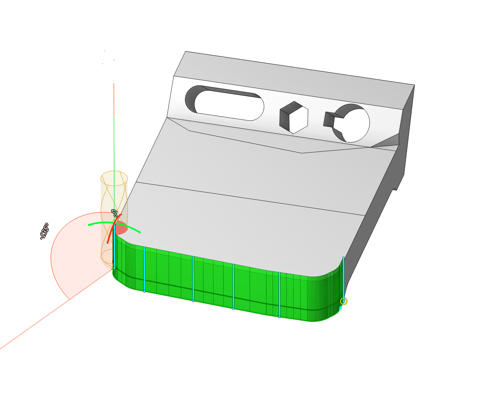
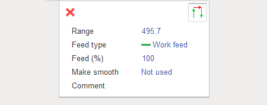

# Parameters of Curves

<strong>Application Area:</strong>

The 6D Contouring operation allows for path creation using two varieties of <strong>Job Assignment</strong> lines:

<strong>5D Curve.</strong> The system generates the 5-axis tool path as the projection of the arbitrary curves on the part surface. In this case the tool tip will move in touch with the surface. Specify the surfaces or body to be projected on as the part of the operation.

Click here to expand..

<strong>Edge/Curve on Surface. Job assignment</strong> is formed with the edges of the part or any curves. If the edges if not highlighted when the mouse pointer goes under it then check the edges selection button on the filter panel ( the same applies to curves ). It must be down.

If the edge selection filter button is down but the edges is still not highlighted then [sew](1000.md) the faces. If the set of the connected edges must be machined in one pass, then it must be selected from the screen together and added to the <strong>Job Assignment</strong> list by the one click on the Edge\Curve on surface button. In this case the edges are joined to the one item and machined as a whole. If the edges are added to the list separately then it is machined separately even if it is connected. Press and hold the Ctrl to select some objects from the screen at once. This option is most commonly used when it's necessary to mill surfaces with the side part of the mill. In this case, you can select the lower edges of the surface to be machined as the <strong>Job Assignment</strong>.

Click here to expand..

<strong>Item Properties:</strong>

## Base Info:

<strong>Name</strong>. Specify a name for the item's appearance in the <strong>Job Assignment</strong> list.

<strong>Stock</strong>. This feature allows to shift both rough and finishing passes from the machined surface by the specified value. If the value is positive, the tool will follow a path outside the workpiece material at the specified distance. If the value is negative, the tool will cut the part material at the specified depth.

<strong>Selected Count.</strong> The number of selected items.

## Project Curves Parameters:

<strong>Alternate Direction.</strong> This feature alters the toolpath direction along the curve.

<strong>Alternate Front Side.</strong> An edge/curve might relate to two different surfaces. Pressing this button allows switching between one of the two surfaces.

## Properties:

An important advantage of the 6D Contouring operation of CAM system is its comprehensive set of features for adjusting the tool movement parameters along the curve. You can edit these parameters interactively in the graphical window or in the dialog window.

Click here to expand..

In the graphical window, you can adjust vectors that determine the tool orientation at points along the selected curve. This can be done in the following ways:

- clicking on the point on the curve and holding the left mouse button, you can move the vector along the contour.  
- if you do the same with the Ctrl key pressed, the copied vector will move, the main one will remain in place.

 

- by clicking on the vector, you can edit the direction through the interactive sphere, it has two circles along and across the original surface (or changing the value of two angles).

- holding Shift, the left mouse button has the ability to tilt the vector strictly to the point on the surface of the part.
- delete the vector by Del button on your keyboard.

- Multi-select functionality expanded: Modifying a vector's angle via size adjustment or semi-circle rotation now propagates the angle change to all selected vectors. (using <strong>Ctrl/Shift</strong>)

- To select a group of vectors, Shift-click the first vector, then Shift-click the last vector. All vectors between them will be selected.

 

By dragging the circular point, you can modify the beginning of the toolpath. Clicking the blue arrow allows for a change of the direction of the tool's path along the curve.

When you click on a curve, a pop-up window appears, enabling you to specify following parameters:

<strong>Lead in.</strong> Configure the tool axis direction and the length of engage. Upon activation of this feature, a yellow arrow and a line segment originating from a yellow dot become visible. Dragging this segment adjusts both the engage length and direction. By rotating the yellow arrow, the user can modify the tool's orientation when approach.

<strong>Lead out.</strong> Configure the tool axis direction and the length of retract. Upon activation of this feature, a yellow arrow and a line segment originating from a yellow dot become visible. Dragging this segment adjusts both the retract length and direction. By rotating the yellow arrow, the user can modify the tool's orientation when retutrn.

<strong>Compensated.</strong> Adjusts for contact point compensation by switching the vector direction from along the tool axis to along the normal to the tool surface at the contact point.

<strong>Normal Interpolation Mode.</strong> Defines the rule for vector direction variation between points.

<strong>Relative to Curve.</strong> The vector change is based on accounting for the curve's tangent.

<strong>Linear.</strong> Vector modification follows a linear rule.

<strong>Smoothed.</strong> Modifies vector using a spherical principle.

<strong>Normal Blend Distance.</strong> The distance between two points along the toolpath where the tool's axis angle remains constant.

<strong>Set Tool Vectors Automatically</strong>. This feature appears when operating <strong>5D Curve</strong>, CAM system will attempt to automatically set the vectors normal to the surface.

<strong>Use custom vectors.</strong> This feature appears when operating <strong><strong>Edge/Curve on Surface.</strong></strong> By default, system positions vectors to follow the designated surface. To enable vector editing in the graphical window, select the curve and click the <strong>Use Custom Vectors</strong> button.

<strong>Alternate Front Side</strong>. This feature appears when operating <strong>Edge/Curve on Surface.</strong> An edge might relate to two different surfaces. Pressing this button allows switching between one of the two surfaces.

<strong>Convert to Spline.</strong> If the curve is not a spline, pressing the corresponding button can transform the curve into a spline.

<strong>Feed Control Mode.</strong> This feature enables the creation of a contour segment with specific feed values. To use this feature, press the relevant button and then click on the curve segment where you wish to set the desired feed mode. In the pop-up window, select the <strong>Add New Feed</strong> command. You can move the processing segment to any location on the curve by dragging the point. Expand this segment along the curve by dragging the arrows. Double-clicking on the processing segment again brings up a pop-up window where you can enter the necessary feed control parameters:

 

<strong>Range.</strong> Specify the length of the contour segment where feed value adjustment occurs.

<strong>Feed Type.</strong> Determine the type of motion - <strong>Work feed</strong> or <strong>Rapid feed</strong>.

<strong>Feed (%).</strong> You can configure the feed value on the editable contour as a percentage of the <strong>Feed Type</strong> value determined in the <strong>Speeds</strong> tab.

<strong>Make Smooth.</strong> Facilitate smooth changes in feed rate.

<strong>Not Used.</strong> Do not perform feed rate smoothing.

<strong>By (%) of Range.</strong> Modify the feed over a distance half the <strong>Step's</strong> length, calculated as a percentage of the <strong>Range</strong>, to achieve the <strong>Feed (%)</strong> value at the <strong>Range's</strong> midpoint.

<strong>By Feed Step</strong>. Modify the feed stepwise using the <strong>Step</strong> value to achieve the specified <strong>Feed (%)</strong> at the <strong>Range's</strong> midpoint.

By pressing the <strong>Delete</strong> button you can remove the segment currently being modified in the feed mode configuration. Press the button <strong>Feed Control Mode</strong> once more to exit the mode for editing feed settings.

When you click on the curve, a dimension appears that enables vector <strong>Height</strong> adjustment. This only affects the convenience of working with them.

