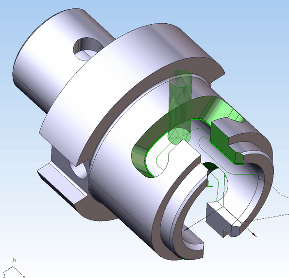
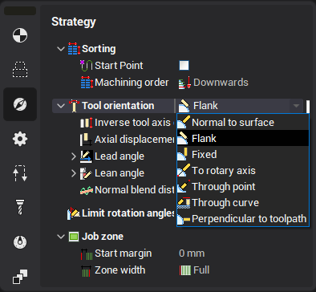
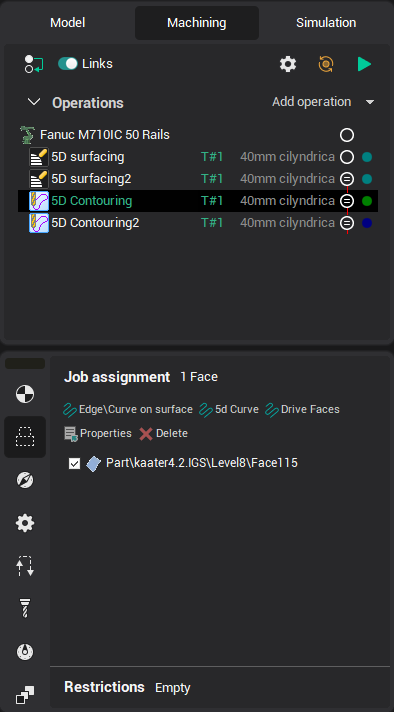
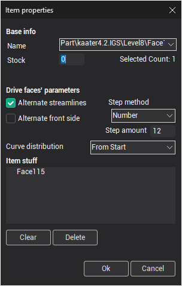

# 5-axis milling of the ruled surfaces by the flank of the mill

Set the **Contact tool type** parameter to the **Flank** position to machine the ruled surfaces by the flank of the mill. The **Inverse tool axis direction** tick changes the tool axis direction to the opposite one. **Axial displacement** defines the additional shift along the tool axis.

Job assignment is formed with the edges of the part or any curves. If the edges if not highlighted when the mouse pointer goes under it then check the edges selection button on the filter panel ( the same applies to curves ). It must be down.

If the edge selection filter button is down but the edges is still not highlighted then [sew](1000.md) the faces.

If the set of the connected edges must be machined in one pass, then it must be selected from the screen together and added to the job assignment list by the one click on the `Edge\Curve on surface` button. In this case the edges are joined to the one item and machined as a whole. If the edges are added to the list separately then it is machined separately even if it is connected. Press and hold the Ctrl to select some objects from the screen at once.

The direction and side of the machining can be changed item properties window. Select the item and click properties button to open it.

