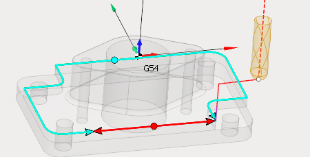

# Feeds control feature

This function allows you to create feed value contour. In order to have the ability to edit feed value you need to click <strong>Feed control mode</strong>.

In the pop-up panel, you can control the range, feed type, speed and interpolation type.

