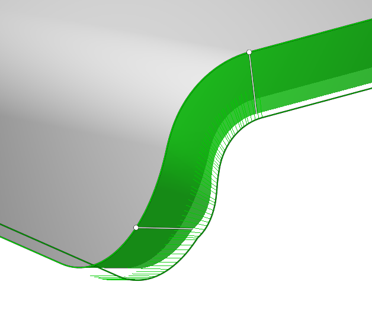
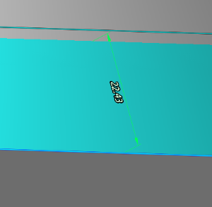

# Using custom vectors feature

Vectors allow to set the orientation of the tool at any point of the contour. In order to have the ability to edit vectors you need to click <strong>Use custom tool vectors</strong>.

If a 5D Curve was added to the Job assignment, instead of an Edges, then by default there is available only one Fixed vector. By pressing the same button, CAM system will try to set the vectors automatically.

Using <strong>Custom vectors</strong> allows you to edit the original surface to be processed. Editing methods:

- holding the left mouse button, you can move the vector along the contour.
- if you do the same with the Ctrl key pressed, the copied vector will move, the main one will remain in place.
- by clicking on the vector, you can edit the direction through the interactive sphere, it has two circles along and across the original surface (or changing the value of two angles).
- holding Shift, the left mouse button has the ability to tilt the vector strictly to the point on the surface of the part.
- delete the vector by Del button on your keyboard.

If to click on the contour, a size appears with which you can edit the height of the vectors. This only affects the convenience of working with them.
