# Surfacing

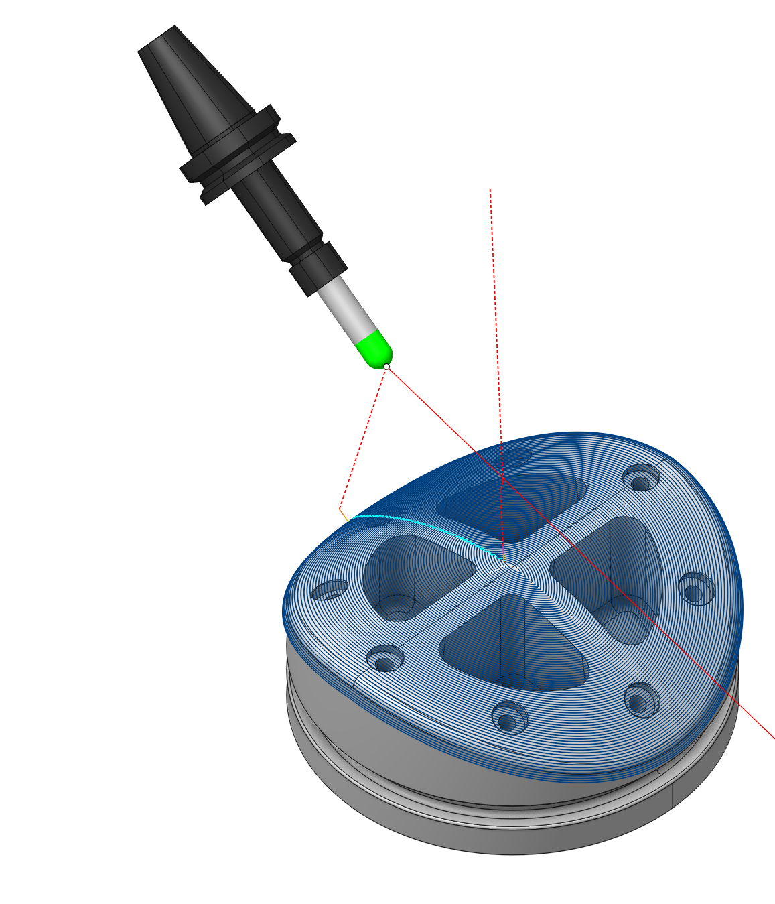

## Application area:

Surfacing operation is the operation from the finishing group and enables machining the surfaces of the model with a variety of strategies (parallel to planes, parallel to curve, morph, etc.) and tool axis orientation modes (fixed, normal to surfaces, to rotary axis, through point, through curve, etc.).

### Job assigment:

<strong>Machining Surfaces.</strong> Select various surfaces of the part as the working task. The system will calculate the trajectory based on the chosen surfaces.

<strong>First Curve.</strong> For the <strong>Parallel to Curve</strong> strategy, this feature specifies curves for parallel passes computations. Additionally, in the <strong>Morphing Between Two Curves</strong> strategy, it specifies the <strong>First Curve</strong> <strong>.</strong> You can select one or multiple, not necessarily connected, curves or edges.

<strong>Second Curve.</strong> The system uses it in he <strong>Morphing Between Two Curves</strong> strategy. It specifies the <strong>Second Curve</strong> <strong>.</strong> You can select one or multiple, not necessarily connected, curves or edges.

<strong>Tilt Curve.</strong> This is t he curve that the tool axis vector aims at when setting <strong>Tool Orientation</strong> specification <strong>Through Curve.</strong>

<strong>First Surface.</strong> This feature s erves as the <strong>First Surface</strong> in a <strong>Morph Between Two Surfaces</strong> strategy, facilitating the morphing process to create toolpath lines.

<strong>Second Surface.</strong> This feature s erves as the <strong>Second Surface</strong> in a <strong>Morph Between Two Surfaces</strong> strategy, facilitating the morphing process to create toolpath lines.

<strong>Surfaces for projection.</strong> These are the s urfaces intended for machining onto which the toolpath transfers when enabling the <strong>Project Toolpath onto the Part</strong> option in the <strong>Strategy</strong> tab.

<strong>Job Zone.</strong> Use the job zone to trim the passes outside the specified 2d containment areas. The plane of the containment area is defined by the initial tool orientation. [Details](10151.md).

<strong>Restrict Zone.</strong> In addition to <strong>Job Zones</strong> in system you can use <strong>Restrict Zones</strong> geometry from curves and edges to specify the workpiece areas that s hould avoid machining in the current operation. [Details](10152.md)

<strong>Properties.</strong> Displays the properties of an element. It is possible to add the stock. You can also call this menu by double clicking on an item in the list.

<strong>Delete.</strong> Removes an item from the list.

<strong>Restrictions.</strong> It allows you to restrict areas that should not be machined. [Details](101231.md)

### Strategy:

#### Strategy:

This parameter allows the user to achieve a required toolpath:

Click here to expand..

<strong>Type of Strategy:</strong>

Click here to expand..

<strong>Parallel to Horizontal Plane.</strong> The system generates the tool passes as section lines of the <strong>Machining Surface</strong> by horizontal planes (planes are perpendicular to the tool axis), similar to the strategy in a Finishing Waterline operation. [Details.](841.md)

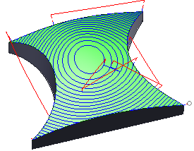

<strong>Parallel to Vertical Plane.</strong> The system generates the tool passes as section lines of the <strong>Machining Surface</strong> by vertical planes (planes are parallel to the tool axis), similar to the strategy in a Finishing Plane operation. You can change the angle of the plane around the tool axis. [Details.](713.md)

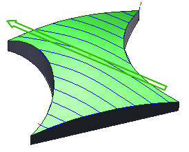

<strong>Parallel to 3d Plane.</strong> The system generates the tool p asses as section lines of the <strong>Machining Surface</strong> by planes positioned at adjustable angles in space.

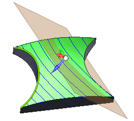

<strong>Parallel to Curve.</strong> The system generates the tool p asses on <strong>Machining Surface</strong> at a specified <strong>Step</strong> parallel to the <strong>First Curve</strong> defined in the <strong>Job Assignment.</strong>

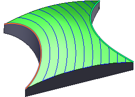

<strong>Morph Between Two Curves.</strong> The system generates the tool p asses as geometric points arrays on the <strong>Machining Surface</strong>, maintaining a constant ratio between the distance from the point to the <strong>First Curve</strong> and the distance to the <strong>Second Curve</strong> for each pass.

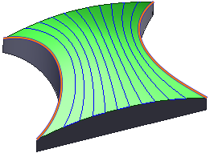

<strong>Around Rotary Axis.</strong> The system generates the tool p asses as sections of the <strong>Machining Surface</strong> at a specified <strong>Step</strong> by employing cylinders with an axis specified as the <strong>Rotary Axis</strong>.

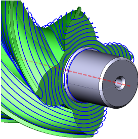

<strong>Across Curve.</strong> The system generates the tool p asses as section lines of the <strong>Machining Surface</strong> with planes perpendicular to the <strong>First Curve</strong> specified in the <strong>Job Assignment</strong>.

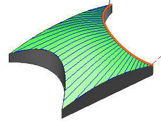

<strong>Morph Between two surfaces.</strong> The system generates the tool p asses as section lines of the <strong>Machining Surface</strong> by surfaces formed through a smooth transition from the <strong>First Surface</strong> to the <strong>Second Surface</strong>, at intervals according to the <strong>Step</strong>.

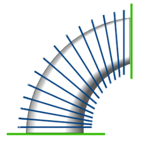

<strong>Step.</strong> The maximum allowed width of cut.

.png)

<strong>Adaptive Step.</strong> <strong>If enabled:</strong> This parameter adjusts the distances between tool passes according to the curvature radii of the surface and the tool to maintain uniform scallop height after surface machining. [Details](113.md).

<strong>If disabled:</strong> This is the fixed vertical distance between consecutive tool passes.

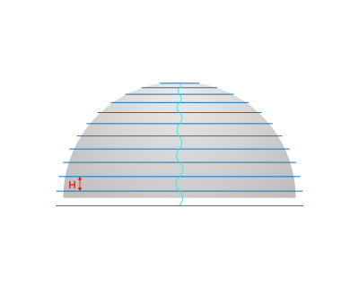

<strong>Calculate Based on Tool Center.</strong> Flagging switches the mode that involves first offsetting the surfaces for machining by the tool profile for 3-axis machining or along the surface normal by the tool radius for 5-axis machining, and then calculating toolpath curves on these offset surfaces. In another mode, the system initially generates tool path as curves on the machined surfaces. Then, it positions and orient the tool relative to the calculated curves to keep the tool's contact point with the machined surface constant.

<strong><strong>Comparison of the toolpath based on the center and the tool contact point:</strong></strong>

<strong>Calculation based on tool contact point:</strong>

In this mode the work passes are generated by calculating curves on the machining surfaces as the first step and then positioning and orienting the tool relative to the calculated curves in such a way that the point of contact of the tool with a machining surface stays the same. It is desirable, for example, when smooth surfaces are machining, or doing flank milling.

<strong>Calculation based on tool center:</strong>

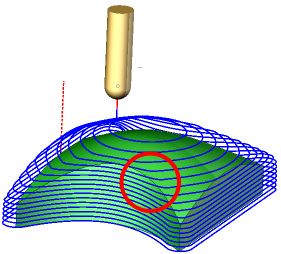

In this mode the work passes are generated in such a way that at first the machining surfaces are being offset either by the tool shape itself for 3 axis machining or by the tool radius along the surface normal for 5 axis machining and only then the sections of the offset surfaces are calculated. For example, for the Parallel to plane strategies it means that the generated work passes all lie on parallel planes. Another advantage of this mode is that not only the surfaces themselves but the edges between machining surfaces are taken into account.

<strong>XY Angle.</strong> This is the r otation angle of the section planes around the tool axis.

<strong>Z Angle.</strong> This is the a ngle between the Z-axis and the normal to the section plane.

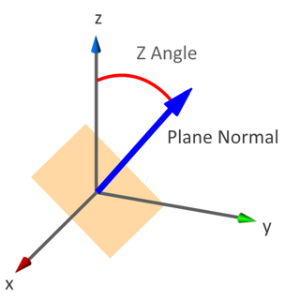

<strong>Use 2d Curves.</strong> When flagging, the system generates the toolpaths relative to curves projected onto the XY plane in <strong>Parallel to Curve</strong> and <strong>Morphing between Two Curve</strong> s strategies.

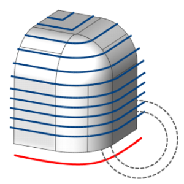

<strong>One Side Machining.</strong> In the <strong>Parallel to Curve</strong> and <strong>Morph between Two Curve</strong> s strategies, it controls the placement of the toolpath relative to the curves specified in the <strong>Job Assignment</strong>. Without the flag, the system generates toolpath on both sides of the curve.

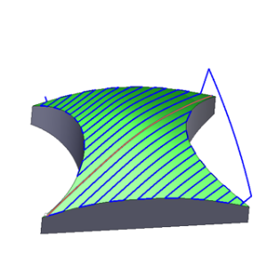

<strong>Left.</strong> The system generates passes on the left side of the curve specified in the <strong>Job Assignment.</strong>

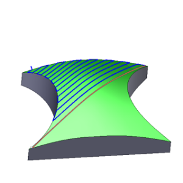

<strong>Right.</strong> The system generates passes on the right side of the curve specified in the <strong>Job Assignment.</strong>

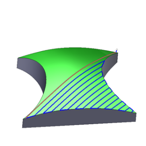

<strong>Extend Curves to Infinity.</strong> Setting the flag allows the system to extend the passes parallel to the selected lines up to the edges of the <strong>Machining Surface</strong> when the curves are smaller than the <strong>Machining Surface</strong>.

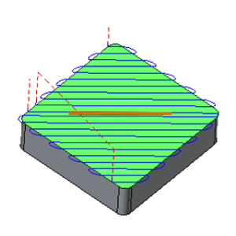

<strong>Rotary Axis.</strong> This is t he axis of section cylinders in the <strong>Around Rotation Axis</strong> strategy.

#### Milling Type:

Сan be assigned in almost all operations, except for the curve machining operations. This allows the user to control the required milling type (climb or conventional) during the toolpath calculation process.

The parameters of the <strong>Milling Type</strong> are the same. as in the <strong>Waterline Roughing</strong> <strong>operation</strong>. [Details.](736.md)

#### Sorting:

Controls the sequence of toolpath passes during surface machining.

Click here to expand..

<strong>By regions.</strong> Determines whether working passes are grouped by region or by layer.

<strong>ON.</strong> All layers of one region (cavity) are machined before moving to the next region.

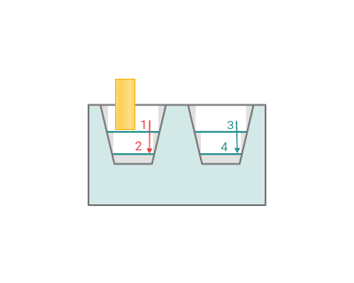

<strong>OFF.</strong> One layer is machined across all regions before moving to the next layer.

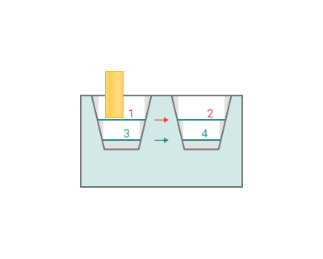

<strong><strong>Start Point.</strong></strong> Activating the flag permits the input of coordinates marking the starting point of working passes in surface machining.

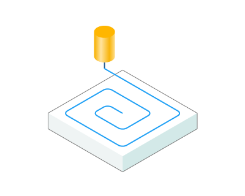 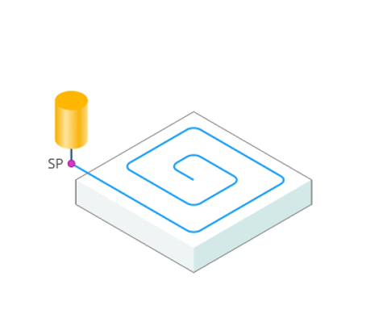

<strong>Machining Order</strong>. Controls the execution order of the tool's working passes.

Click here to expand..

<strong>Downwards</strong>. Working passes proceed from top to bottom, from the nearest pass to the furthes.

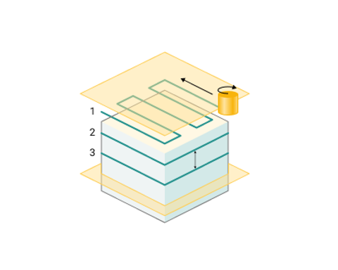

<strong>Upwards</strong>. Working passes proceed from bottom to top, from the most distant pass to the closest one.

<strong>From First to Second</strong>. Operation executes passes from the <strong>First</strong> towards the <strong>Second Curve</strong> or <strong>Surface</strong>.

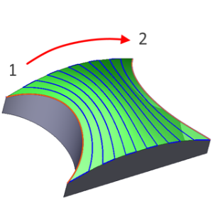

<strong>From Second to First</strong>. Operation executes passes from the <strong>Second</strong> towards the <strong>First Curve</strong> or <strong>Surface</strong>.

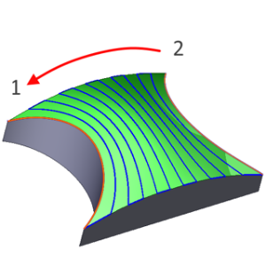

<strong>From Outside in</strong>. Working passes proceed from the periphery towards the midpoint of the <strong>Machining Surface.</strong>

<strong>From Inside Out</strong>. Working passes proceed from the midpoint towards the periphery of the <strong>Machining Surface.</strong>

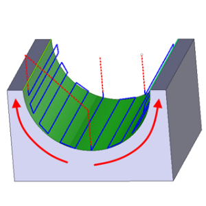

#### Tool contact point.

Tool Contact Point (TCP) is a specific location on a cutting tool that defines the primary interaction point between the tool and the workpiece surface or geometric entities during machining operations.

Click here to expand..

<strong>Auto.</strong> The point of contact of the cutting tool moves along the cutting edge of the tool without changing the axis vector of the tool.

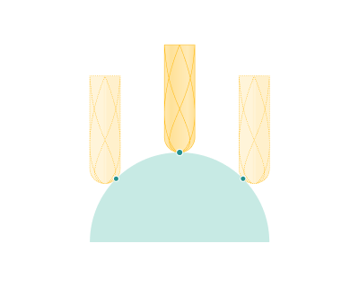

<strong>End.</strong> The point of contact of the cutting tool is located at the top of the cutting edge of the tool.

<strong>Center.</strong> The processing is carried out on the outer radius of the cylinder, which is located at a certain distance from the top of the cutting edge.

<strong>Height.</strong> The processing is done on the outer radius of the cylinder, which is located at a certain distance from the top of the cutting edge. The distance can be adjusted through the nested parameter <strong>Value</strong>.

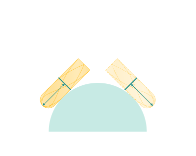

<strong>Parameter.</strong> The processing is done with the flat part of the cutting tool, which is located at a certain distance from the top of the cutting edge. The distance can be adjusted through the nested parameter <strong>Value</strong>.

<strong>Value.</strong> Parameter determining distances.

#### Tool Orientation:

Controls tool axis orientation.

Click here to expand..

<strong>Fixed</strong>. Throughout the toolpath, the tool maintains a fixed orientation, defined by the initial positions of the machine's rotary axes as configured in the <strong>Setup</strong> tab.

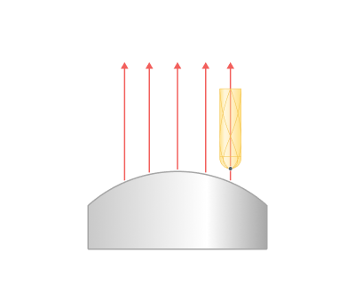

<strong>Normal to Surface. T</strong> he system orients t he tool axis normal to the <strong>Machining Surface.</strong>

<strong>Flank</strong>. The tool's side part machines the surfaces.

<strong>To Rotary Axis.</strong> The system directs tool's axis vector from the designated <strong>Rotary Axis</strong>.

<strong>Through Point.</strong> The system directs tool's axis vector towards the designated point (pole).

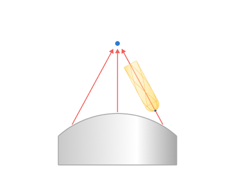

<strong>Through Curve.</strong> The tool axis vector targets the nearest point on the <strong>Tilt Curve</strong> specified in the <strong>Job Assignment.</strong>

<strong>Perpendiculat to Toolpath.</strong> The tool's axis stands perpendicular to the tangent of the trajectory while being parallel to the <strong>Rotary Axis.</strong>

<strong>Vertical Clearance Angle.</strong> When the flag is set, the system automatically tilts the tool to the specified angle at areas where the <strong>Machining Surface</strong> displays a steep or negative incline (with the surface normal pointing down relative to the tool's axis), making it possible to machine simple areas with undercuts.

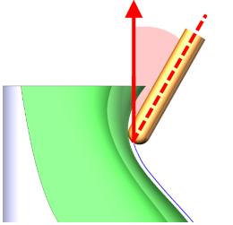

<strong>Rotary Axis.</strong> Setting the flag locks one of the components of the tool orientation vector, maintaining a constant <strong>Side Angle</strong> between the tool axis and the perpendicular to the specified axis (or the axis itself if the <strong>Tool Orientation</strong> is set as <strong>Perpendicular to Toolpath)</strong>.

<strong>Side Angle.</strong> Specifies the inclination angle value of the tool axis relative to the axis designated as the <strong>Rotary Axis.</strong>

<strong><strong>End Side Angle.</strong></strong> Specifies the inclination angle value of the tool axis relative to the axis designated as the <strong>Rotary Axis</strong> at the end of the toolpath.

<strong>Inverse Tool Axis Direction.</strong> Alters the tool axis vector direction. Use this parameter if CAM system incorrectly attempts to machine surfaces from the opposite side to the desired one or if it fails to generate a toolpath..

 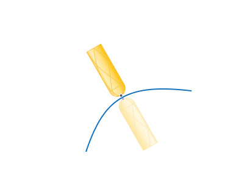

<strong>Lead Angle.</strong> It is a n additional tool tilt angle within the plane of motion direction.

<strong>End Lead Angle.</strong> It is a n additional tool tilt angle within the plane of motion direction at the end of the toolpath.

<strong>Lean Angle.</strong> It is a n additional tool tilt angle within the plane ortogonal to the motion direction.

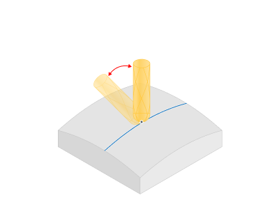

<strong><strong>End Lean Angle.</strong></strong> It is a n additional tool tilt angle within the plane ortogonal to the motion directionat the end of the toolpath.

<strong>Inverse Lead Angle.</strong> When flagging, t he lead angle sign becomes the opposite when the direction of tool movement changes.

<strong>Normal Blend Distance.</strong> The distance along the toolpath where the tool's tilt angle remains constant.

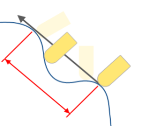

<strong>Axial Displacement.</strong> The feature shifts the contact point of the tool and the <strong>Machining Surface</strong> along the tool's axis.

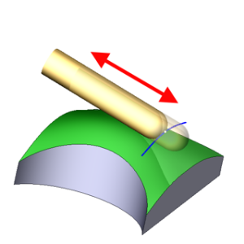

<strong>Contact Points.</strong> С hange the tool's contact point from the initial line to the final line.

.png) .png)

<strong>Start param.</strong> Initial point of contact

.png)

<strong>End param.</strong> End point of contact

.png)

<strong>Lean Angle 1.</strong> If the <strong>Tool Orientation</strong> is set as <strong>To Rotary Axis</strong> it is the angle by which the tool deviates in the positive direction from the initial vector in a plane perpendicular to the <strong>Rotary Axis.</strong>

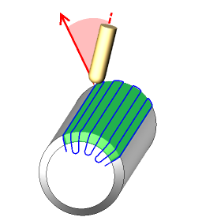

<strong>Lean Angle 2.</strong> If the <strong>Tool Orientation</strong> is set as <strong>To Rotary Axis</strong> it is the angle by which the tool deviates in the negative direction from the initial vector in a plane perpendicular to the <strong>Rotary Axis</strong>.

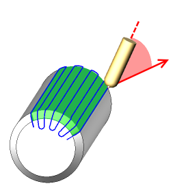

<strong>Origin</strong>. Specifies the pole coordinates if the <strong>Tool Orientation</strong> is set as <strong>Through Point.</strong>

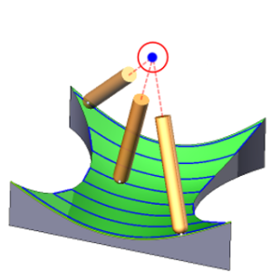

#### Limit Rotation Angles:

When the flag is set, it specifies the limit values of the tool's angular position relative to the specified axis.

Click here to expand..

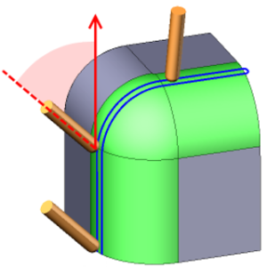

Click here to expand..

<strong>Around X (YZ).</strong> Activating the flag defines the tool's tilt limit values relative to the X axis within the YZ plane.

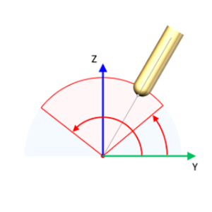

<strong><strong>Around Y (XZ).</strong></strong> Activating the flag defines the tool's tilt limit values relative to the Y axis within the XZ plane.

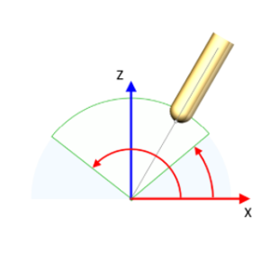

<strong><strong>Around Z (XY).</strong></strong> Activating the flag defines the tool's tilt limit values relative to the Z axis within the XY plane.

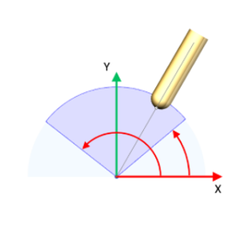

<strong>Conical limit.</strong> Activating the flag establishes maximum and minimum tilt angles of the tool relative to the designated axis, constrained by two cones with specified angles.

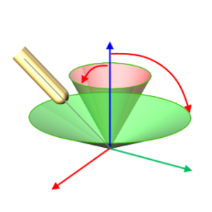

#### Job zone.

Enables additional modification of the working area initially selected on the <strong>Job assignment</strong> tab.

Click here to expand..

<strong>Margins.</strong> For strategies that run parallel to planes, there are constraints on the positioning of slicing planes.

<strong>Full</strong>. There are no constraints on the formation of slicing planes.

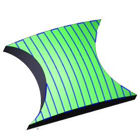

<strong>Points</strong>. Arrange slicing planes between two designated red points. Use the mouse to drag these points to the appropriate locations in the graphic window.

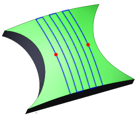

<strong>Start Margin.</strong> I n curve or surface-based strategies, the parameter determines the offset from the First Curve or Surface, i where the toolpath formation begins.

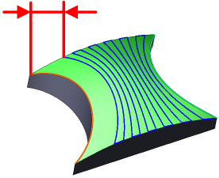

<strong>Zone Width.</strong> In curve or surface-based strategies, the parameter determines the distance from the <strong>Start Margin</strong> to t he last machining pass.

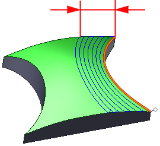

<strong>End Margin.</strong> The parameter defines the offset from the <strong>Second Curve</strong> or <strong>Surface</strong>, up to which the toolpath is formed.

<strong>Limit Job Zone.</strong> In the <strong>Across Curve</strong> strategy, it allows using for the trajectory only the section of the <strong>Machined Surface</strong> closer to the current point on the curve.

<strong>Machining from inside.</strong> The parameter allows you to process the internal surfaces of the part (project the trajectory onto the internal surfaces of the part)

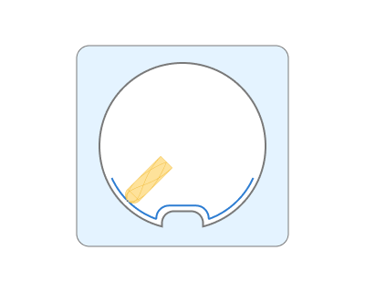

<strong>Max retract height.</strong> The projection zone is defined. Projection will not be performed on surfaces located below this level. Сhecks for tool-part collisions only below a specified height

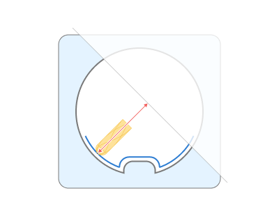

Some parameter group works similarly to the <strong>Plane finishing operation.</strong> [Details](713.md)

#### Corners smoothing.

When there is a sudden change of the tool direction, the milling control performs deceleration before starting the turn, and then accelerates again. This fact can lead to vibrations and high tool and milling machine wear. The problem can be solved if the toolpath has very few or no breaks. For this reason, in the system there is the toolpath smoothing function using the defined radius for machining inner or outer corners of the model.

Click here to expand..

<strong>Blend Distance.</strong> Smoothing occurs within this distance inside the sharp corner.

.png) .png)

#### Roughing Passes.

Toolpath is offset in plane by the <strong>Roughing passes</strong> thickness amount. Additional passes are added to the contour by the value specified in the parameters with the specified number of steps.

Click here to expand..

<strong>Orientation of roughing passes:</strong>

Click here to expand..

<strong>By Surface Normal.</strong> Calculating roughing paths involves offsetting the finish paths along the surface normal direction.

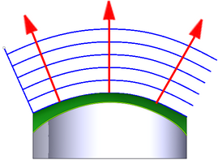

<strong>Along Tool Axis.</strong> Calculating roughing paths involves offsetting the finish paths along the tool's axis.

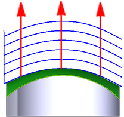 Tool orientation

<strong>In Tool Plane.</strong> Calculating roughing paths involves offsetting the finish paths within the plane of tool motion. This approach is effective for the strategy <strong>Parallel to Vertical Plane</strong> and when surfaces are machined with the end part of the tool.

<strong>Perpendicular to Tool Axis.</strong> Calculating roughing paths involves offsetting the finish paths within the plane perpendicular to the tool axis,. This approach is effective for the strategy <strong>Parallel to Horizontal Plane</strong>.

<strong>By Default.</strong> Displays the default calculation method adopted in the system.

<strong>Count.</strong> It is the count of rough passes.

<strong>Step</strong>. It is the distance between rough passes.

.png)

<strong>Sort By.</strong> Specifies the execution order for rough passes.

<strong>Levels</strong>. Rough passes are executed in the order of the layers' arrangement.

<strong>Strings</strong>. Rough passes are executed in the order of the strings' arrangement.

#### Project Toolpath onto the Part:

By setting the flag, the system generates tool paths for processing the surfaces identified as <strong>Surfaces for Projection</strong> in the <strong>Job Assignment</strong> by mapping the path derived from the <strong>Machining Surface</strong> onto the <strong>Surfaces for Projection.</strong>

Click here to expand..

In this instance, identify auxiliary geometry surfaces, obtainable through extra constructions in the CAD module, as the <strong>Machining Surfaces</strong> instead of the part surfaces needing direct milling. Arrange these surfaces so that projecting the toolpath from them is straightforward. Declare the milling surfaces as the <strong>Surfaces for Projection</strong>.

.png) .png)

<strong>Along tool axis.</strong> Projects along the tool axis.

<strong>By surface normal.</strong> Projection occurs along the surface normals.

<strong>Max deviation.</strong> This distance represents how far the trajectory can move away from the original position along the surface normal.

#### Trimming:

Allows for the skipping of surfaces not intended for machining and allows for the extension of the toolpath.

Click here to expand..

<strong>Hole Capping.</strong> Activating this option allows the system to skip holes with diameters that are equal to or smaller than the specified dimension.

 

<strong>Gap capping.</strong> By enabling this feature, the system can close toolpath gaps smaller than the specified dimension.

.png) .png)

<strong>Extend (+)/Trim (-) passes.</strong> With this setting, users can extend or trim the initial and final segments of the toolpath.

__Trim_(-)_passes.png)

<strong>Start</strong>. Entering a positive value, the system extends the start of the working passes of the toolpath by the specified amount. Entering a negative value shortens the beginning of the passes.

<strong>End</strong>. Entering a positive value, the system extends the end of the working passes of the toolpath by the specified amount. Entering a negative value shortens the end of the passes.

### Parameters:

This tab contains the main parameters for controlling the part, workpiece, fixture and other items, which allow you to change the trajectory. [Details](100112.md)

### Links/Leads:

In the Links/Leads tab, you define the parameters for rapid movements. These movements include tool approach from the tool change position, engage to the start of the working stroke, retraction after the final cutting motion, transitions between working passes, and return to the tool change point. You can configure the sequence of movements along the coordinates, the trajectory of these motions, and the magnitude of displacements.

Click here to expand..

<strong>Сonsists of:</strong>

<strong>Approach/Return.</strong> This group of parameters manages the tool movements from the tool change position to the start of the engage toolpathes, and back. [Details](100116.md).

<strong><strong>Links.</strong></strong> Defines the rules governing Entry/Exit links and links between work moves. [Details](100130.md).

<strong>Leads.</strong> Allows you to add additional engage and retract to the working moves using their feed. [Details](100136.md).

<strong>Safe motions.</strong> Defines the type of <strong>Safety Surface</strong> and the distance from the workpiece to it. This surface facilitates transitions between the processed surfaces or tool paths, and the first stage of approach or return occurs toward it. [Details](100117.md).

<strong>Advanced links settings.</strong> This group of parameters specifies the features of trajectory formation for primarily five-axis operations, considering optimal movements of rotational axes. [Details](100118.md).

<strong>Distances.</strong> Distances used in Links rules [Details](100140.md).

### Feeds/Speeds:

Using this dialogue the user can define the spindle rotation speed; the rapid feed value and the feed values for different areas of the toolpath. Spindle rotation speed can be defined as either the rotations per minute or the cutting speed. The defining value will be underlined. The second value will be recalculated relative to the defining value, with regard to the tool diameter. [Details](100142.md)

### Transformations:

Parameter's kit of operation, which allow to execute converting of coordinates for calculated within operation the trajectory of the tool. [Details](10168.md).

### Part:

A Part is a group of geometrical elements that defines the space to check for gouges. [Details](330.md)

### Workpiece:

A workpiece model of an operation defines the material to be machined. [Details](738.md)

### Fixtures:

As the Fixtures the fixing aids such as chucks, grips, clamps, etc., and the restriction areas of any other nature are usually specified. [Details](10283.md)
