# Rotary finishing

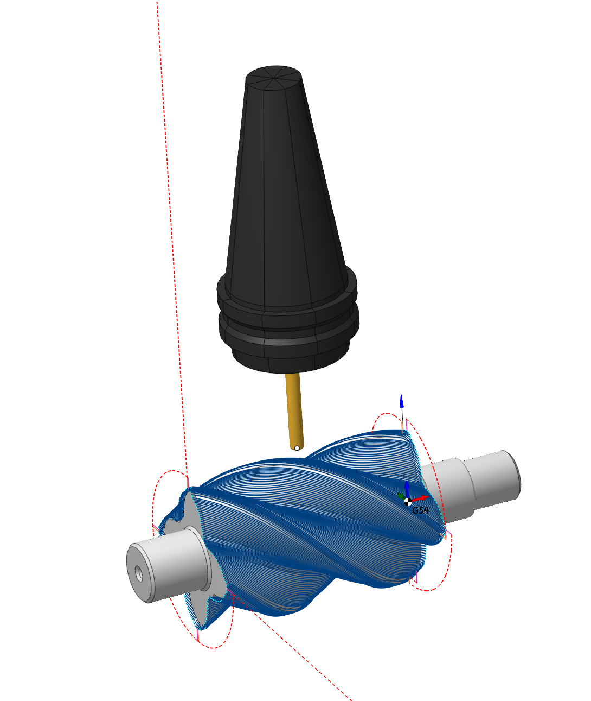

## Application area:

The rotary machining operation is available if machine has at least <strong>one continuous rotary axis</strong>. It is used for the machining of the camshafts, crankshafts, worm shafts, paddles, decorate parts and so on. The main peculiarity of the operation is that it uses the 4th rotary axis together with the linear axes. The 5th axis (when it exists) is fixed. Sometimes the 5th axis can be used also. The <strong>Rotary machining operation</strong> gives the possibility to machine some surfaces of the part or the part as a whole. In the first case the required surfaces must be specified in the job assignment. In the second case the job assignment must be empty.

### Job assignment:

<strong>Faces.</strong> Select various surfaces of the part as the working task. The system will calculate the trajectory based on the chosen surfaces.

<strong>Spiral curve.</strong> The curve needed to indicate the angle of the spiral for the strategy <strong>Side angle</strong>.

<strong>Properties.</strong> Displays the properties of an element. It is possible to add the stock. You can also call this menu by double clicking on an item in the list.

<strong>Delete.</strong> Removes an item from the list.

<strong>Restrictions.</strong> It allows you to restrict areas that should not be machined. [Details](101231.md)

### Strategy.

#### Job zone.

It enables additional modification of the working area initially selected on the <strong>Job assignment</strong> tab.

Click here to expand..

<strong>Surface only.</strong> Machining occurs only on the selected surfaces.

<strong>With edges.</strong> The resulting toolpath features areas of machining selected surfaces as well as tool rolling sections on edges of selected surfaces.

<strong>With restriction model.</strong> The resulting toolpath features areas of machining selected surfaces, tool rolling sections on edges of selected surfaces, and areas with surfaces that form constraints.

<strong>Rotary axis.</strong> The system directs tool's axis vector from the designated <strong><strong>Rotary Axis.</strong></strong> The rotary axis position can be defined in the properties inspector. You can adjust the rotary axis interactively using the arrow or select it from the drop-down menu.

If the mode is set to the <strong>Along X</strong>, <strong>Along Y</strong> or <strong>Along Z</strong>, then the axis of rotation will be oriented along the corresponding axis of the coordinate system.

<strong>Direction.</strong> If mode is <strong>Custom(WCS)</strong> then axis vector must be defined manually in the fields <strong>X,Y,Z</strong> of custom direction group. Specify the direction cosines relative to each axis.

<strong>Origin.</strong> The <strong>Origin</strong> field defines the point that acts as the coordinate start for the chosen rotary axis.

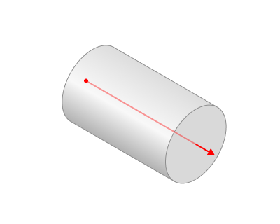

<strong>Base CS.</strong> The Base Coordinate System (Base CS) changes the coordinate system between the global and local coordinate systems of the part.

<strong>Min. axial position.</strong> The minimum distance from the <strong>Origin</strong> along the axis of rotation. By default, it is taken from the workpiece.

<strong>Max. axial position.</strong> The maximum distance from the <strong>Origin</strong> along the axis of rotation. By default, it is taken from the workpiece.

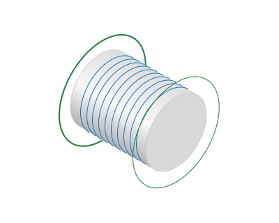

<strong>Angular domain.</strong> This is an area defined by <strong>Start Angle</strong> and <strong>Finish Angle</strong> within which machining occurs. To change the job zone sizes you can mouse drag corresponding side of the visualized sector or specify the exact numerical value in the text box that appears next to dimension line.

<strong>Full circle.</strong>

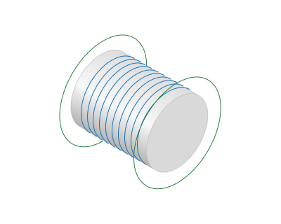

<strong>0...90.</strong>

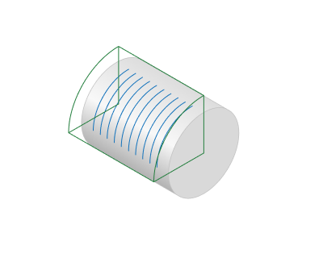

<strong>Start angle.</strong> The initial angle of the sector.

<strong>Finish angle.</strong> The final angle of the sector.

<strong>Machining from inside.</strong> The parameter allows you to process the internal surfaces of the part (project the trajectory onto the internal surfaces of the part). This parameter group works similarly to the <strong>5D Surfacing operation. In the section Job zone.</strong> [Details](10135.md)

#### Trajectory form.

The trajectory output format.

Click here to expand..

The trajectory can be in one of the following forms:

<strong>Linear.</strong> When you select this option, the work passes form as intersection lines between the machined surfaces and planes through the <strong>Rotary Axis</strong>..

<strong>Circular.</strong> When you select this option, the work passes form as intersection lines between the machined surfaces and planes perpendicular to the <strong>Rotary Axis</strong>.

<strong>Spiral.</strong> Activating this option shapes the toolpath into a continuous helical line.

<strong>Step.</strong> Step along the rotary axis.

<strong>Axial direction.</strong> Depending on the feature of the <strong>Trajectory Form</strong> parameter, it either defines the direction of the tool passes themselves or the sequence of several tool passes. In the case of a spiral whose step matches the machining <strong>Step</strong>, this parameter influences the direction of the spiral's twist.

<strong>Forward.</strong> The tool passes is ordered in the <strong>Rotary</strong> Axis vector direction.

<strong>Backward.</strong> The tool passes are ordered in the <strong>reverse</strong> direction of the <strong>Rotary</strong> Axis vector.

<strong>Spiral step.</strong> It defines parameters of the <strong>Spiral</strong> toolpath<strong>.</strong> The spiral step value can be positive or negative. The sign defines the torsion direction.

<strong>Same as the Basic Step.</strong> The toolpath is a single helix line.

<strong><strong>mm, %Diameter, Angle.</strong></strong> You can set it as an arbitrary value either as an absolute amount, as a percentage of the tool diameter, or as the angle of spiral twist in degrees. When the spiral step is not equivalent to the machining <strong>Step</strong>, a sequence of spiral paths occurs, spaced by the machining <strong>Step</strong>.

<strong>Angle by curve.</strong> Automatically determines the helix angle based on the curve from the <strong>Job assignment.</strong>

<strong>Use flexible axis.</strong> When setting the flag, the system automatically determines the axis around which the working strokes are formed in each section a s the average of the curvature centers in the section. This leads to a consistent trajectory that maintains continuity and corrects the orientation of the tool axis relative to the part. The option is suitable for asymmetric parts such as crankshafts

 

#### Tool orientation.

Controls tool axis orientation.

Click here to expand..

<strong>By Normal.</strong> The tool axis is parallel to the surface normal in every tool path point in the plane perpendicular to the <strong>Rotary Axis</strong>.

<strong>Lead angle.</strong> It is a n additional tool tilt angle within the plane of motion direction. It allows to improve the cutting conditions in the contact point. It can be positive or negative.

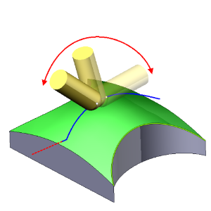

<strong>Side angle.</strong> Specifies the inclination angle value of the tool axis relative to the axis designated as the <strong><strong>Rotary Axis</strong></strong> in the plane perpendicular to the motion direction.

<strong>Normal blend distance.</strong> Parameter for controlling normal vector smoothing. Available when <strong>Use new calculation method</strong> is enabled. [Details](100125.md)

<strong>To axis.</strong> The tool axis is intersect the rotary axis in every tool path point. So the tool axis does not depends on the surface normal.

<strong>Offset.</strong> The point towards which the tool is oriented can be offset from the <strong>Rotary Axis</strong> by the specified value. It can be specified to improve the cutting conditions. The offset can be defined as absolute value or as the percents of the tool diameter. It can be positive or negative.

<strong>Side angle.</strong> Specifies the inclination angle value of the tool axis relative to the axis designated as the <strong><strong>Rotary Axis</strong></strong> in the plane perpendicular to the motion direction.

#### Milling type.

Сan be assigned in almost all operations, except for the curve machining operations. This allows the user to control the required milling type (climb or conventional) during the toolpath calculation process.

Click here to expand..

<strong>Both.</strong> Tool rotation around the <strong>Rotary Axis</strong> reverses with each pass, minimizing auxiliary travel lengths and reducing overall machining time.

<strong>Follow.</strong> Tool rotation direction around the <strong>Rotary Axis</strong> follows the tool's own rotational direction, adjusted to make the tool and workpiece movements compatible for climb milling.

<strong>Counter.</strong> Tool rotation direction around the <strong>Rotary Axis</strong> depends on the tool's own rotational direction, adjusted to make the tool and workpiece movements compatible for conventional milling.

<strong>CW.</strong> When viewed from the positive direction of the axis, the tool rotates around the <strong>Rotary Axis</strong> in a clockwise direction, independent of the tool's own rotation.

<strong>CCW.</strong> When viewed from the positive direction of the axis, the tool rotates around the <strong>Rotary Axis</strong> in a counterclockwise direction, independent of the tool's own rotation.

#### Sorting.

Controls the sequence of toolpath passes during surface machining.

Click here to expand..

<strong>By layers.</strong> The first layer of all profiles is machined in the beginning. After that the next layer is machined.

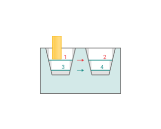

<strong>By strings.</strong> All levels of the first profile are machined first. After that all levels of the next profile are machined.

<strong>Idling minimization.</strong> If the flag is set, the system chooses each subsequent pass to minimize the links distance. When the flag is disabled, it processes all passes in a strict order determined by the machining directions and trajectory type.

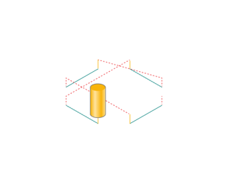 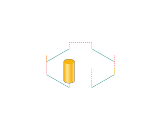

#### Passes.

Defines the settings for rough and finish machining passes.

Click here to expand..

<strong>Rough passes.</strong> Setting the flag triggers the addition of roughing passes.You should specify the overall allowance for these passes in the text field.

<strong>Step.</strong> The step between rough passes. If the step is defined as the number of passes, the system will perform as many additional passes as specified. If the step is defined by distance or as a percentage of the tool diameter, the system calculates the number of passes by dividing the allowance by the roughing <strong>Step</strong>.

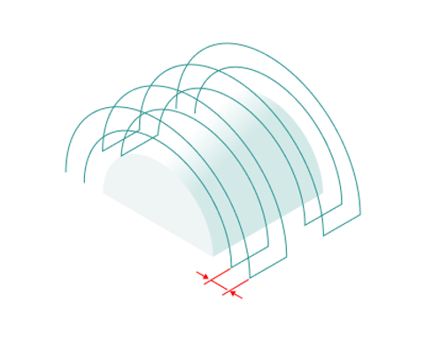

<strong>Passes order.</strong> For additive processing allows you to control the order of passages.

<strong>Insude to outside.</strong> The tool transitions from the central toolpath curves to the outer ones.

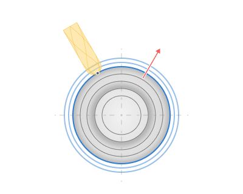

<strong>Outside to insude.</strong> The tool transitions from the outer toolpath curves to the central ones.

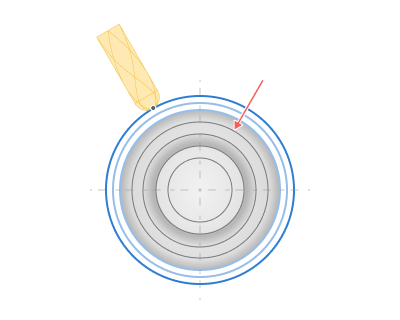

<strong>Finish pass.</strong> When the flag is set, the contour defined in the <strong>Job Assignment</strong> becomes the tool's finishing pass. The system adds an additional roughing pass at the entered distance. If <strong>Rough passes</strong> are in use, the final rough pass will take place at this entered distance.

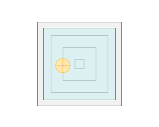 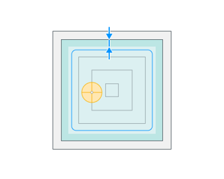

### Parameters:

This tab contains the main parameters for controlling the part, workpiece, fixture and other items, which allow you to change the trajectory. [Details](100112.md)

### Links/Leads:

In the Links/Leads tab, you define the parameters for rapid movements. These movements include tool approach from the tool change position, engage to the start of the working stroke, retraction after the final cutting motion, transitions between working passes, and return to the tool change point. You can configure the sequence of movements along the coordinates, the trajectory of these motions, and the magnitude of displacements.

Click here to expand..

<strong>Сonsists of:</strong>

<strong>Approach/Return.</strong> This group of parameters manages the tool movements from the tool change position to the start of the engage toolpathes, and back. [Details](100116.md).

<strong>Safe motions.</strong> Defines the type of Safety Surface and the distance from the workpiece to it. This surface facilitates transitions between the processed surfaces or tool paths, and the first stage of approach or return occurs toward it. [Details](100117.md).

<strong>Advanced links settings.</strong> This group of parameters specifies the features of trajectory formation for primarily five-axis operations, considering optimal movements of rotational axes. [Details](100118.md).

<strong>Links.</strong> Defines the rules governing Entry/Exit links and links between work moves. [Details](100131.md).

<strong>Leads.</strong> Allows you to add additional engage and retract to the working moves using their feed. [Details](100135.md).

<strong>Distances.</strong> Distances required to switch feeds [Details](100138.md).

### Feeds/Speeds:

Using this dialogue the user can define the spindle rotation speed; the rapid feed value and the feed values for different areas of the toolpath. Spindle rotation speed can be defined as either the rotations per minute or the cutting speed. The defining value will be underlined. The second value will be recalculated relative to the defining value, with regard to the tool diameter. [Details](100142.md)

### Transformations:

Parameter's kit of operation, which allow to execute converting of coordinates for calculated within operation the trajectory of the tool. [Details](10168.md).

### Part:

A Part is a group of geometrical elements that defines the space to check for gouges. [Details](330.md)

### Workpiece:

A workpiece model of an operation defines the material to be machined. [Details](738.md)

### Fixtures:

As the Fixtures the fixing aids such as chucks, grips, clamps, etc., and the restriction areas of any other nature are usually specified. [Details](10283.md)
