# Rotary roughing

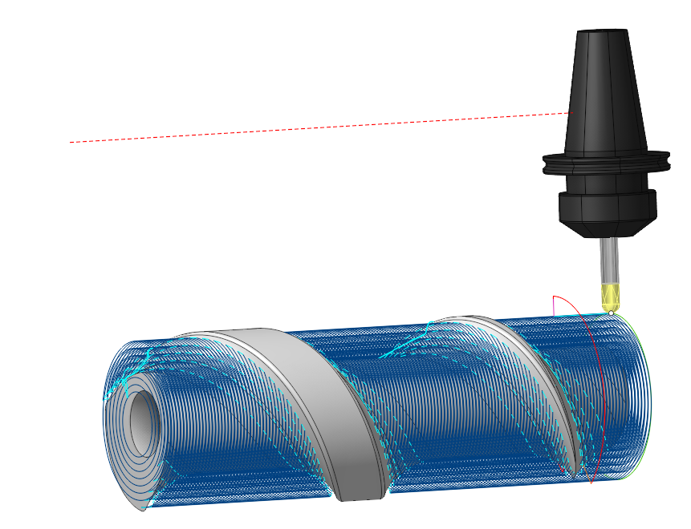

## Application Area:

Rotary Roughing is a continuous rough four-axis machining operation that removes the workpiece material layer by layer. It is similar to the [<strong>Roughing Waterline</strong>](736.md)operation except that the machining layers are not planes, but cylinders with their axis aligned along the Rotary Axis.

### Job Assignment:

<strong>Spiral curve.</strong> The curve needed to indicate the angle of the spiral for the strategy <strong><strong>Side angle</strong>.</strong>

<strong>Top Level.</strong> Specifying the top level by model elements. This level defines the maximum radius on the model where machining happens. [Details](10153.md)

<strong>Bottom Level.</strong> Specifying the bottom level by model elements. This level defines the minimum radius on the model where machining happens. [Details](10153.md)

<strong>Properties.</strong> Displays the properties of an element. It is possible to add the stock. You can also call this menu by double clicking on an item in the list.

<strong>Delete.</strong> Removes an item from the list.

<strong>Restrictions.</strong> It allows you to restrict areas that should not be machined. [Details](101231.md)

### Strategy.

#### Job zone.

It enables additional modification of the working area initially selected on the <strong>Job Assignment</strong> tab.

Click here to expand..

<strong>Rotary axis.</strong> The system directs tool's axis vector from the designated <strong>Rotary Axis.</strong> The rotary axis position can be defined in the properties inspector. You can adjust the rotary axis interactively using the arrow or select it from the drop-down menu.

If the mode is set to the <strong>WCS X (GlobalCS X)</strong>, <strong>WCS Y (GlobalCS Y)</strong> or <strong>WCS Z (GlobalCS Z)</strong>, then the axis of rotation will be oriented along the corresponding axis of the coordinate system.

<strong>Direction.</strong> If mode is <strong>WCS (GlobalCS) (0,0,0)</strong> then axis vector must be defined manually in the fields <strong>X,Y,Z</strong> of custom direction group. Specify the direction cosines relative to each axis.

<strong>Origin.</strong> The <strong>Origin</strong> field defines the point that acts as the coordinate start for the chosen rotary axis.

<strong>Base CS.</strong> The Base Coordinate System (Base CS) changes the coordinate system between the global and local coordinate systems of the part.

Some parameters works similarly to the <strong>Rotary finishing</strong> <strong>.</strong> [Details](10136.md)

#### Trajectory form.

The trajectory output format.

Click here to expand..

The trajectory can be in one of the following forms:

<strong>Linear.</strong> When you select this option, the work passes form as intersection lines between the machined surfaces and planes through the <strong>Rotary Axis</strong>..

<strong>Circular.</strong> When you select this option, the work passes form as intersection lines between the machined surfaces and planes perpendicular to the <strong>Rotary Axis.</strong>

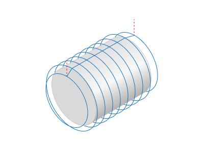

<strong>Spiral.</strong> Activating this option shapes the toolpath into a continuous helical line. The pattern is well suited for machining parts like screws and impellers.

<strong>Step.</strong> It is the distance between tool passes along the rotary axis.

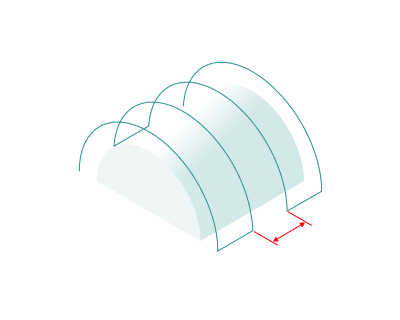

<strong>Axial direction.</strong> Depending on the feature of the <strong>Trajectory Form</strong> parameter, it either defines the direction of the tool passes themselves or the sequence of several tool passes. In the case of a spiral whose step matches the machining <strong>Step</strong>, this parameter influences the direction of the spiral's twist.

<strong>Forward.</strong> The tool passes is ordered in the <strong>Rotary</strong> Axis vector direction.

<strong>Backward.</strong> The tool passes are ordered in the <strong>reverse</strong> direction of the <strong>Rotary</strong> Axis vector.

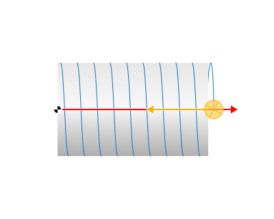

<strong>Spiral step.</strong> It defines parameters of the <strong>Spiral</strong> toolpath<strong>.</strong> The spiral step value can be positive or negative. The sign defines the torsion direction.

<strong>Same as the Basic Step.</strong> The toolpath is a single helix line.

<strong>mm, %Diameter, Angle.</strong> You can set it as an arbitrary value either as an absolute amount, as a percentage of the tool diameter, or as the angle of spiral twist in degrees. When the spiral step is not equivalent to the machining <strong>Step</strong>, a sequence of spiral paths occurs, spaced by the machining <strong>Step</strong>.

<strong>Angle by curve.</strong> Automatically determines the helix angle based on the curve from the <strong>Job assignment.</strong>

<strong>Use flexible axis.</strong> When setting the flag, the system automatically determines the axis around which the working strokes are formed in each section as the average of the curvature centers in the section. This leads to a consistent trajectory that maintains continuity and corrects the orientation of the tool axis relative to the part. The option is suitable for asymmetric parts such as crankshafts

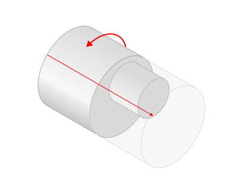 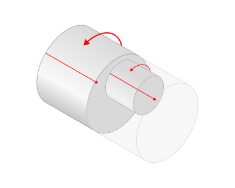

#### Milling Type.

Сan be assigned in almost all operations, except for the curve machining operations. This allows the user to control the required milling type (climb or conventional) during the toolpath calculation process.

The parameters of the <strong>Milling Type</strong> are the same. as in the <strong>Waterline Roughing</strong> <strong>operation</strong>. [Details.](736.md)

#### Tool contact point.

Tool Contact Point (TCP) is a specific location on a cutting tool that defines the primary interaction point between the tool and the workpiece surface or geometric entities during machining operations.

The parameters of this group are the same as in the <strong>5D Surfacing operation</strong>. [Details.](10135.md)

#### Sorting.

Controls the sequence of toolpath passes during surface machining.

Click here to expand..

<strong>By layers.</strong> The first layer of all profiles is machined in the beginning. After that the next layer is machined.

<strong>By strings.</strong> All levels of the first profile are machined first. After that all levels of the next profile are machined.

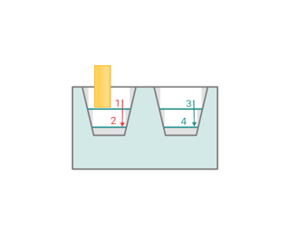

#### Offset.

Click here to expand..

<strong>If enabled:</strong> The point towards which the tool is oriented can be offset from the <strong>Rotary Axis</strong> by the specified value. It can be specified to improve the cutting conditions. The offset can be defined as absolute value or as the percents of the tool diameter. It can be positive or negative.

<strong>If disabled:</strong> Offset is off — tool orientation is aligned with the Rotary Axis.

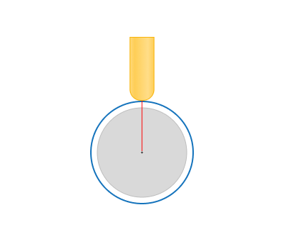 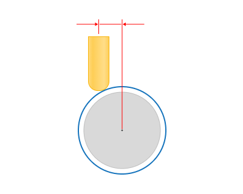

#### Machining levels:

It defines the range along tool axis for the machining.

Click here to expand..

<strong>Depth Step.</strong> Material removed in one pass along the tool axis between the <strong>Top</strong> and <strong>Bottom levels</strong>. If the step is defined as the number of passes, the system will perform as many roughing passes as specified. If the step is defined by distance or as a percentage of the tool diameter, the system calculates the number of passes by dividing the allowance by the roughing <strong>Depth Step</strong>.

<strong>Uniform Step.</strong> Activating the flag causes the system to arrange depth passes to provide an even cutting depth within the allowed material removal.

<strong>Top level.</strong> The radius at which the first pass is made. By default it is the top most level of the machined part.

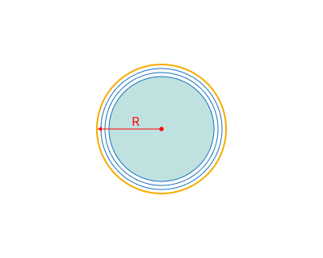

<strong>Bottom level.</strong> The radius at which the final pass is made. Drag the cylinder with the mouse and use 'Smart snap' to align with a feature to set the desired bottom level for machining. If the text in the field is green in colour, the level is calculated automatically as the bottom of the part, wokpiece and fixtures. To return to the automatic mode, simply clear the field and press 'Enter'.

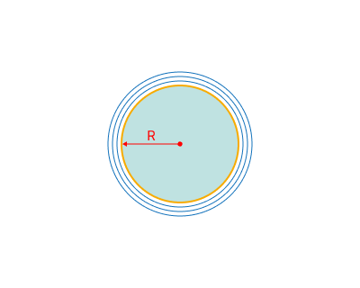

### Parameters:

This tab contains the main parameters for controlling the part, workpiece, fixture and other items, which allow you to change the trajectory. [Details](100112.md)

### Links/Leads:

In the Links/Leads tab, you define the parameters for rapid movements. These movements include tool approach from the tool change position, engage to the start of the working stroke, retraction after the final cutting motion, transitions between working passes, and return to the tool change point. You can configure the sequence of movements along the coordinates, the trajectory of these motions, and the magnitude of displacements.

Click here to expand..

<strong>Сonsists of:</strong>

<strong>Approach/Return.</strong> This group of parameters manages the tool movements from the tool change position to the start of the engage toolpathes, and back. [Details](100116.md).

<strong>Links.</strong> Defines the rules governing Entry/Exit links and links between work moves. [Details](100130.md).

<strong>Leads.</strong> Allows you to add additional engage and retract to the working moves using their feed. [Details](100136.md).

<strong>Safe motions.</strong> Defines the type of <strong>Safety Surface</strong> and the distance from the workpiece to it. This surface facilitates transitions between the processed surfaces or tool paths, and the first stage of approach or return occurs toward it. [Details](100117.md).

<strong>Advanced links settings.</strong> This group of parameters specifies the features of trajectory formation for primarily five-axis operations, considering optimal movements of rotational axes. [Details](100118.md).

<strong>Distances.</strong> Distances used in Links rules [Details](100140.md).

### Feeds/Speeds:

Using this dialogue the user can define the spindle rotation speed; the rapid feed value and the feed values for different areas of the toolpath. Spindle rotation speed can be defined as either the rotations per minute or the cutting speed. The defining value will be underlined. The second value will be recalculated relative to the defining value, with regard to the tool diameter. [Details](100142.md)

### Transformations:

Parameter's kit of operation, which allow to execute converting of coordinates for calculated within operation the trajectory of the tool. [Details](10168.md).

### Part:

A Part is a group of geometrical elements that defines the space to check for gouges. [Details](330.md)

### Workpiece:

A workpiece model of an operation defines the material to be machined. [Details](738.md)

### Fixtures:

As the Fixtures the fixing aids such as chucks, grips, clamps, etc., and the restriction areas of any other nature are usually specified. [Details](10283.md)
