# Morph

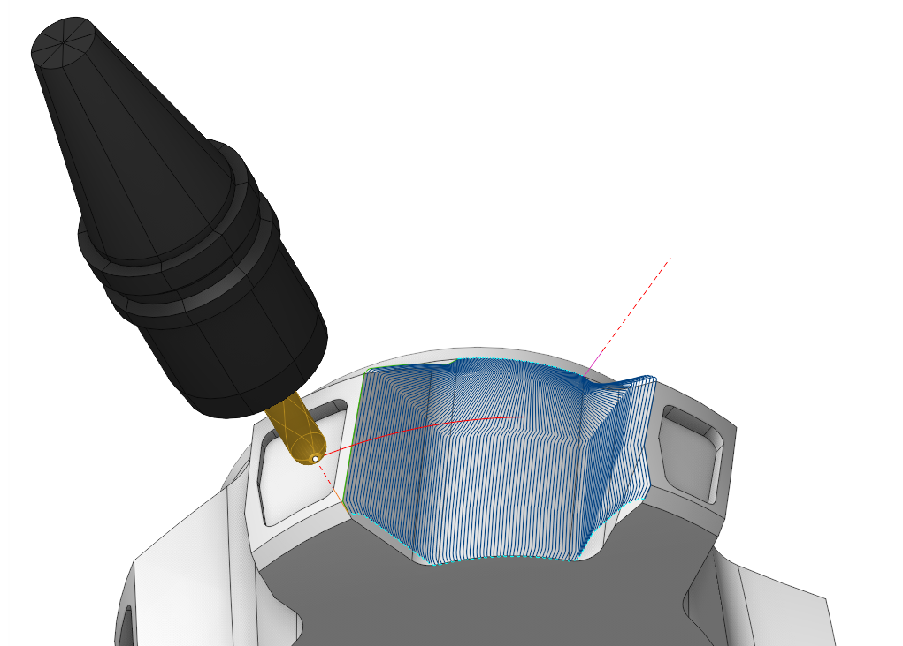

## Application Area:

The system generates toolpath passes as lines spaced at a specified distance, each shaped by a smooth transition from the first defined curve to the second

### Job Asssignment:

<strong>Machining Surfaces.</strong> The system uses the <strong>Machining</strong> Surfaces to restrict the area of machining. Morph generates passes only where a tool has contact with those surfaces. Morph generates passes not between two curves you set in the job assignment, but between two <strong>M</strong><strong>achining</strong> Surfaces contact curves which are closest to those two curves you specify as the <strong>First</strong> and the <strong>Second curve</strong>.

<strong>First Curve.</strong> It is t he starting line from among the two lines between which the system generates the toolpaths.

<strong>Second Curve.</strong> It is t he finishing line from among the two lines between which the system generates the toolpaths.

Sync lines are used to improve the quality of morphing in difficult cases, especially when machining closed contours. A <strong>Sync Line</strong> specifies two corresponding points of the <strong>First</strong> and the <strong>Second</strong> <strong>Curve</strong>. You can use any types of curves as <strong>Sync</strong> <strong>Lines</strong>: edges, 3D curves, 2D geometry curves. They do not have to start and end precisely on the <strong>First</strong> and <strong>Second Curve</strong>. You can draw sync lines at the 2D geometry tab.

<strong><strong>Tilt Curve.</strong></strong> This is t he curve that the tool axis vector aims at when setting <strong><strong>5 Axis Conversion</strong></strong> specification <strong>Through Curve.</strong>

<strong>Properties.</strong> Displays the properties of an element. It is possible to add the stock. You can also call this menu by double clicking on an item in the list.

<strong>Delete.</strong> Removes an item from the list.

<strong>Restrictions.</strong> It allows you to restrict areas that should not be machined. [Details](101231.md)

### Strategy:

#### Strategy:

These parameters allows the user to achieve a required toolpath:

Click here to expand..

<strong>Toolpath Direction:</strong>

<strong>Along</strong>. The system generates tool passes parallel to the <strong>First</strong> and the <strong>Second Curves.</strong> This toolpath is calclulated based on <strong>Across</strong> toolpath. So if it look not good you can always switch to <strong>Across</strong> to find possible reasons out.

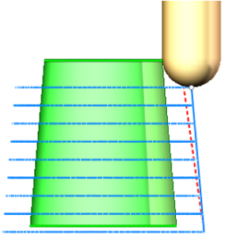

<strong>Across</strong>. The system generates tool passes by connecting corresponding points on the <strong>First</strong> and the <strong>Second Curves.</strong>

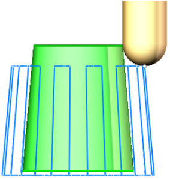

<strong>Spiral.</strong> The resulting toolpath is one smooth spiral that morphs between the <strong>First</strong> and the <strong>Second Curves.</strong> This toolpath is calclulated based on <strong>Across</strong> toolpath. So if it look not good you can always switch to <strong>Across</strong> to find possible reasons out.

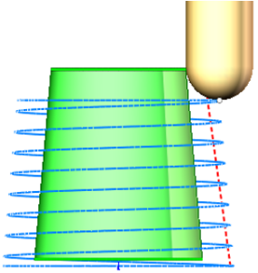

<strong>Step.</strong> The maximum allowed width of cut. Due to the nature of the toolpath the stepover varies from point to point, but it will never exceed this value.

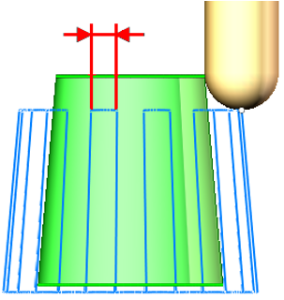

<strong>Tool Containment.</strong> This feature defines methods to develop toolpath curves, considering the tool's interaction with the <strong>Machining Surfaces.</strong>

Click here to expand..

<strong>Contact</strong>. The system generates tool passes where the tool has contact with <strong>Machinig Surfaces,</strong> between two contact curves (point curves of <strong>Machining Surfaces</strong> and tool contact) which are closest to those two curves you specify as the <strong>First</strong> and the <strong>Second curve</strong>. Use this option if the <strong>First</strong> and <strong>Second curves</strong> are the boundary edges of <strong>Machining Surfaces.</strong>

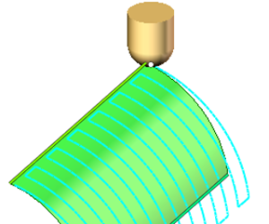

<strong>Center</strong>. The toolpath forms between the motion lines of the tool center on the <strong>First</strong> and <strong>Second Curves</strong> within the <strong>Machining surface</strong> area, ensuring no gouging occurs with the tool's current orientation.

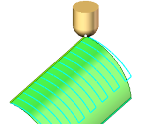

<strong>Inside</strong>. The system shifts t he machining area's borders inward from the <strong>First</strong> and <strong>Second Curves</strong> by the radius of the tool.

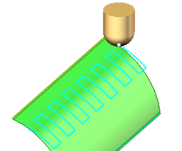

<strong>Outside</strong>. The system shifts t he machining area's borders outwards from the <strong>First</strong> and <strong>Second Curves</strong> by the radius of the tool.

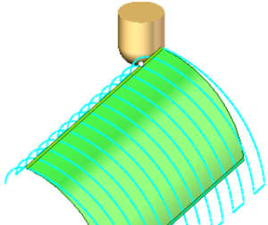

#### Milling Type:

This feature enables users to select the necessary milling direction (climb or conventional) during the toolpath calculation process.

The parameters of the <strong>Milling Type</strong> are the same. as in the <strong>Waterline Roughing</strong> <strong>operation</strong>. [Details.](736.md)

#### Sorting:

Controls the organization of the toolpath during surface machining

<strong>Start Point.</strong> Activating the flag permits the input of coordinates marking the starting point of working passes in surface machining.

#### Machining from inside.

The parameter allows you to process the internal surfaces of the part (project the trajectory onto the internal surfaces of the part). This parameter group works similarly to the <strong>5D Surfacing operation. In the section Job zone.</strong> [Details](10135.md)

#### Tool Axis Orientation:

Controls the tool axis orientation during the machining process.

Click here to expand..

Click here to expand..

<strong>Fixed</strong>. The tool orientation is fixed throughout the toolpath and is determined by the initial position of the machine rotary axes, which is set at the <strong>Setup</strong> tab in the inspector.

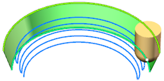

<strong>Normal to Curves.</strong> The tool is positioned by normal to the surface that is formed by connecting corresponding points of the <strong>First</strong> and the <strong>Second</strong> <strong>drive curves</strong>. Additionally, <strong>Lean angles</strong> may be applied to deflect the tool from this direction.

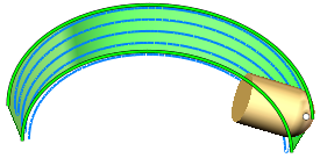

<strong>Normal to Surfaces.</strong> The tool is positioned by normal to the <strong>Machining Surfaces.</strong> The performance of the function depends on the type and accuracy of the elements in the 3D model of the part. Use it on your own risk.

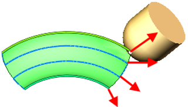

<strong>To Rotary Axis.</strong> The principal tool axis orientation is computed by subtracting the tool center point from the projection of this point onto the rotary axis. The <strong>Side Angle</strong> between the tool axis and the rotary axis can be either computed automatically or specified directly.

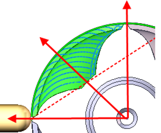

<strong>Lean angle 1.</strong> It is the angle by which the tool is inclined from the normal towards the <strong>Second Curve</strong> near the <strong>First Curve.</strong>

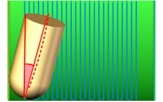

<strong>Lean angle 2.</strong> It is the angle by which the tool is inclined from the normal towards the <strong>First Curve</strong> near the <strong>Second Curve.</strong>

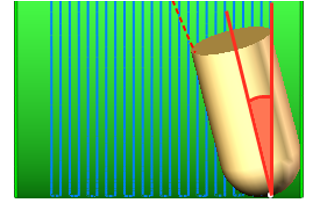

<strong>Alternate front side.</strong> Check this box if CAM system mistakenly tries to machine surfaces from the side opposite to the desired one or there is no toolpath at all.

<strong>Rotary Axis.</strong> Setting the flag locks one of the components of the tool orientation vector, maintaining a constant <strong>Side Angle</strong> between the tool axis and the perpendicular to the specified axis (or the axis itself if the <strong>Tool Orientation</strong> is set as <strong>Perpendicular to Toolpath)</strong>. The parameters of <strong>Rotary axis</strong> are the same as in the <strong>5D Surfacing operation</strong>. [Details.](10135.md)

<strong>Side Angle.</strong> Specifies the inclination angle value of the tool axis relative to the axis designated as the <strong>Rotary Axis.</strong> The parameters of <strong>Side Angle</strong> are the same as in the <strong><strong>5D Surfacing operation</strong>.</strong> [Details.](10135.md)

#### 5 Axis Conversion:

You can control the tool's position when executing operations on a five-axis machine. [Details.](10141.md)

The parameters of tool 's position are the same as in the <strong>5D Surfacing operation</strong>. [Details.](10135.md)

#### Limit Rotation Angles:

When the flag is set and the <strong>5 Axis Conversion</strong> option is on, it specifies the limit values of the tool's angular position relative to the axes. The parameters of <strong>Limit Rotation Angles</strong> are the same as in the <strong>5D Surfacing operation.</strong> [Details.](10135.md)

#### Trimming:

Allows for the skipping of surfaces not intended for machining. The parameters of <strong>Trimming</strong> are the same as in the <strong>Waterline Roughing operation</strong>. [Details.](736.md)

### Parameters:

This tab contains the main parameters for controlling the part, workpiece, fixture and other items, which allow you to change the trajectory. [Details](100112.md)

### Links/Leads:

In the Links/Leads tab, you define the parameters for rapid movements. These movements include tool approach from the tool change position, engage to the start of the working stroke, retraction after the final cutting motion, transitions between working passes, and return to the tool change point. You can configure the sequence of movements along the coordinates, the trajectory of these motions, and the magnitude of displacements.

Click here to expand..

<strong>Сonsists of:</strong>

<strong>Approach/Return.</strong> This group of parameters manages the tool movements from the tool change position to the start of the engage toolpathes, and back. [Details](100116.md).

<strong>Links.</strong> Defines the rules governing Entry/Exit links and links between work moves. [Details](100130.md).

<strong>Leads.</strong> Allows you to add additional engage and retract to the working moves using their feed. [Details](100136.md).

<strong>Safe motions.</strong> Defines the type of <strong>Safety Surface</strong> and the distance from the workpiece to it. This surface facilitates transitions between the processed surfaces or tool paths, and the first stage of approach or return occurs toward it. [Details](100117.md).

<strong>Advanced links settings.</strong> This group of parameters specifies the features of trajectory formation for primarily five-axis operations, considering optimal movements of rotational axes. [Details](100118.md).

<strong>Distances.</strong> Distances used in Links rules [Details](100140.md).

### Feeds/Speeds:

Using this dialogue the user can define the spindle rotation speed; the rapid feed value and the feed values for different areas of the toolpath. Spindle rotation speed can be defined as either the rotations per minute or the cutting speed. The defining value will be underlined. The second value will be recalculated relative to the defining value, with regard to the tool diameter. [Details](100142.md)

### Transformations:

Parameter's kit of operation, which allow to execute converting of coordinates for calculated within operation the trajectory of the tool. [Details](10168.md)

### Part:

A Part is a group of geometrical elements that defines the space to check for gouges. [Details](330.md)

### Workpiece:

A workpiece model of an operation defines the material to be machined. [Details](738.md)

### Fixtures:

As the Fixtures the fixing aids such as chucks, grips, clamps, etc., and the restriction areas of any other nature are usually specified. [Details](10283.md)
