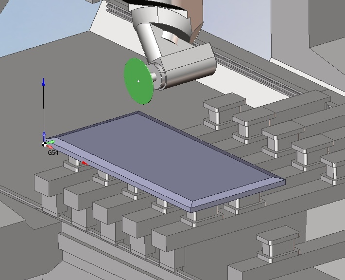
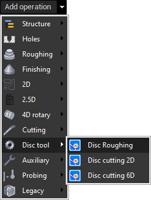
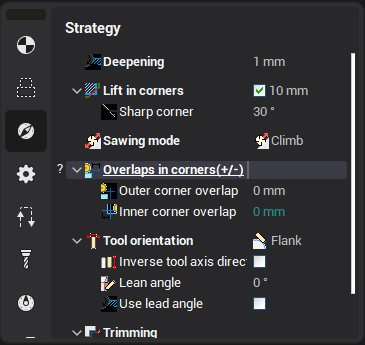
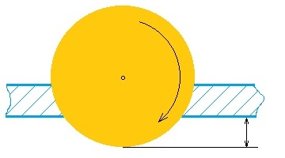

# Saw operation

The operation is designed for the circular saw cutting on the 5-axis milling machines or robots with spindle. The sawing operation is based on the "5D contour" operation. Only few changes are made for the correct approach and retract or the disc tool. Source data for programming is a solid. Machining of the curves taken for example from.dxf are not supported.

Way of use:

1. Create sawing operation.

2. Define the required tool size and speeds, the same way as it can be done for all other operations.

3. To define the job assignment it's necessary to choose the edge of a solid and press "Edge/Curve on surface". Selected edge will be added into the job list. One of the adjacent surfaces will be highlighted by green color. This face will be formed as the result of sawing. If you need to make another adjacent face, you have to click on edge once more, after that the panel with two buttons appears. Press "change the side" button.

4. Unlike "[5D contour](10129.md)" there is the additional parameter in sawing operation to define the overlap.

 

See example of operation on YouTube:

[http://www.youtube.com/watch?v=op5vH1P-V3s](http://www.youtube.com/watch?v=op5vH1P-V3s)
