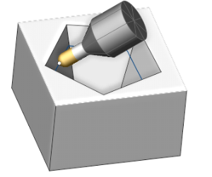
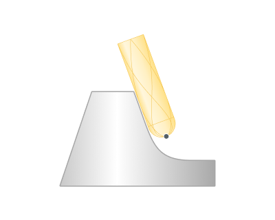
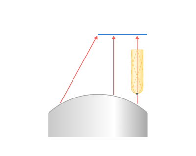
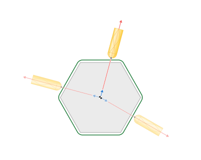
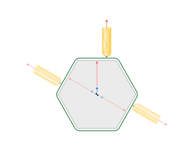

# 5 axis tool path conversion

This option converts 3 axis toolpath into 5 axis for such operations as: [Scallop](10118.md), [Morph](10138.md)and Geodesic. This feature allows to avoid collisions and use minimal length tool. 5 axis tool path conversion can be used with spherical mill tool.

5 axis toolpath conversion options:

<strong>Normal to surface</strong>

The tool is oriented by normal to machining surfaces. Additionally the lead and lean tool angles can be applied to further tilt the tool along or to the side from the cutting direction.

<strong>Flank</strong>

The tool contacts machining surfaces with the peripheral part (cylindrical part for the cylindrical mills). Additionally <strong>lead</strong> and <strong>lean</strong> angles can be applied. The strategy can be used for swarf milling.

<strong>Through point</strong>

The tool axis is oriented to the specified point.

<strong>Through curve</strong>

The tool axis is oriented to the nearest point of the specified Tilt curve. Additionally <strong>lead</strong> angles can be applied.

<strong>To rotary axis</strong>

The tool axis is directed to the rotary axis, as in the rotary machining. Additionally the side angle to the rotary axis and <strong>lean angles</strong> can be specified

<strong>Perpendicular to toolpath</strong>

The tool axis is oriented to the perpendicular to toolpath and perpendicular to the rotary axis. Additionally the side angle to the rotary axis and <strong>blend distance</strong> can be specified.

<strong>4 axis machining with the Rotary axis</strong>

The rotary axis feature allows to transform a 5 axis toolpath into a 4 axis toolpath by locking one of the components (X, Y, Z) of the tool axis direction.

<strong>Limit Rotation angles</strong>

<strong>Limit around axis</strong>

.png)

With this option you can limit the tool on the XY plane, XZ plane or YZ plane between two angles.

<strong>Conical limit</strong>

.png)

With this option, you can limit the tool at an angle along one axis between two cones.
