# 5D by meshes

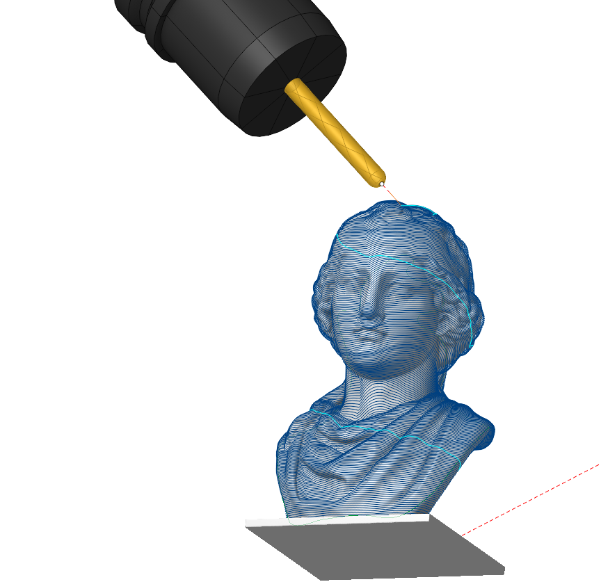

## Application Area:

A versatile 5 axis finishing operation with a powerful set of strategies, tool axis orientation modes and automatic tool and holder collision avoidance. Perfect for finishing of complex shapes such as sculptures or scanned STL models. Easy to use. The operation allows machining mesh models similarly to [Scallop](10118.md), [3D Helical](10119.md) and Waterline strategy from [5D Surfacing](10135.md). The operation allows generating machining toolpath on the 5 axis machines and robots. The operation supports surface models and triangular mesh models. You can use spherical, conical mills with a spherical end and lollipop mills.

To start machining just create the operation and press Run. The operation will generate a scallop pattern on the whole part starting from the bottom level. The tool will stay in the vertical orientation unless there is a collision with the part, otherwise it will be tilted to the side.

<strong>Workflow:</strong>

1. Define the toolpath <strong>Strategy.</strong> The default strategy is Scallop as it allows to machine the whole part with a consistent stepover.
2. Choose the <strong>tool axis orientation</strong>. The default option is <strong>Fixed</strong>, because together with the automatic collision avoidance it doesn't require any additional setup and achieves a smooth and predictable toolpath.
3. Define the <strong>collision avoidance</strong> strategy. The default is <strong>Side Tilting</strong>, as it is works well with Scallop, Helical and Waterline patterns.
4. Optionally, define the job zone
5. Generate the toolpath

### Job assignment

<strong>Machining Surfaces.</strong> Select various surfaces of the part as the working task. The system will calculate the trajectory based on the chosen surfaces.

<strong><strong>Tilt Curve.</strong></strong> This is t he curve that the tool axis vector aims at when setting <strong><strong>Tool Orientation</strong></strong> specification <strong><strong>Through Curve.</strong></strong>

<strong>Job Zone.</strong> Use the <strong>Job Zone</strong> to trim the passes outside the specified 2D containment areas. You can select the normal to the area of <strong>Job Zone</strong>. [Details](10151.md).

<strong>Restrict Zone.</strong> In addition to <strong>Job Zones</strong> in system you can use <strong>Restrict Zones</strong> geometry from curves and edges to specify the workpiece areas that s hould avoid machining in the current operation. [Details](10152.md)

<strong>Start Curves.</strong> Using a closed curve, such as a spline, you can select a model segment for machining. You can specify the machining side and configure vectors to define the tool axis orientation.

<strong>Properties.</strong> Displays the properties of an element. It is possible to add the stock. You can also call this menu by double clicking on an item in the list.

<strong>Delete.</strong> Removes an item from the list.

<strong>Restrictions.</strong> It allows you to restrict areas that should not be machined. [Details](101231.md)

### Strategy:

#### Strategies:

This parameter allows the user to achieve a required toolpath:

Click here to expand..

<strong><strong>Waterline</strong>.</strong> The system generates the tool passes as section lines of the <strong><strong>Machining Surface</strong></strong> by horizontal planes (planes are perpendicular to the tool axis), similar to the strategy in a <strong>Waterline Finishing operation</strong> [Details.](841.md)

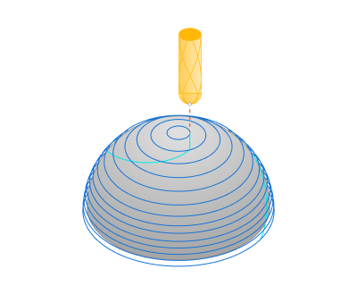

<strong>Plane</strong>. The system generates the tool passes as section lines of the <strong>Machining Surface</strong> by vertical planes (planes are parallel to the tool axis), similar to the strategy in a <strong>Plane Finishing operation.</strong> [Details.](713.md)

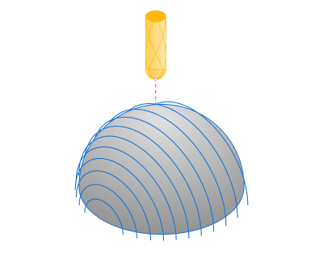

<strong>Scallop</strong>. The Scallop toolpath starts from the curves lying on the part surfaces and is generated by repeatedly offsetting those curves inwards until the curves collapse. The system generates toolpath as in the <strong>Scallop finishing operation</strong>. [Details.](10118.md)

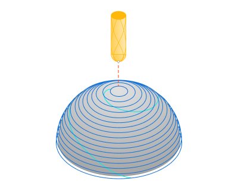

<strong>Helical</strong>. The strategy generates continuous helical passes as in the <strong>3D Helical operation</strong>. [Details.](10119.md)

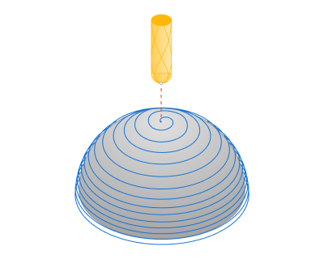

<strong>Step</strong>. The maximum allowed width of cut.

<strong>XY Angle.</strong> This is the r otation angle of the section planes around the tool axis.

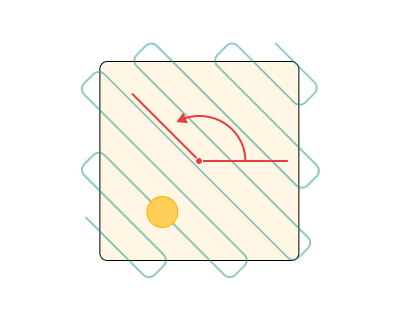

#### Start From:

This group of parameters appears when the <strong>Scallop</strong> strategy is active and determines the construction of the initial toolpath curves.

Click here to expand..

<strong>Bottom</strong>. The toolpath begins at the <strong>Bottom Level</strong> of machining. within the <strong>Job Assignment.</strong>

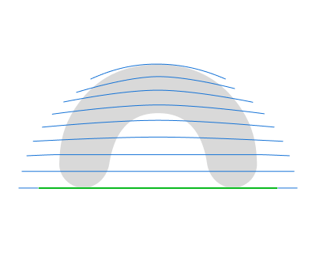

<strong>Job Boundary.</strong> The toolpath begins at the curves of the <strong>Job Zone.</strong>

Other parameters of this group are the same as in the <strong>Scallop Finishing operation.</strong> [Details.](10118.md)

#### Smooth Radius:

This parameter appears when the <strong>Helical</strong> strategy is active and a llows for the smoothing of inner toolpath corners using a designated radius.

Click here to expand..

.png) .png)

#### Job zone:

Enables additional modification of the working area initially selected on the <strong>Job assignment</strong> tab.

Click here to expand..

<strong>Restrict Job Zone:</strong>

<strong>With Edges.</strong> Upon this parameter's activation, the system machines both the surfaces specified in the <strong>Job Assignment</strong> and their boundary edges.

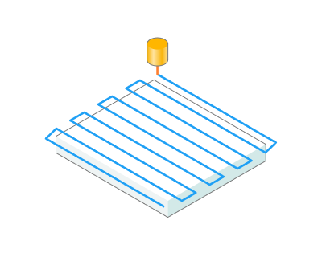

<strong>Surface Ony.</strong> Upon activation of this parameter, the system processes exclusively the surfaces specified in the J <strong>ob Assignment</strong>, excluding their bounding edges.

<strong>Rotary Axis.</strong> Specifies the origin and direction for tracking this group's parameters. The <strong>Rotary Axis</strong> is defined by its <strong>Origin</strong> and <strong>Direction</strong>. You can easily set the desired parameters of the rotary axis both in the inspector and with the mouse in the graphic view.

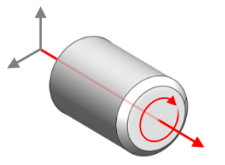

<strong>WCS X (Global CS X).</strong> The X axis of the specified coordinate system is the <strong>Rotary Axis</strong>.

<strong>WCS Y (Global CS Y).</strong> The Y axis of the specified coordinate system is the <strong>Rotary Axis</strong>.

<strong>WCS Z (Global CS Z).</strong> The Z axis of the specified coordinate system is the <strong>Rotary Axis</strong>.

<strong>WCS (0,0,1) (Global CS (0,0,1)).</strong> The vector of the <strong>Rotary Axis</strong> gets its definition from direction cosines relative to each axis.

<strong>Direction</strong>. Specify the direction cosines relative to each axis.

<strong>Origin</strong>. Specify the origin coordinates for tracking this group's parameters.

<strong>Base CS</strong>. Specify the coordinate system to configure the initial position and orientation of the <strong>Rotation Axis</strong>.

<strong>Tool axis.</strong> The vector of the <strong>Rotary Axis</strong> is the tool axis.

<strong><strong>Top level.</strong></strong> The highest distance from the <strong>Origin</strong> where tool passes occur. The level at which the final pass is made. By default it is the top most level of the machined part.

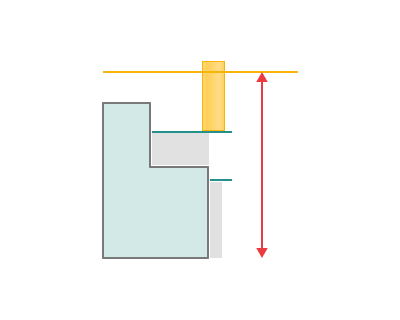

<strong>mm</strong>. Specify desired dimension from the <strong>Origin</strong> to the <strong>Top Level</strong> in the text field in the inspector. You can also drag the plane with the mouse or drag the plane centre circle and use 'Smart snap' to align with a feature or, click on the dimension in the graph view.

<strong>Auto</strong>. The system determines the <strong>Top Level</strong> from the highest points in the designated areas of the <strong>Job Assignment</strong>.

<strong>Bottom Level.</strong> The lowest distance from the <strong>Origin</strong> where tool passes occur.

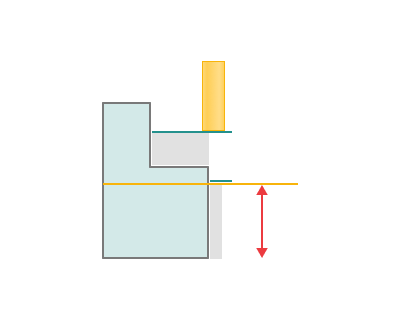

<strong>mm</strong>. Specify desired dimension from the <strong>Origin</strong> to the <strong>Bottom Level</strong> in the text field in the inspector. You can also d rag the plane with the mouse or drag the plane centre circle and use 'Smart snap' to align with a feature or, click on the dimension in the graph view.

<strong>Auto</strong>. T he system determines the <strong>Bottom Level</strong> from the lowest points in the designated areas of the <strong>Job Assignment</strong>.

<strong>Machining Side.</strong> Identifies the permissible side of the surface for machining. [Details.](724.md)

<strong>Front</strong>. The tool can only process from the side with the positive direction of the surface normal vector.

.png)

<strong>Back</strong>. The tool can only perform processing from the side opposite to the surface normal vector.

.png)

<strong>Both</strong>. The tool can perform processing from both sides of the surface.

<strong>By Default</strong>. Utilizes the machining method set as the default in the system.

#### Milling Type:

Сan be assigned in almost all operations, except for the curve machining operations. This allows the user to control the required milling type (climb or conventional) during the toolpath calculation process.

The parameters of the <strong>Milling Type</strong> are the same. as in the <strong>Waterline Roughing</strong> <strong>operation</strong>. [Details.](736.md)

#### Sorting.

Controls the sequence of toolpath passes during the surface machining.

Click here to expand..

<strong>Machining Direction.</strong> Controls the direction of tool motion on toolpath curves. The parameters of this function are the same as in the <strong>Scallop Finishing operation</strong>. [Details](10118.md).

<strong>Start from.</strong> Specifies the starting level for tool motion. The parameters of this function are the same as in the <strong>3D Helical operation</strong>. [Details.](10119.md)

<strong>Change Direction.</strong> Allows for the modification of pass execution order - from bottom to top or top to bottom.

#### Tool Orientation:

Controls tool axis orientation. The principal parameters of this function are the same as in the <strong>5D Surfacing operation</strong>. [Details.](10135.md)

Click here to expand..

<strong>Singularity avoidance angle.</strong> With this option, the tool deviates from the fixed axis at a specified angle consistently, even when there are no collisions. As a result, the "singularity" of the rotating table is avoided.

#### Avoid Collisions:

With the <strong>Check Holder</strong> function, this feature detects segments of the toolpath where the tool holder collides with the part and modifies those segments according with the specified strategy. [Details](11211.md)

#### Limit Rotation Angles:

This option specifies the limit values of the tool's angular position relative to the axes. The parameters of <strong>Limit Rotation Angles</strong> are the same as in the <strong>5D Surfacing operation.</strong> [Details.](10135.md)

#### Trimming:

Allows for the skipping of surfaces not intended for machining and allows for the extension of the toolpath. The parameters of <strong>Trimming</strong> are the same as in the <strong>Waterline Roughing operation</strong>. [Details.](736.md)

### Parameters:

This tab contains the main parameters for controlling the part, workpiece, fixture and other items, which allow you to change the trajectory. [Details](100112.md)

### Links/Leads:

In the Links/Leads tab, you define the parameters for rapid movements. These movements include tool approach from the tool change position, engage to the start of the working stroke, retraction after the final cutting motion, transitions between working passes, and return to the tool change point. You can configure the sequence of movements along the coordinates, the trajectory of these motions, and the magnitude of displacements.

Click here to expand..

<strong>Сonsists of:</strong>

<strong>Approach/Return.</strong> This group of parameters manages the tool movements from the tool change position to the start of the engage toolpathes, and back. [Details](100116.md).

<strong>Links.</strong> Defines the rules governing Entry/Exit links and links between work moves. [Details](100130.md).

<strong>Leads.</strong> Allows you to add additional engage and retract to the working moves using their feed. [Details](100136.md).

<strong>Safe motions.</strong> Defines the type of <strong>Safety Surface</strong> and the distance from the workpiece to it. This surface facilitates transitions between the processed surfaces or tool paths, and the first stage of approach or return occurs toward it. [Details](100117.md).

<strong>Advanced links settings.</strong> This group of parameters specifies the features of trajectory formation for primarily five-axis operations, considering optimal movements of rotational axes. [Details](100118.md).

<strong>Distances.</strong> Distances used in Links rules [Details](100140.md).

### Feeds/Speeds:

Using this dialogue the user can define the spindle rotation speed; the rapid feed value and the feed values for different areas of the toolpath. Spindle rotation speed can be defined as either the rotations per minute or the cutting speed. The defining value will be underlined. The second value will be recalculated relative to the defining value, with regard to the tool diameter. [Details](100142.md)

### Transformations:

Parameter's kit of operation, which allow to execute converting of coordinates for calculated within operation the trajectory of the tool. [Details](10168.md)

### Part:

A Part is a group of geometrical elements that defines the space to check for gouges. [Details](330.md)

### Workpiece:

A workpiece model of an operation defines the material to be machined. [Details](738.md)

### Fixtures:

As the Fixtures the fixing aids such as chucks, grips, clamps, etc., and the restriction areas of any other nature are usually specified. [Details](10283.md)
