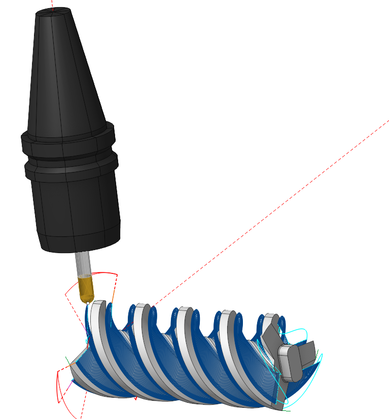
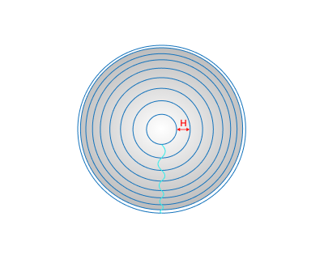
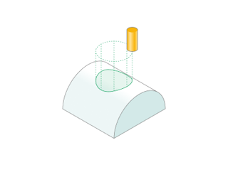

# Rotary waterline operation

## Application Area:

This operation is based on the <strong>5D surfacing</strong> operation and preconfigurated for a rotary machining of models like a screw and body rotation. It is available for <strong>4x</strong> and <strong>5x</strong> configrations, but it locks many five-axis machining strategies, tool incline angles, singularity avoidance functions, and axis deviation. It only comes pre-set with the <strong>Around Rotaty Axis</strong> strategy and the <strong>Tool Orientation</strong> is set to <strong>To Rotary Axis</strong> only. So, t he system generates the tool p asses as sections of the <strong>Machining Surface</strong> at a specified <strong>Step</strong> by employing cylinders with an axis specified as the <strong>Rotary Axis</strong>. The operation will process the entire model when the <strong>Job Assignment</strong> is empty.

### Job Assignment:

<strong>Machining Surfaces.</strong> Select various surfaces of the part as the working task. The system will calculate the trajectory based on the chosen surfaces.

<strong>Surfaces for Projection.</strong> These are the s urfaces intended for machining onto which the toolpath transfers when enabling the <strong>Project Toolpath onto the Part</strong> option in the <strong>Strategy</strong> tab.

<strong>Job Zone.</strong> Use the <strong>Job Zone</strong> to trim the passes outside the specified 2D containment areas. You can select the normal to the area of <strong>Job Zone</strong>. [Details](10151.md).

<strong>Restrict Zone.</strong> In addition to <strong>Job Zones</strong> in system you can use <strong>Restrict Zones</strong> geometry from curves and edges to specify the workpiece areas that s hould avoid machining in the current operation. [Details](10152.md)

<strong>Properties.</strong> Displays the properties of an element. It is possible to add the stock. You can also call this menu by double clicking on an item in the list.

<strong>Delete.</strong> Removes an item from the list.

<strong>Restrictions.</strong> It allows you to restrict areas that should not be machined. [Details](101231.md)

### Strategy:

#### Step:

The maximum allowed width of cut.

Click here to expand..

#### Adaptive Step:

Click here to expand..

<strong>If enabled:</strong> This parameter adjusts the distances between tool passes according to the curvature radii of the surface and the tool to maintain uniform scallop height after surface machining. [Details](113.md).

<strong>If disabled:</strong> This is the fixed vertical distance between consecutive tool passes

 

#### Milling Type:

Сan be assigned in almost all operations, except for the curve machining operations. This allows the user to control the required milling type (climb or conventional) during the toolpath calculation process.

The parameters of the <strong>Milling Type</strong> are the same. as in the <strong>Waterline Roughing</strong> <strong>operation</strong>. [Details](736.md)

#### Sorting:

Controls the sequence of toolpath passes during surface machining. The parameters of this group are the same, as in the <strong>5D Surfacing operation</strong>. [Details.](10135.md)

#### Rotary Axis.

This is t he axis of section cylinders used to construct the tool path lines.

Click here to expand..

#### Job zone:

Enables additional modification of the working area initially selected on the <strong>Job assignment</strong> tab.

Click here to expand..

<strong>R min</strong>. The smallest radius from the <strong>Rotary Axis</strong>, where tool passes occur.

<strong>R max</strong>. The largest radius from the <strong>Rotary Axis</strong>, where tool passes occur.

#### Corners smoothing:

When there is a sudden change of the tool direction, the milling control performs deceleration before starting the turn, and then accelerates again. This fact can lead to vibrations and high tool and milling machine wear. The problem can be solved if the toolpath has very few or no breaks. For this reason, in the system there is the toolpath smoothing function using the defined radius for machining inner or outer corners of the model. The parameters of this group are the same, as in the <strong>5D Surfacing operation</strong>. [Details](736.md)

#### Roughing Passes.

Toolpath is offset in plane by the <strong>Roughing passes</strong> thickness amount. Additional passes are added to the contour by the value specified in the parameters with the specified number of steps. The parameters of this group are the same, as in the <strong>5D Surfacing operation</strong>. [Details](10135.md)

#### Project Toolpath onto the Part:

By setting the flag, the system generates tool paths for processing the surfaces identified as <strong>Surfaces for Projection</strong> in the <strong>Job Assignment</strong> by mapping the path derived from the <strong>Machining Surface</strong> onto the <strong>Surfaces for Projection.</strong>

Click here to expand..

In this instance, identify auxiliary geometry surfaces, obtainable through extra constructions in the CAD module, as the <strong>Machining Surfaces</strong> instead of the part surfaces needing direct milling. Arrange these surfaces so that projecting the toolpath from them is straightforward. Declare the milling surfaces as the <strong>Surfaces for Projection</strong>.

#### Trimming:

Allows for the skipping of surfaces not intended for machining and allows for the extension of the toolpath. The parameters of this group are the same, as in the <strong>5D Surfacing operation</strong>. [Details](10135.md)

### Parameters:

This tab contains the main parameters for controlling the part, workpiece, fixture and other items, which allow you to change the trajectory. [Details](100112.md)

### Links/Leads:

In the Links/Leads tab, you define the parameters for rapid movements. These movements include tool approach from the tool change position, engage to the start of the working stroke, retraction after the final cutting motion, transitions between working passes, and return to the tool change point. You can configure the sequence of movements along the coordinates, the trajectory of these motions, and the magnitude of displacements.

Click here to expand..

<strong>Сonsists of:</strong>

<strong>Approach/Return.</strong> This group of parameters manages the tool movements from the tool change position to the start of the engage toolpathes, and back. [Details](100116.md).

<strong>Links.</strong> Defines the rules governing Entry/Exit links and links between work moves. [Details](100130.md).

<strong>Leads.</strong> Allows you to add additional engage and retract to the working moves using their feed. [Details](100136.md).

<strong>Safe motions.</strong> Defines the type of <strong>Safety Surface</strong> and the distance from the workpiece to it. This surface facilitates transitions between the processed surfaces or tool paths, and the first stage of approach or return occurs toward it. [Details](100117.md).

<strong>Advanced links settings.</strong> This group of parameters specifies the features of trajectory formation for primarily five-axis operations, considering optimal movements of rotational axes. [Details](100118.md).

<strong>Distances.</strong> Distances used in Links rules [Details](100140.md).

### Feeds/Speeds:

Using this dialogue the user can define the spindle rotation speed; the rapid feed value and the feed values for different areas of the toolpath. Spindle rotation speed can be defined as either the rotations per minute or the cutting speed. The defining value will be underlined. The second value will be recalculated relative to the defining value, with regard to the tool diameter. [Details](100142.md)

### Transformations:

Parameter's kit of operation, which allow to execute converting of coordinates for calculated within operation the trajectory of the tool. [Details](10168.md).

### Part:

A Part is a group of geometrical elements that defines the space to check for gouges. [Details](330.md)

### Workpiece:

A workpiece model of an operation defines the material to be machined. [Details](738.md)

### Fixtures:

As the Fixtures the fixing aids such as chucks, grips, clamps, etc., and the restriction areas of any other nature are usually specified. [Details](10283.md)
