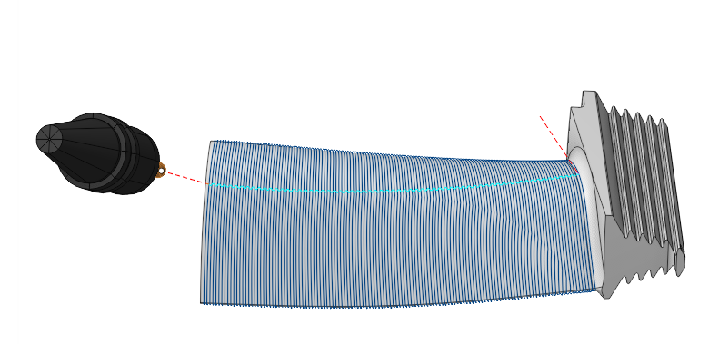

# 4D Surfacing

## Application Area:

This finishing operation is for <strong>4x</strong> and <strong>5x</strong> configurations and adapts [<strong>5D Surfacing operations</strong>](10135.md) to rotary machining of complex surfaces with a distinct axis of rotation or the surfaces extended along the axis. It does not support the <strong>Through Point</strong>, <strong>Through Curve</strong>, and <strong>Perpendicular to Toolpath</strong> tool orientation strategies. In this operation incline angles, avoid singularity and axis deviation features are blocked. Safe surface set as <strong>Cylinder</strong>.

### Job Assignment:

<strong>Machining Surfaces.</strong> Select various surfaces of the part as the working task. The system will calculate the trajectory based on the chosen surfaces.

<strong>First Curve.</strong> For the <strong>Parallel to Curve</strong> strategy, this feature specifies curves for parallel passes computations. Additionally, in the <strong>Morphing Between Two Curves</strong> strategy, it specifies the <strong>First Curve</strong> <strong>.</strong> You can select one or multiple, not necessarily connected, curves or edges.

<strong>Second Curve.</strong> The system uses it in he <strong>Morphing Between Two Curves</strong> strategy. It specifies the <strong>Second Curve</strong><strong>.</strong> You can select one or multiple, not necessarily connected, curves or edges.

<strong>Tilt Curve.</strong> This is the curve that the tool axis vector aims at when setting <strong>Tool Orientation</strong> specification <strong>Through Curve.</strong>

<strong>First Surface.</strong> This feature serves as the <strong>First Surface</strong> in a <strong>Morph Between Two Surfaces</strong> strategy, facilitating the morphing process to create toolpath lines.

<strong>Second Surface.</strong> This feature serves as the <strong>Second Surface</strong> in a <strong>Morph Between Two Surfaces</strong> strategy, facilitating the morphing process to create toolpath lines.

<strong>Surfaces for projection.</strong> These are the surfaces intended for machining onto which the toolpath transfers when enabling the <strong>Project Toolpath onto the Part</strong> option in the <strong>Strategy</strong> tab.

<strong>Job Zone.</strong> Use the job zone to trim the passes outside the specified 2d containment areas. The plane of the containment area is defined by the initial tool orientation. [Details](10151.md).

<strong>Restrict Zone.</strong> In addition to <strong>Job Zones</strong> in system you can use <strong>Restrict Zones</strong> geometry from curves and edges to specify the workpiece areas that s hould avoid machining in the current operation. [Details](10152.md)

<strong>Properties.</strong> Displays the properties of an element. It is possible to add the stock. You can also call this menu by double clicking on an item in the list.

<strong>Delete.</strong> Removes an item from the list.

<strong>Restrictions.</strong> It allows you to restrict areas that should not be machined. [Details](101231.md)

### Strategy:

#### Strategy:

This parameter allows the user to achieve a required toolpath. The parameters of this group are the same as in the <strong>5D Surfacing operation</strong>. [Details.](10135.md)

#### Milling Type:

Сan be assigned in almost all operations, except for the curve machining operations. This allows the user to control the required milling type (climb or conventional) during the toolpath calculation process.

The parameters of the <strong>Milling Type</strong> are the same. as in the <strong>Waterline Roughing</strong> <strong>operation</strong>. [Details.](736.md)

#### Sorting:

Controls the sequence of toolpath passes during surface machining. The parameters of this group are the same as in the <strong>5D Surfacing operation</strong>. [Details.](10135.md)

#### Tool contact point.

Tool Contact Point (TCP) is a specific location on a cutting tool that defines the primary interaction point between the tool and the workpiece surface or geometric entities during machining operations.

The parameters of this group are the same as in the <strong>5D Surfacing operation</strong>. [Details.](10135.md)

#### Tool Orientation:

Controls tool axis orientation. This operation features tool orientation strategies such as <strong>Normal to Surface</strong>, <strong>Fixed</strong>, <strong>Flank</strong>, and <strong>To Rotary Axis</strong> only. It locks options like <strong>Lean Angle</strong> and <strong>Vertical Clearance Angle</strong>. Other parameters of these strategies are the same as in the <strong>5D Surfacing operation</strong>. [Details.](10135.md)

#### Limit Rotation Angles:

When the flag is set, it specifies the limit values of the tool's angular position relative to the specified axis. The parameters of this group are the same as in the <strong>5D Surfacing operation</strong>. [Details.](10135.md)

#### Job zone:

Enables additional modification of the working area initially selected on the <strong>Job assignment</strong> tab. The parameters of this group are the same as in the <strong>5D Surfacing operation</strong>. [Details.](10135.md)

#### Corners smoothing:

When there is a sudden change of the tool direction, the milling control performs deceleration before starting the turn, and then accelerates again. This fact can lead to vibrations and high tool and milling machine wear. The problem can be solved if the toolpath has very few or no breaks. For this reason, in the system there is the toolpath smoothing function using the defined radius for machining inner or outer corners of the model. The parameters of this group are the same as in the <strong>5D Surfacing operation</strong>. [Details.](10135.md)

#### Roughing Passes:

Toolpath is offset in plane by the <strong>Roughing passes</strong> thickness amount. Additional passes are added to the contour by the value specified in the parameters with the specified number of steps. The parameters of this group are the same as in the <strong>5D Surfacing operation</strong>. [Details.](10135.md)

#### Project Toolpath onto the Part:

By setting the flag, the system generates tool paths for processing the surfaces identified as <strong>Surfaces for Projection</strong> in the <strong>Job Assignment</strong> by mapping the path derived from the <strong>Machining Surface</strong> onto the <strong>Surfaces for Projection.</strong> The parameters of this group are the same as in the <strong>5D Surfacing operation</strong>. [Details.](10135.md)

#### Trimming:

Allows for the skipping of surfaces not intended for machining and allows for the extension of the toolpath. The parameters of this group are the same as in the <strong>5D Surfacing operation</strong>. [Details.](10135.md)

### Parameters:

This tab contains the main parameters for controlling the part, workpiece, fixture and other items, which allow you to change the trajectory. [Details](100112.md)

### Links/Leads:

In the Links/Leads tab, you define the parameters for rapid movements. These movements include tool approach from the tool change position, engage to the start of the working stroke, retraction after the final cutting motion, transitions between working passes, and return to the tool change point. You can configure the sequence of movements along the coordinates, the trajectory of these motions, and the magnitude of displacements.

Click here to expand..

<strong>Сonsists of:</strong>

<strong>Approach/Return.</strong> This group of parameters manages the tool movements from the tool change position to the start of the engage toolpathes, and back. [Details](100116.md).

<strong>Links.</strong> Defines the rules governing Entry/Exit links and links between work moves. [Details](100130.md).

<strong>Leads.</strong> Allows you to add additional engage and retract to the working moves using their feed. [Details](100136.md).

<strong>Safe motions.</strong> Defines the type of <strong>Safety Surface</strong> and the distance from the workpiece to it. This surface facilitates transitions between the processed surfaces or tool paths, and the first stage of approach or return occurs toward it. [Details](100117.md).

<strong>Advanced links settings.</strong> This group of parameters specifies the features of trajectory formation for primarily five-axis operations, considering optimal movements of rotational axes. [Details](100118.md).

<strong>Distances.</strong> Distances used in Links rules [Details](100140.md).

### Feeds/Speeds:

Using this dialogue the user can define the spindle rotation speed; the rapid feed value and the feed values for different areas of the toolpath. Spindle rotation speed can be defined as either the rotations per minute or the cutting speed. The defining value will be underlined. The second value will be recalculated relative to the defining value, with regard to the tool diameter. [Details](100142.md)

### Transformations:

Parameter's kit of operation, which allow to execute converting of coordinates for calculated within operation the trajectory of the tool. [Details](10168.md).

### Part:

A Part is a group of geometrical elements that defines the space to check for gouges. [Details](330.md)

### Workpiece:

A workpiece model of an operation defines the material to be machined. [Details](738.md)

### Fixtures:

As the Fixtures the fixing aids such as chucks, grips, clamps, etc., and the restriction areas of any other nature are usually specified. [Details](10283.md)
