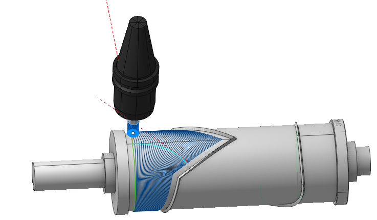

# Morph 4D

## Application Area:

This finishing operation is for <strong>4x</strong> and <strong>5x</strong> configurations and adapts [<strong>Morph operation</strong>](10138.md) to rotary machining of complex surfaces with a distinct axis of rotation or the surfaces extended along the axis. Tool orientation set as default <strong>To Rotary axis,</strong> also the <strong>Fixed</strong> strategy is available, other tool orientation strategies are blocked. In the <strong>To Rotary axis</strong> strategy <strong>Lead Angle</strong> is available only. Safe surface set as <strong>Cylinder</strong>. For holder collision available <strong>Trim toolpath</strong> method only.

### Job Asssignment:

<strong>Machining Surfaces.</strong> The system uses the <strong>Machining</strong> Surfaces to restrict the area of machining. Morph generates passes only where a tool has contact with those surfaces. Morph generates passes not between two curves you set in the job assignment, but between two <strong>M</strong><strong>achining</strong> Surfaces contact curves which are closest to those two curves you specify as the <strong>First</strong> and the <strong>Second curve</strong>.

<strong>First Curve.</strong> It is t he starting line from among the two lines between which the system generates the toolpaths.

<strong>Second Curve.</strong> It is the finishing line from among the two lines between which the system generates the toolpaths.

Sync lines are used to improve the quality of morphing in difficult cases, especially when machining closed contours. A <strong>Sync Line</strong> specifies two corresponding points of the <strong>First</strong> and the <strong>Second</strong> <strong>Curve</strong>. You can use any types of curves as <strong>Sync</strong> <strong>Lines</strong>: edges, 3D curves, 2D geometry curves. They do not have to start and end precisely on the <strong>First</strong> and <strong>Second Curve</strong>. You can draw sync lines at the 2D geometry tab.

<strong>Properties.</strong> Displays the properties of an element. It is possible to add the stock. You can also call this menu by double clicking on an item in the list.

<strong>Delete.</strong> Removes an item from the list.

<strong>Restrictions.</strong> It allows you to restrict areas that should not be machined. [Details](101231.md)

### Strategy:

#### Strategy:

These parameters allows the user to achieve a required toolpath. The parameters of this group are the same as in the <strong>Morph operation.</strong> [Details.](10138.md)

#### Milling Type:

This feature enables users to select the necessary milling direction (climb or conventional) during the toolpath calculation process. The parameters of thus group are the same. as in the <strong>Waterline Roughing</strong> <strong>operation</strong>. [Details.](736.md)

#### Sorting:

Controls the organization of the toolpath during surface machining

<strong>Start Point.</strong> Activating the flag permits the input of coordinates marking the starting point of working passes in surface machining.

#### Tool Axis Orientation:

Controls the tool axis orientation during the machining process. The strategies <strong>To Rotary axis</strong> (where one can use only the <strong>Side Angle</strong>) and <strong><strong>Fixed</strong></strong> are available in this operation. These parameters are the same as in the <strong>5D Surfacing operation.</strong> [Details.](10135.md)

#### Trimming:

Allows for the skipping of surfaces not intended for machining. The parameters of <strong>Trimming</strong> are the same as in the <strong>Waterline Roughing operation</strong>. [Details.](736.md)

### Parameters:

This tab contains the main parameters for controlling the part, workpiece, fixture and other items, which allow you to change the trajectory. [Details](100112.md)

### Links/Leads:

In the Links/Leads tab, you define the parameters for rapid movements. These movements include tool approach from the tool change position, engage to the start of the working stroke, retraction after the final cutting motion, transitions between working passes, and return to the tool change point. You can configure the sequence of movements along the coordinates, the trajectory of these motions, and the magnitude of displacements.

Click here to expand..

<strong>Сonsists of:</strong>

<strong>Approach/Return.</strong> This group of parameters manages the tool movements from the tool change position to the start of the engage toolpathes, and back. [Details](100116.md).

<strong>Links.</strong> Defines the rules governing Entry/Exit links and links between work moves. [Details](100130.md).

<strong>Leads.</strong> Allows you to add additional engage and retract to the working moves using their feed. [Details](100136.md).

<strong>Safe motions.</strong> Defines the type of <strong>Safety Surface</strong> and the distance from the workpiece to it. This surface facilitates transitions between the processed surfaces or tool paths, and the first stage of approach or return occurs toward it. [Details](100117.md).

<strong>Advanced links settings.</strong> This group of parameters specifies the features of trajectory formation for primarily five-axis operations, considering optimal movements of rotational axes. [Details](100118.md).

<strong>Distances.</strong> Distances used in Links rules [Details](100140.md).

### Feeds/Speeds:

Using this dialogue the user can define the spindle rotation speed; the rapid feed value and the feed values for different areas of the toolpath. Spindle rotation speed can be defined as either the rotations per minute or the cutting speed. The defining value will be underlined. The second value will be recalculated relative to the defining value, with regard to the tool diameter. [Details](100142.md)

### Transformations:

Parameter's kit of operation, which allow to execute converting of coordinates for calculated within operation the trajectory of the tool. [Details](10168.md).

### Part:

A Part is a group of geometrical elements that defines the space to check for gouges. [Details](330.md)

### Workpiece:

A workpiece model of an operation defines the material to be machined. [Details](738.md)

### Fixtures:

As the Fixtures the fixing aids such as chucks, grips, clamps, etc., and the restriction areas of any other nature are usually specified. [Details](10283.md)
