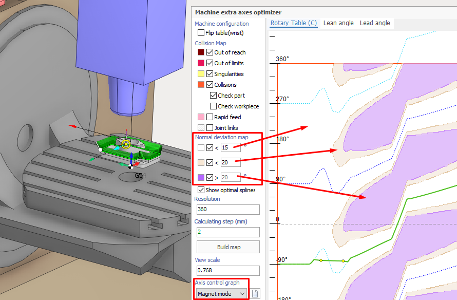
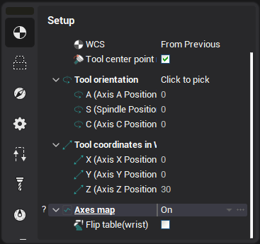
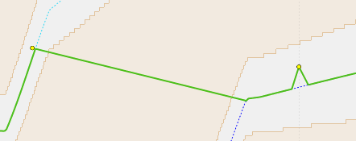

# Axes map for 5-axis machines

The Axes Map feature can be used to optimize the operation trajectory for 5-axis machines, similarly to [robot extra axes optimizer](10266.md). This feature is disabled by default, to enable it use the **Axes map** combobox on the **Setup** inspector tab. To open the special window for toolpath optimization, use the ellipsis button located to the right of the combobox. Currently, there are two types of axes map available for 5-axis machining: the C axis map and the maps for lead/lean angles.

## "C axis" map

The rotary axis of the machine, which is responsible for rotating around the Z axis of the tool, is often named with the <strong>C</strong> letter (and complementary is the <strong>A</strong> or <strong>B</strong> axis). The 5-axis trajectory defines the tool orientation along itself and by default the optimal values are selected for the machine rotary axes to achieve the specified tool orientation in each toolpath point. However in some cases it can lead to undesirable trajectories with obstacle <strong>collisions</strong> or uncontrollable abrupt spikes in the motion of rotary axes due to <strong>singularities</strong>. With this feature, the <strong>axis map spline</strong> can be used to directly specify the value of one of the rotary axes along the toolpath. The value of the secondary axis is selected automatically to minimize the deviation from the user defined tool normal. The common user interface parts are described in the [Robot axes map](10266.md) documentation page, below is the information about special C axis editing features.

### Deviation map

When the C axis map tab is selected, the main part of the window displays the 2D color map showing the minimum possible deviation of the tool normal from the optimal (specified in job assignment) for each possible C axis value (vertical axis) and each toolpath point (this is the horizontal axis). The zones with the same color have the minimum deviation within the same specified range. The ranges can be customized with the <strong>Normal deviation map</strong> panel on the left. The map can also contain zones with the obstacle collisions.

### Optimal splines

The dotted splines on this map (which can't be edited) correspond to the case when the C axis value is optimal in each toolpath point. Those optimal values are not unique, they differ by the shift of 360 degress or correspond to the different fixed value of the <strong>Flip table</strong> parameter. The visibility of the optimal splines can be turned on/off with the checkbox below the "Normal map deviation" panel.

### Spline editing modes

Three modes for the C axis spline editing are available. The first two modes are the same as in the robot axes map. In each mode the trajectory is defined by the custom control points. Use double click to create a new control point and drag it to adjust the position.

1. <strong>Spline mode</strong> - the axis trajectory is defined by the smooth line passing through the specified waypoints.
2. <strong>Polyline mode</strong> - the same as previous, but the control points are connected with the straight segments.
3. <strong>Magnet mode</strong> - the axis trajectory is also defined by the control points, but between them is generated by special algorithm. The goal is to achieve the trajectory which is the least different from the optimal splines. Let's consider the two consecutive points.

- If they are more close to each other than any of the optimal splines they are connected with the straight line segment.
- If they lie near the same optimal spline, then they are first smoothly connected to this spline and between those connection points the trajectory matches the optimal one. If some point is very close to the optimal spline, it is not connected to it, rather it "defines" which optimal spline to use in its neighbourhood.
- If the points are close to different optimal splines, then the algorithm searches the closest points between the two splines and connects them with the straight line. Then the first point is connected with the left closest found point, and the second - with the right closest (as they correspond to the same optimal splines). Below is the axis trajectory example for the third described case. 

## Lead/Lean angle map

The Lead/Lean angle are the important parameters in 5-axis machining which define the inclination of the tool along the toolpath and to the side (in the perpendicular plane) of the toolpath, respectively. Switch to the Lead or Lean angle tab to control the values of these parameters along the operation toolpath. The user interface is the same as for the [robot extra axes optimizer](10266.md).
