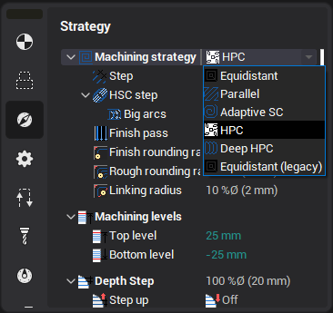
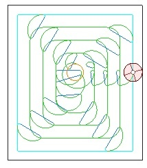
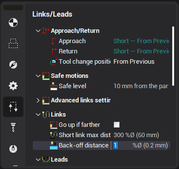
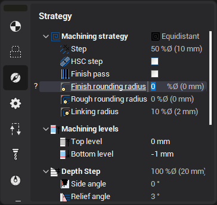
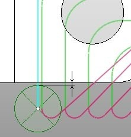
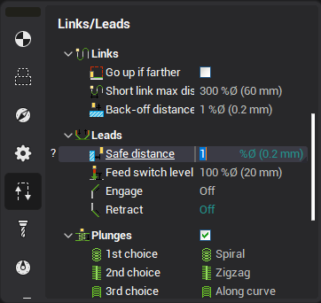
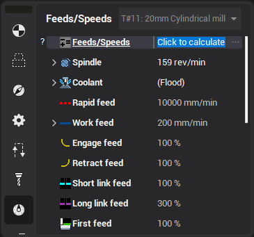

# High performance cutting (HPC)

The high performance cutting (CAM system HPC) strategy is designed for the efficient removing of material in the open and closed pockets.

This strategy is available in the following operations:

- [Rough waterline](736.md)
- [Pocketing](256.md)
- [Pocketing 2.5D](768.md)
- [Flat land finishing](759.md)

The strategy is enabled by selecting the corresponding option in the Machining strategy drop-down:

All the following options are available when the HPC strategy is selected.

New trochoidal arcs

Tool path length has been reduced by up to 20% compared to the legacy version of the program.

New trochoidal arcs avoid tool overload without requiring feed rate reduction.

It makes for a much smoother machining process.

Back-off distance parameter

The tool can be lifted above the already machined surface when it moves to the next trochoidal arc start position.

Rounded links in zigzag mode

 

The 'Finish rounding radius', 'Rough rounding radius' and 'Linking radius' value is used for rounding of the links.

Links on the same Z-level

In the climb and conventional mode, the tool goes directly to the next path without retraction to the safe level. If a rapid motion is performed over an already machined surface, then the "Tool back-off distance" is used. "Idle radius" is also used to make the motion smooth.

Safe distance

 

Safe distance is used to move the tool down/up from/to the safe surface.

The vertical motion is performed at this distance from the workpiece. So there is no longer the need to enable the approaches/retractions to exclude the rapid feed collisions.

If you use a pre-drilled hole to plunge when roughing, the pre-drill tool diameter must be greater than the mill tool diameter by at least double the safe distance amount, otherwise the pre-drilled holes will not be detected.

Rapid feed links

The link moves can be calculated using either the next feed or the return feed values. If the link length is less than the 'short link' distance, then the 'next feed' value is used, else the 'return feed' value is used. The return feed is set to 300% of the work feed by default, which is a non-cutting feed. If cutting is detected during a 'return feed' move when simulated, this move will be marked with an error.
