# Job zones

## Application Area:

Job zones are used to define the part and workpiece areas that have to be machined by roughing and finishing milling operations. Job zones can be closed and open. Open job zones first introduced in legacy CAM system offer an easy and intuitive way to define open machining areas using only source 3d model entities.

### Working with Job zones.

<strong>Using closed job zones</strong>

As a source geometry for closed job zones can be used closed chains of curves, edges and vertical walls. The best practice of using closed job zones includes the following steps.

- In the graphic view select geometry entities defining the job zone. The easiest way is to use 3d Model edges. You can easily select the whole chain of tangent edges by simple double click on an edge of a chain.

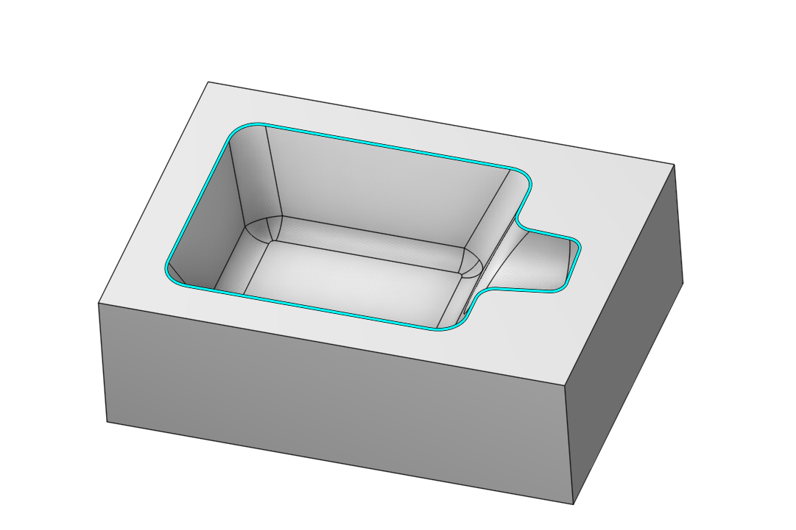

- At the **Job Assignment** panel press the **Job Zone** button.

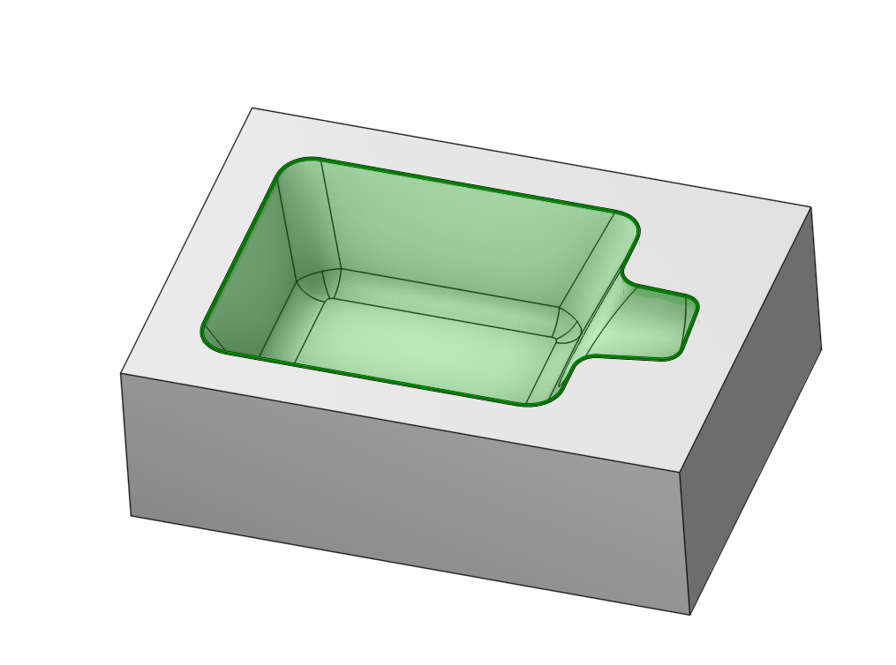

- Generate toolpath. The trajectory should be contained inside the **Job Zone limits**.

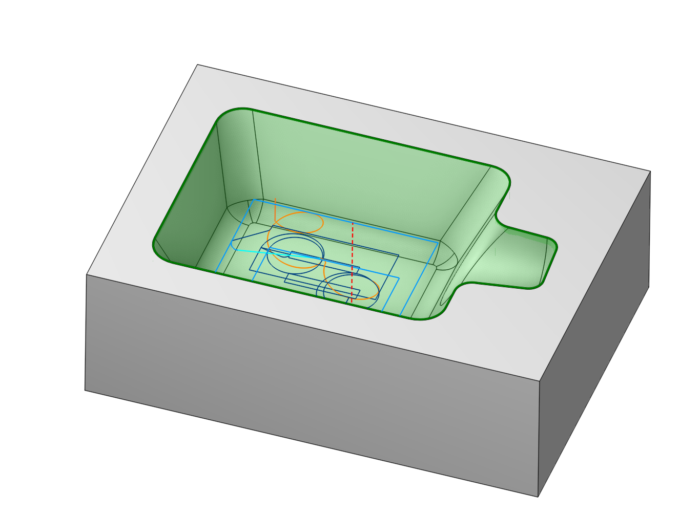

**Using open job zones**

An open job zone is a half-space constructed by one or more entities. As source geometry for an open job zone you can use distinct curves, 3d edges and vertical walls as well as connected chains.

The best way to understand how and when to use open job zones is to look at practical examples.

**Using open job zones in a roughing operation**

As a demonstration, we will attempt to constrain the work area with curves to prevent the machining of the central pocket and to keep the machining zone within the part's profile.

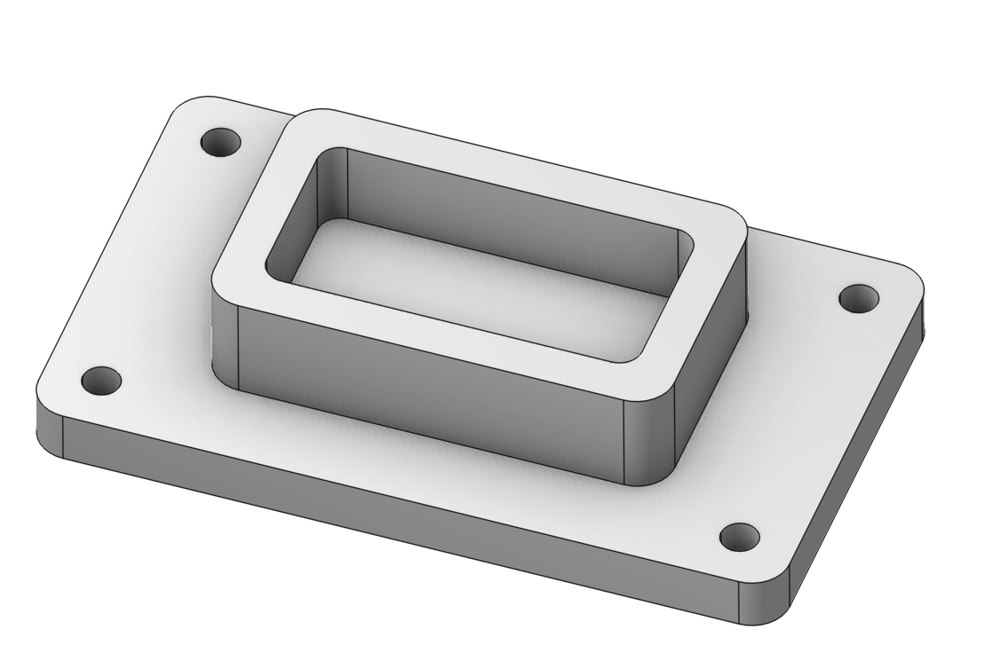

For this, we will select two edges as Job zones.

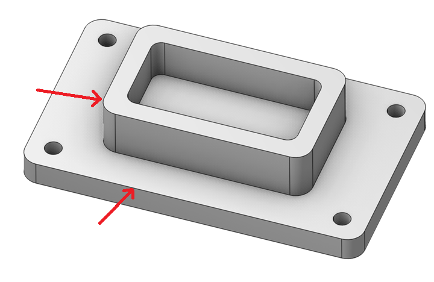 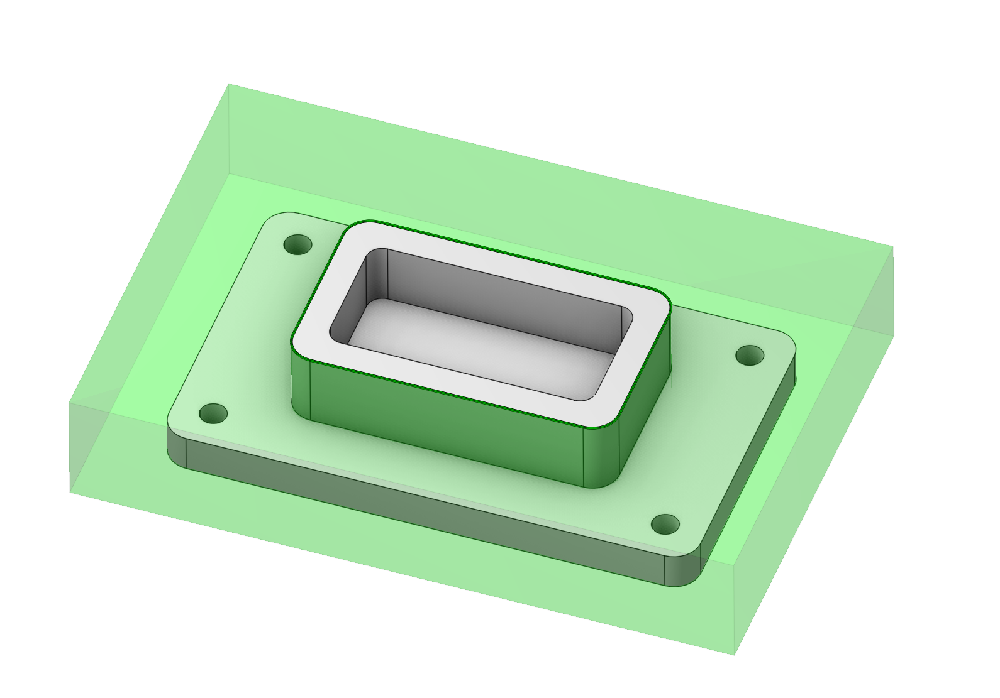 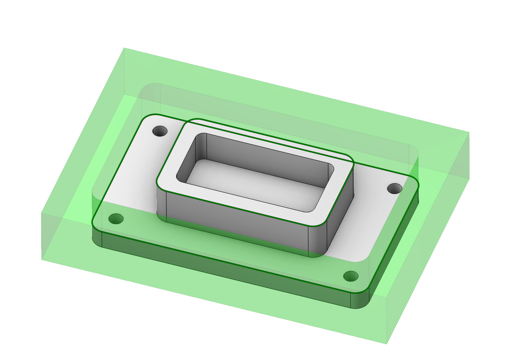

We can see that one of the zones is facing the opposite direction. It needs to be inverted. In the work assignment, we find this zone. We double-click on it and change its direction.

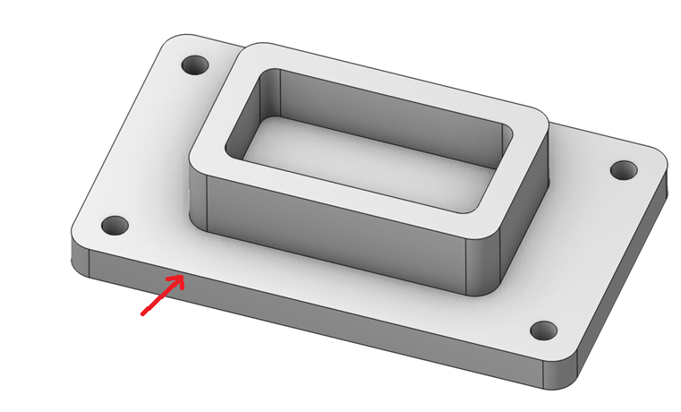 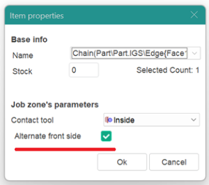

Now the result obtained corresponds to the task. You can apply these skills when choosing a work assignment for your parts.

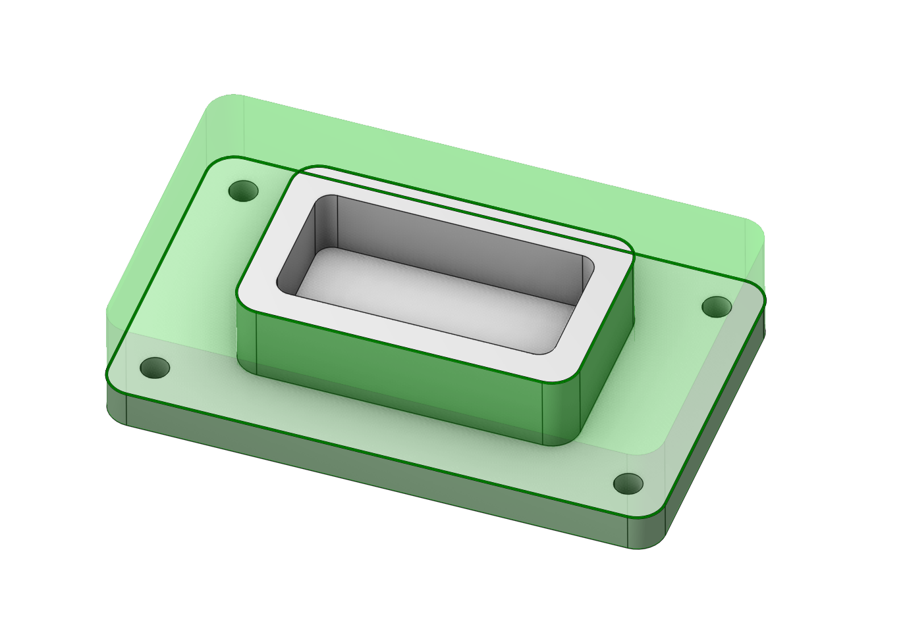 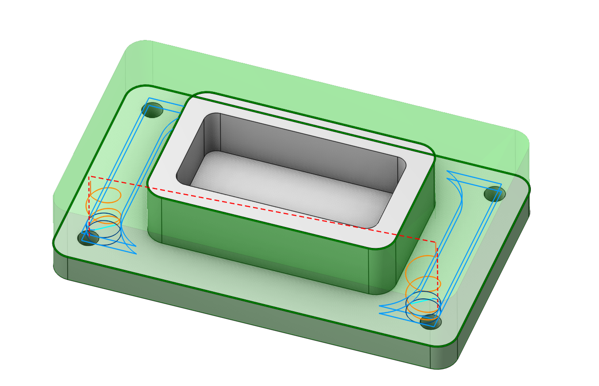

**Using open job zones in a finishing operation**

At the picture below you can see a die with three open freeform pockets. We will machine one small pocket using **Finishing plane** operation.

To accomplish this task we just need select the edge chain around the pocket and add it into the job assignment as a **Job Zone**.

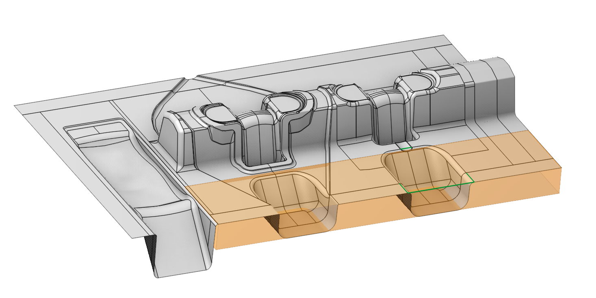

After that we generate toolpath. The result should look as follows.

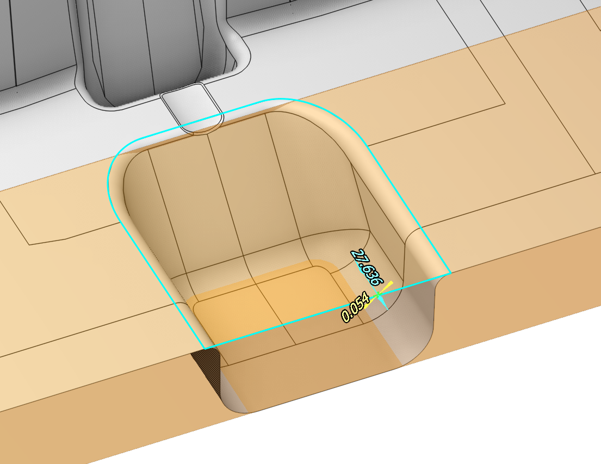 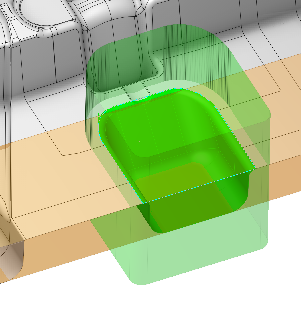 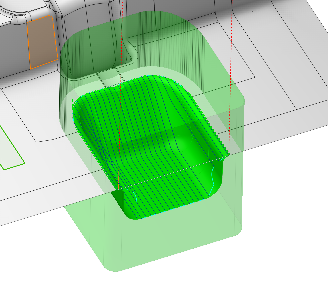
