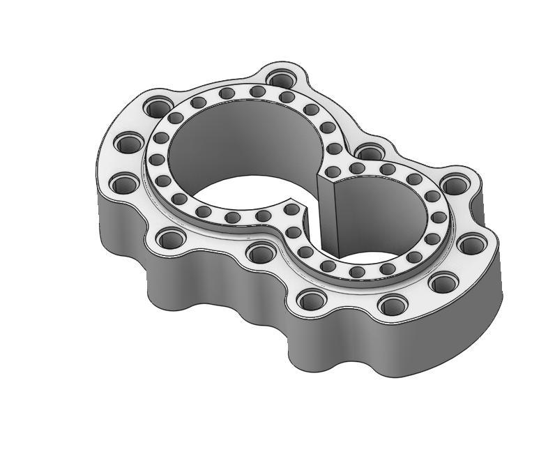
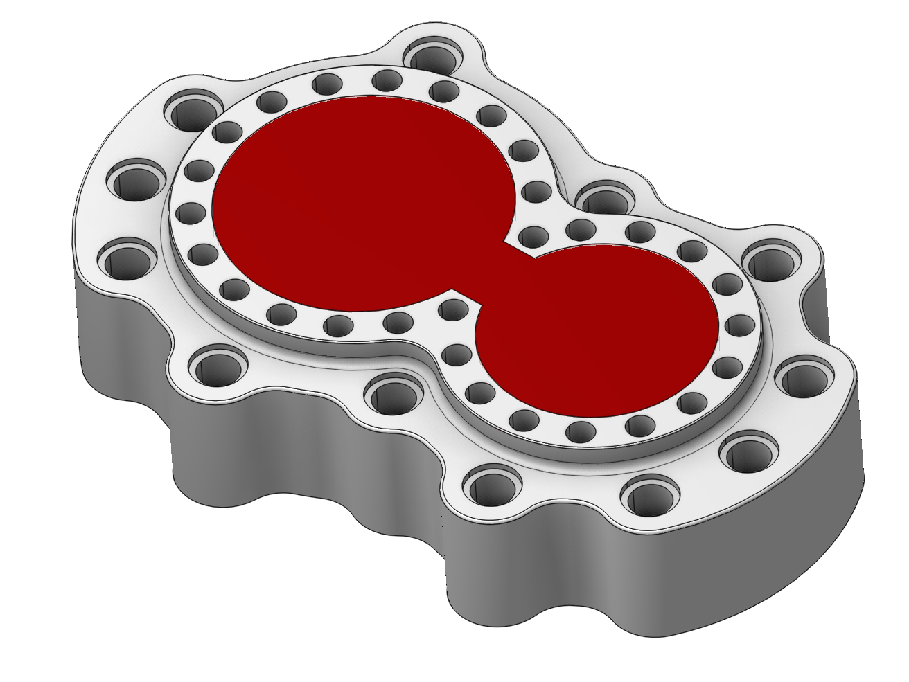
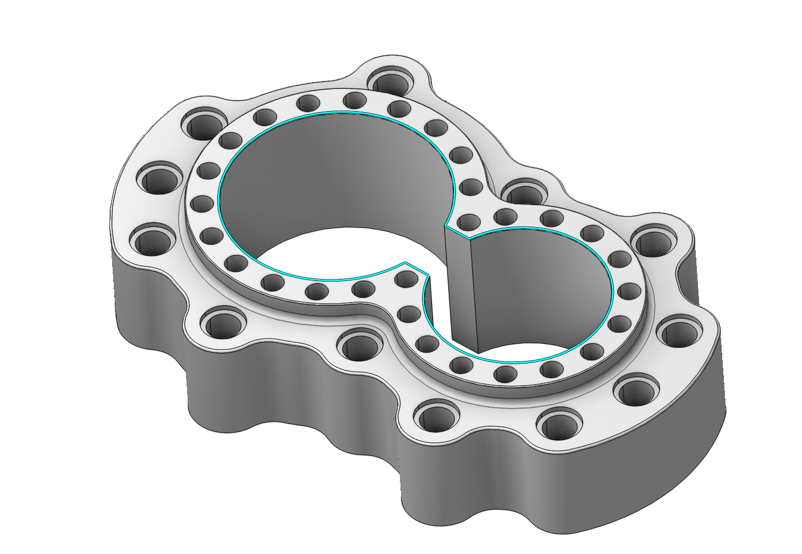
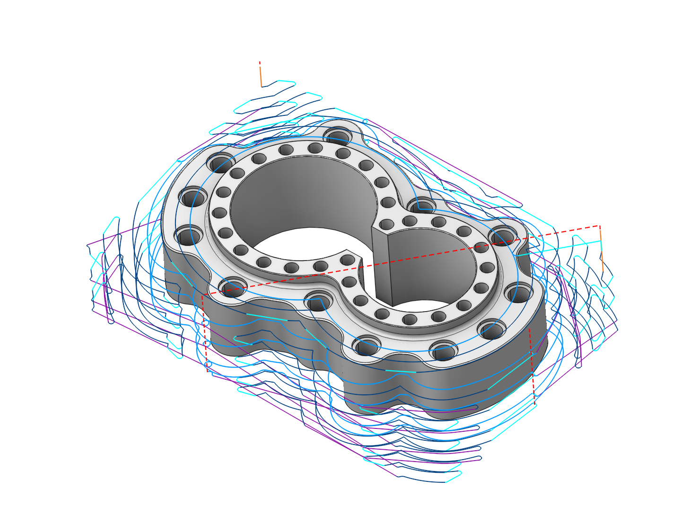

# Restrict zones

 

## Application Area:

In addition to Job Zones in CAM system you can use Restrict Zones to specify the workpiece areas that have not to be machined in the current operation. Opposed to a job zone a restrict zone is always closed. As source geometry for restrict zones you can use any curves, 3d edges as well as vertical walls and connected chains.

### Working with Restrict zones.

At the picture below you can see a part with a window. We will rough the outside of this part. To accomplish this task we have to add a restrict zone covering the inner window.

At first we select the edges chain around the window.

After that we add a new Restrict Zone into the Job Assignment of the Roughing operation.

After generating toolpath we will see the following picture. As you can see the inner window has been leaved uncut.

