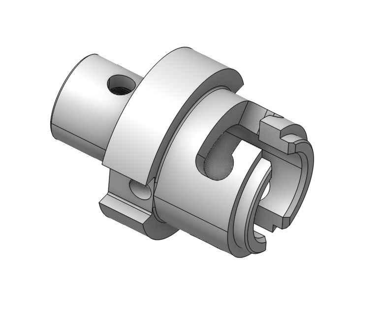
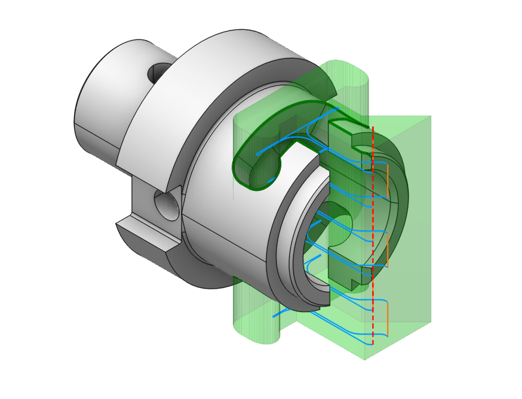
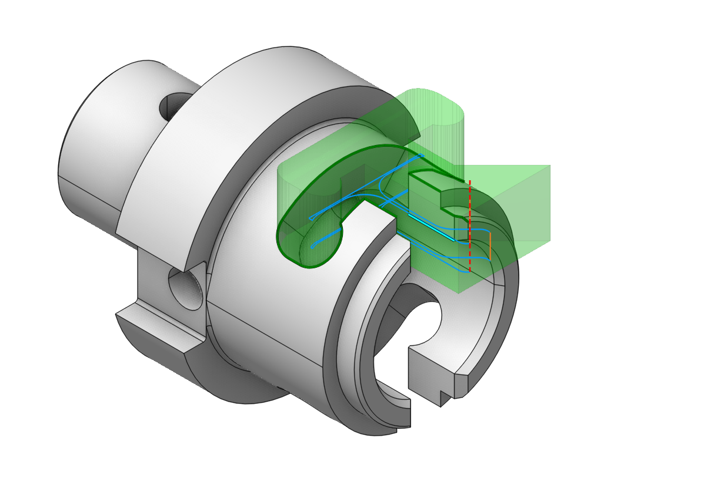
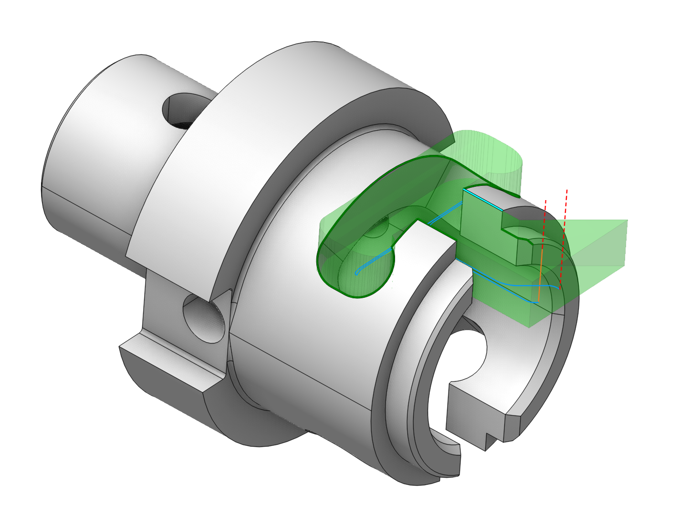

# Top and bottom levels

 

## Application Area:

The common task while machining prismatic and turn-milling parts is to define the Top and Bottom level parameters of an operation based on the geometrical position of the machined feature. The most straightforward way to accomplish this task is to use the corresponding items of the Job Assignment.

As source geometry for the Top and Bottom Level, items of the Job Assignment can be used on any 3d Model entities, including groups. The actual values of the levels are computed from the bounding box of the geometry entity. In addition, you can set a positive or negative stock in the item property dialog.

### Working with Job zones.

In the following picture you can see a turn-milling part. We will machine the front open slot.

Using open job zones, we construct the machining zone in the XY plane. As you can see in the picture below, we have to limit the toolpath by Z. Both top and bottom levels have to be adjusted.

To accomplish this task we will add the side face of the slot as the Bottom Level item into the Job Assignment.

The generated toolpath will look like depicted below.

To limit toolpath from top we add the outer diameter of the slot as the Top Level item into the Job Assignment.

