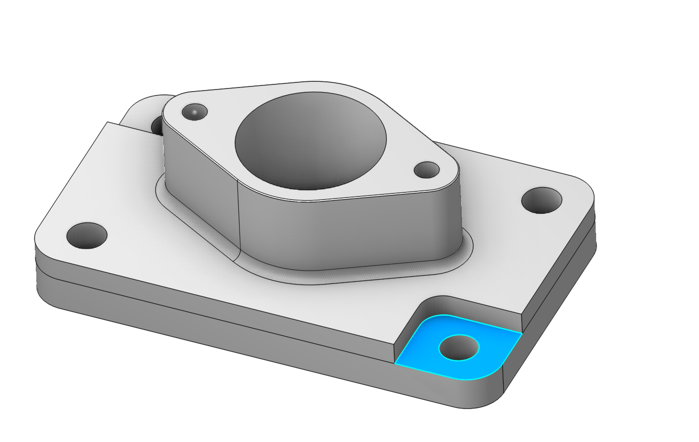
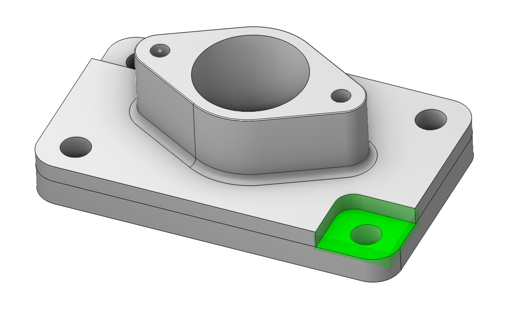
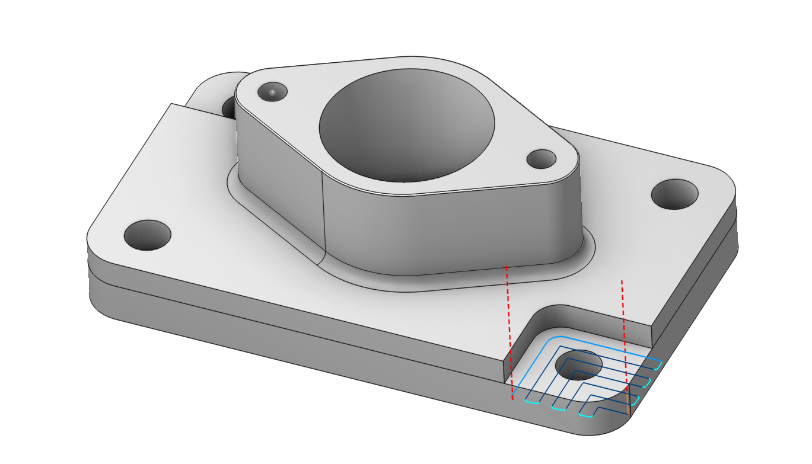
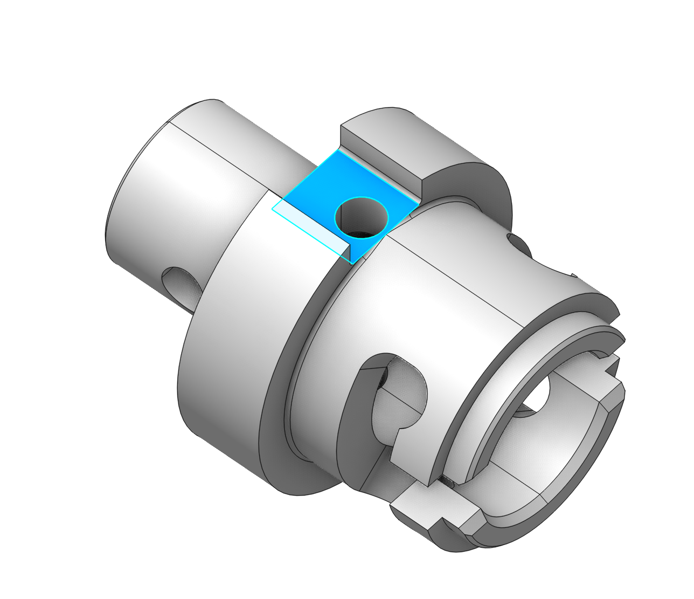
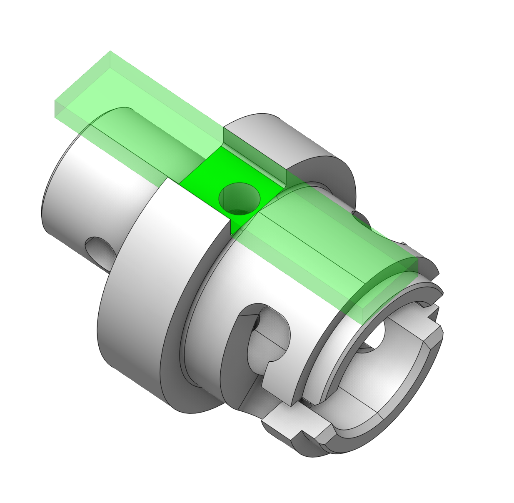
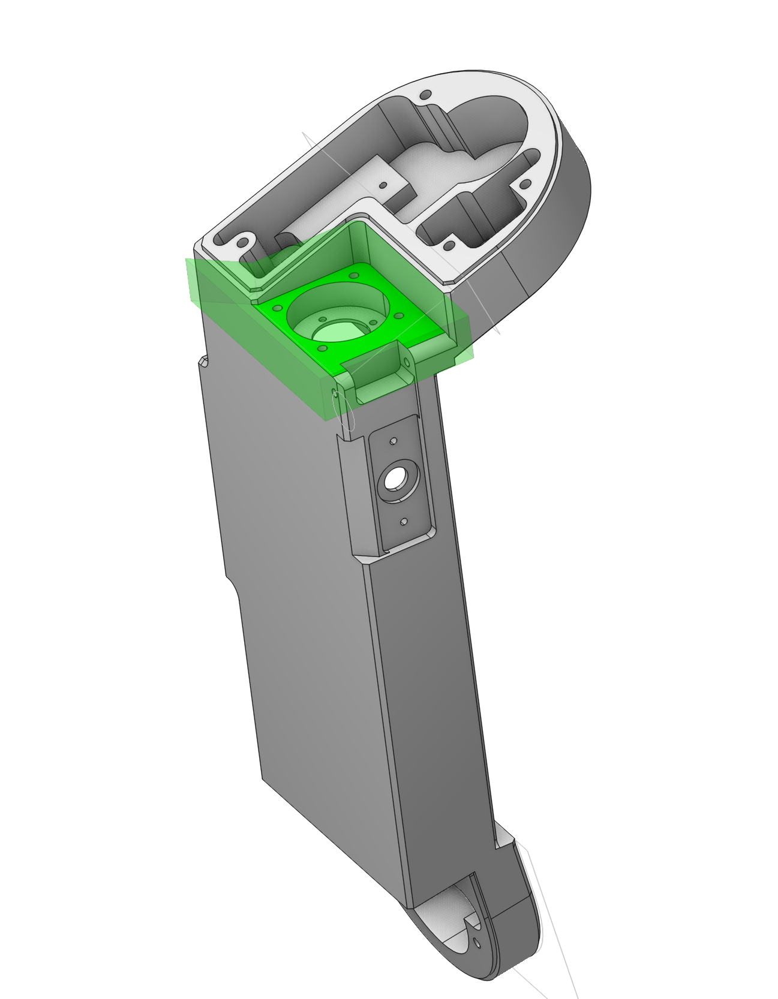
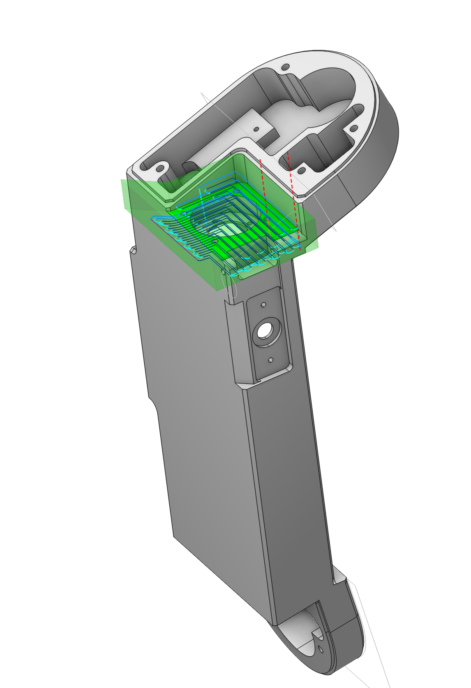
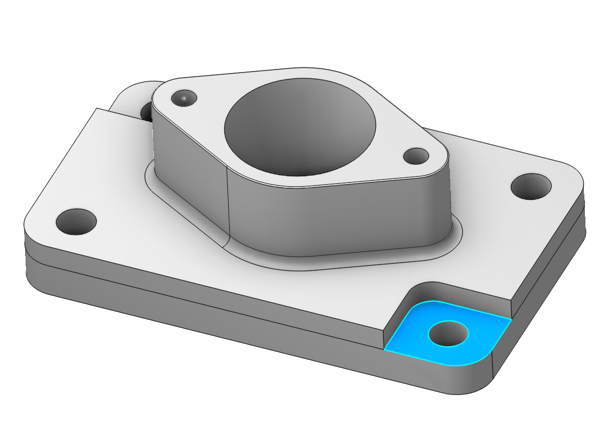
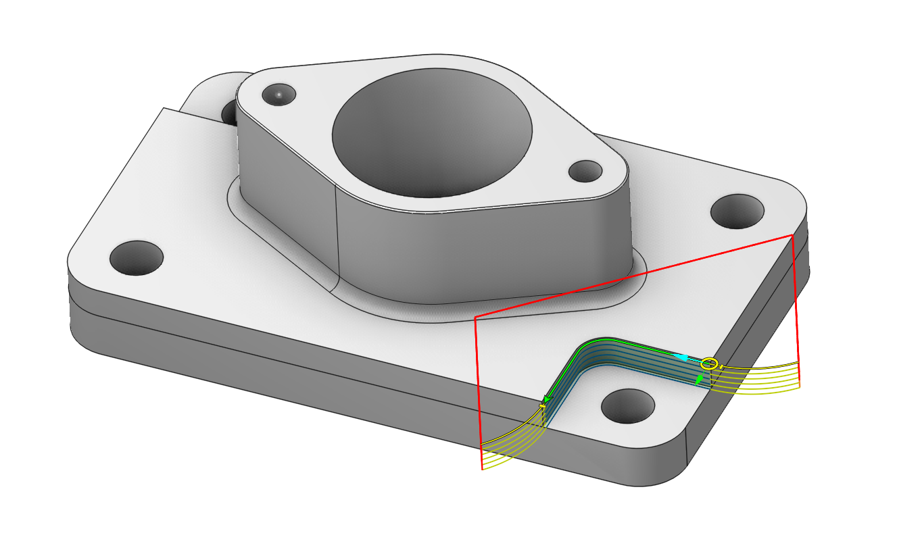

# Pocket feature

  

## Application Area:

A typical prismatic or turn-milling part consists of many simple shapes. Creating technology for such parts using only job zones, restrict zones and machining levels is very time consuming process. To simplify this task, CAM system can recognize the parts elements in a 3d model and automatically convert them to basic job assignment items, such as job zones and machining levels.

The Pocket is a 2d machining feature that consists of 2d Job Zone, Top level and Bottom level, local coordinate system and associated attributes such as corner and fillet radii. The pocket feature is recognized from a base surface that can be either a flat bottom face of a pocket or a side face of a through pocket. You can add a Pocket feature item into the Job Assignment of any 3d milling operation and 2d contouring operation.

### Working with Pocket.

1. The first step is to select the base surface of a pocket. At the picture below you can see a turn-milling part. We will machine the straight open slot at the top of the part.

2. We select the bottom face of the slot and press the Pocket button at the Job Assignment panel.

3. The pocket was converted to an open Job zone and Top level and Bottom level.

### Typical uses of a pocket feature

 

 
