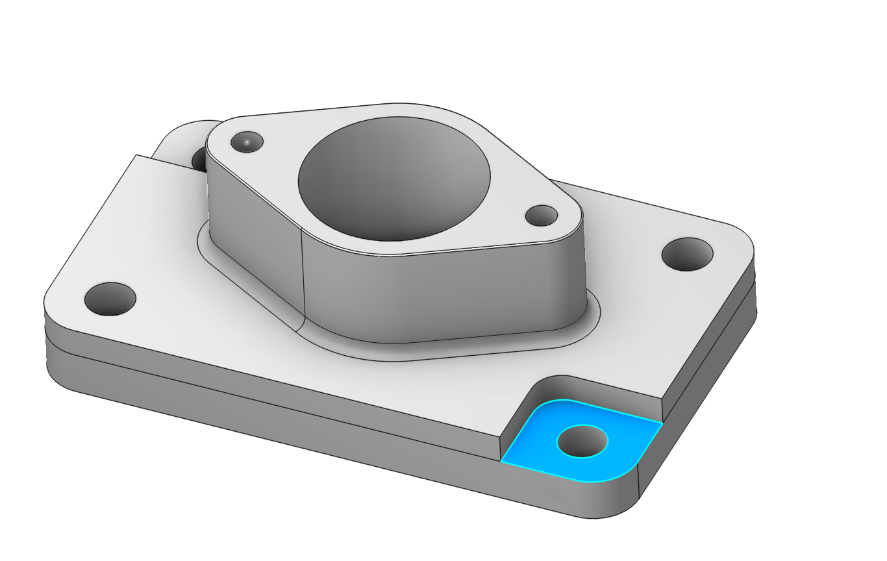
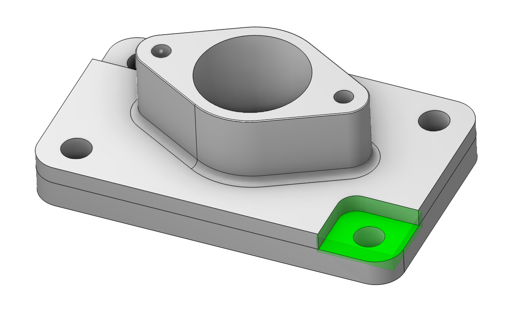
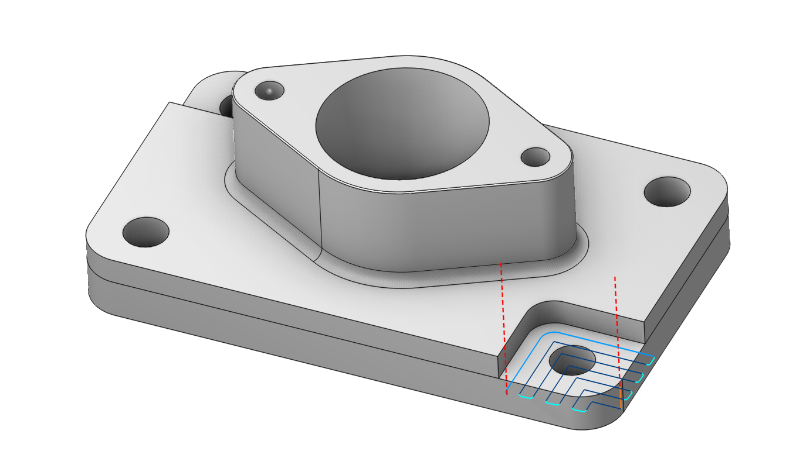
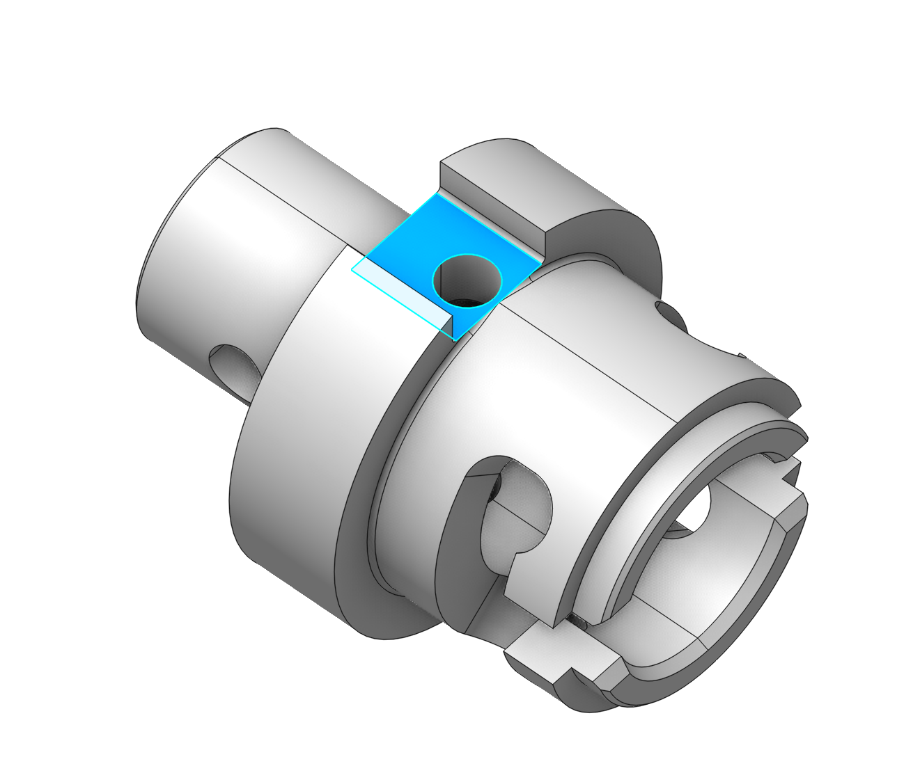
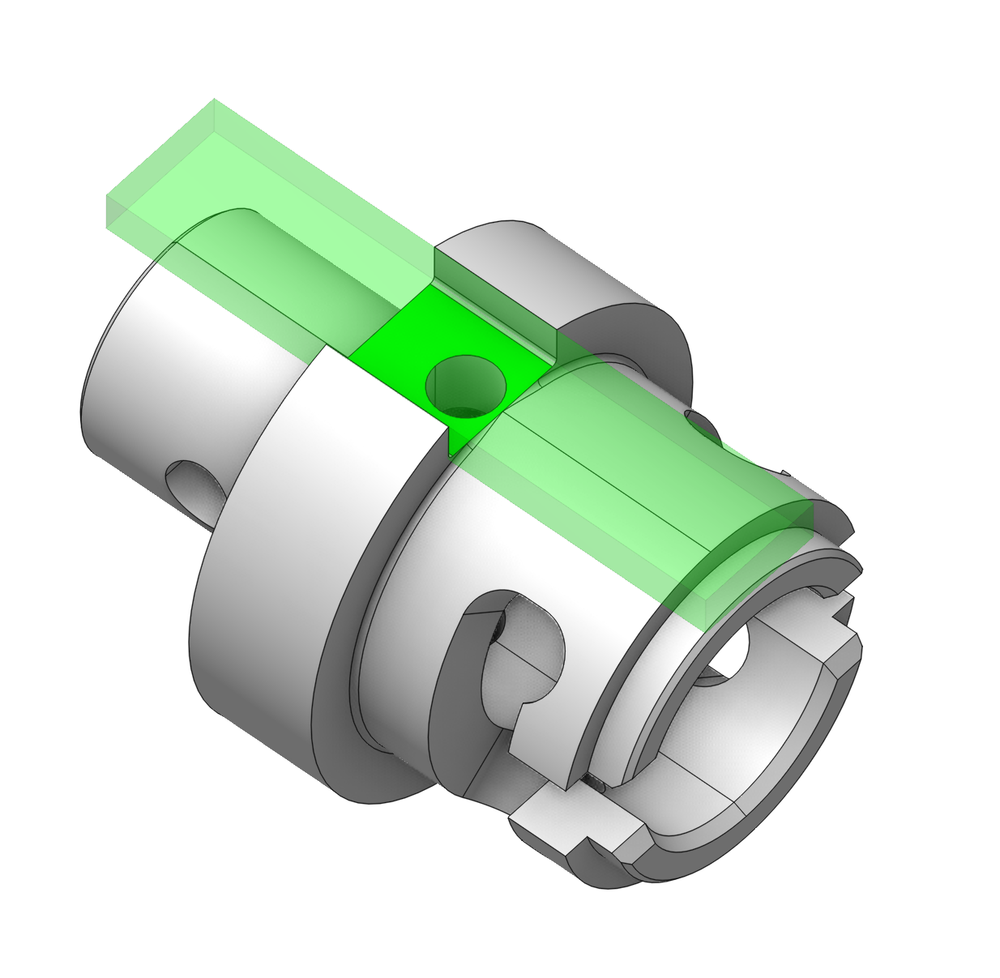
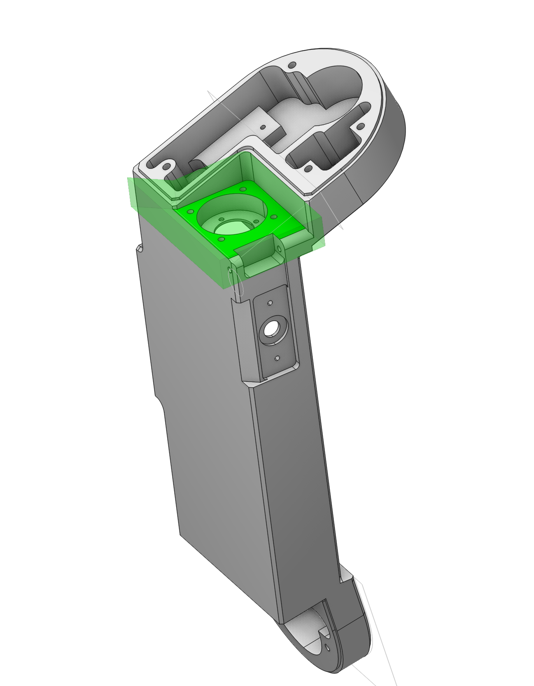
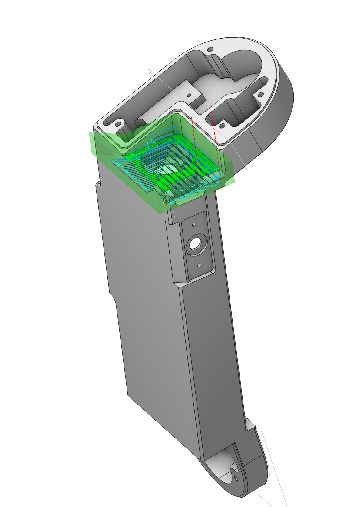
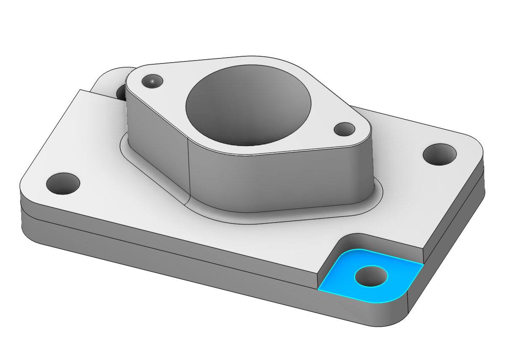
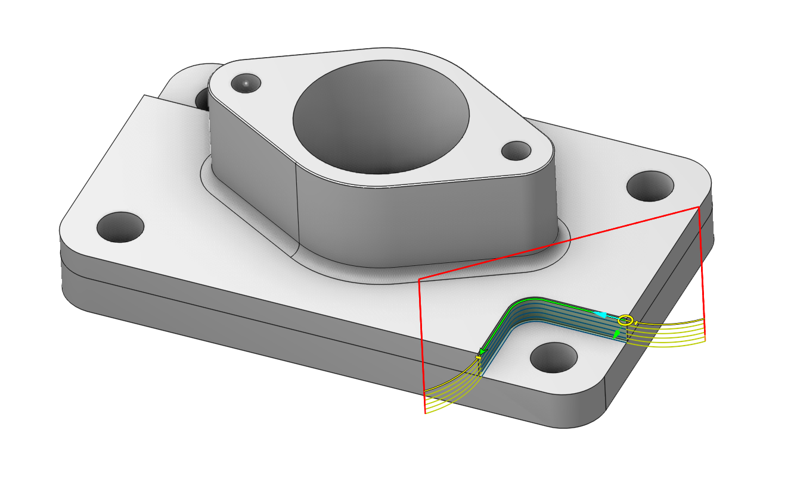

# ポケットフィーチャー

  

## 適用分野：

典型的な角柱状部品やターンミリング部品は、多くの単純な形状で構成されています。ジョブゾーン、制限領域、加工高さのみを使用して、このような部品の技術を作成することは、非常に時間のかかるプロセスです。このタスクを簡素化するために、CAMシステムは3Dモデル内の部品要素を認識し、ジョブゾーンや加工高さのような基本的なジョブ割り当てアイテムに自動的に変換することができます。

<strong>ポケット</strong>は、2D加工フィーチャであり、2Dの<strong>ジョブゾーン</strong>、<strong>上部高さ</strong>、<strong>底部高さ</strong>、ローカル座標系、およびコーナーRやフィレット半径などの関連属性で構成されます。ポケットフィーチャは、基準となるサーフェスから認識され、このサーフェスはポケット底面の平面、または貫通ポケットの側面のいずれかです。また、<strong>ポケット</strong>フィーチャは任意の3Dミーリング加工および2D輪郭加工の<strong>ジョブ割り当て</strong>に追加することができます。

### ポケットの作業

1. 最初のステップは、ポケットの底面を選択することです。下の画像では、Mill-Turn加工の部品が確認できます。部品上部の直線状の開口部(スロット)

2. スロットの底面を選択し、 ジョブ割り当てパネルのポケット ボタンを押します 。

3. ポケットは、オープンな<strong>ジョブゾーン</strong>および<strong>上部高さ</strong>、<strong>底部高さ</strong>に変換されました。

### ポケットフィーチャの主な用途

 

 
