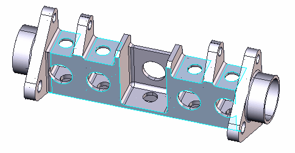
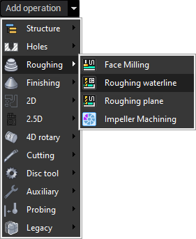
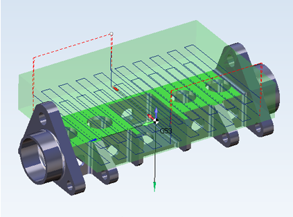

# Creating operations for selected features

Creating technology for a prismatic part consisting of many simple shapes is a time consuming process. To simplify this task CAM system offers the possibility to create operations for selected geometry. This is very straightforward. At first you select what you want to machine in the graphic view, and than you create the operation which will machine the selected geometry. Based on the operation type created CAM system automatically recognizes machining features like pockets and holes in the selected geometry and puts them into the **Job Assignment** of the just created operation. After that CAM system positions the machine tool axes to alight the live tool axis with the Z direction of features local coordinate system. Than it selects the most appropriate tool and parameters of the operation based on the attributes of the machined features.

E.g. if you double click on a hole in the part, CAM system automatically measures it and highlights all the holes with the same diameter. Now if you create a hole machining operation CAM system automatically puts all the selected holes into the **Job Assignment** of the created operation and sets the drill diameter equal to the diameter of the holes. If you create a `3d Hole machining operation` and selected holes are placed in different planes, CAM system will create not one hole machining operation but several operations according to the number of planes in which holes are positioned.

Example of fast creating pocketing operation:

We will machine the part depicted below on a 3+2 milling machine. At first we want to rough open pockets. Just pick the bottom faces of the pockets to be machined at the screen and select the **Roughing waterline operation** from the **Create operation** drop down list.

CAM system automatically creates two roughing operations with pockets in the job assignment. The generated toolpath can be seen at the picture below:

