# Base surface

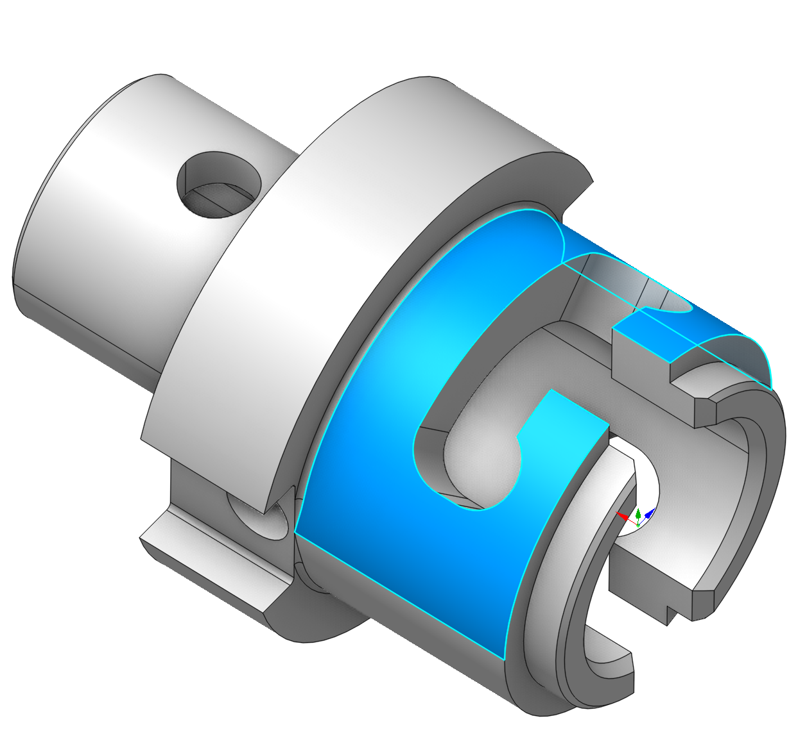 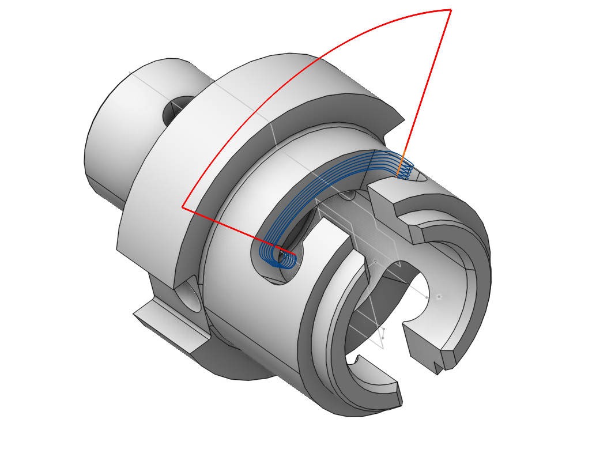

## Application Area:

It is possible to create 2D Contouring, 2D Pocketing, Engraving, Area Cladding operations that generate toolpath on a base surface. As a base surface you can use planes, cylinders and revolution surfaces. The base surface is specified in the Job assignment of a pocketing/engraving operation. You can use existing 3d model surfaces as a base surface. If you do so you also can add surfaces connected to the base surface as job assignment items pockets and bosses. This facility is very useful for letter engraving.

### Base Surface properties dialog box:

Configure the following base surface parameters in the <strong>Properties</strong> dialog box:

<strong id="item-type">Item type:</strong>

<strong>None</strong>. Leave base surface parameters unconfigured.

<strong>Plane</strong>. Set the base surface as a plane passing through the <strong>Center</strong> point, and is perpendicular to the coordinate axis defined in the <strong>Axis Directions</strong> fields. You can designate a plane from the 3D model as the base plane by selecting it in the graphic field. The system will automatically calculate its parameters.

<strong>Cylinder, radius</strong>. Set the base surface as a cylinder with its axis determined by the <strong>Axis Directions</strong> parameters, passing through the <strong>Center</strong> point, and with a radius specified in the dialog box. You can designate a cylindrical surface from the 3D model as the base cylinder by selecting it in the graphic field. The system will automatically calculate its parameters.

<strong>Revolution</strong>. Select a user-defined surface of revolution as the base surface.

<strong id="position">Position.</strong>

<strong>Axis</strong>. Select the axis that defines the position of the base surface (the orthogonal vector to the <strong>Plane</strong> or the axis of the <strong>Cylinder</strong>).

<strong>Axis Direction</strong>. If using a <strong>Custom</strong> axis, input the unit vector components along the coordinate axes that define the axis.

<strong>Center (Pc)</strong>. The point defining the origin of the base surface.

<strong id="parameters">Parameters.</strong>

<strong>Alternate Front Side</strong>. This feature changes the machined side of surface to the back one.

<strong>Curves Project Method</strong>. Specifies the approach for mapping the curve onto the base surface.

<strong>Nearest</strong>. The curve maps directly to the nearest surface according to its position and extent.

<strong>Map to UV domain.</strong> Curve projection is determined by the surface UV map.

<strong>Curves Transformation.</strong> Modify the UV coordinates to change the projected curve.

<strong>Xmin</strong>. Adjust the initial U coordinate of the map for the base <strong>Plane</strong>.

<strong>Xmax</strong>. Adjust the final U coordinate of the map for the base <strong>Plane</strong>.

<strong>Ymin</strong>. Adjust the initial V coordinate of the map for the base <strong>Plane</strong>.

<strong>Ymax</strong>. Adjust the final V coordinate of the map for the base <strong>Plane</strong>.

<strong>Hmin</strong>. Adjust the base <strong>Cylinder's</strong> starting position.

<strong>Hmax</strong>. Adjust the end position of the base <strong>Cylinder</strong>.

<strong>Amin</strong>. Adjust the initial angle of the base <strong>Cylinder</strong> sector.

<strong>Amax</strong>. Adjust the final angle of the base <strong>Cylinder</strong> sector.

<strong>Rotation Angle</strong>. Rotate the curve around the map center.

<strong>Preserve ratio</strong>. Maintain the proportions between curve elements during transformations.

### Working with Base surface.

As an illustration, we will attempt to machine this pocket on a mill-turn machine utilizing the C-axis and cylindrical interpolation.

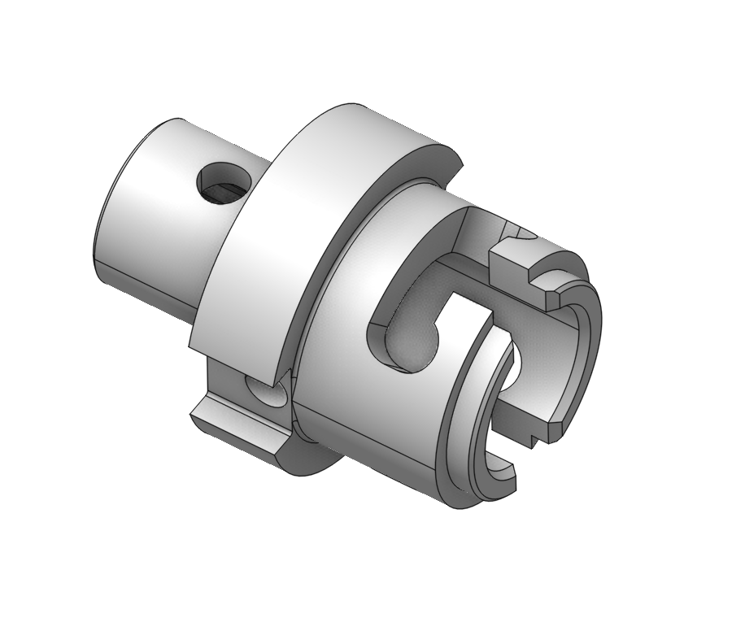

We will be using the 2D contour operation. We will select the edges on the model and calculate the toolpath. We can see that this toolpath isn't satisfactory.

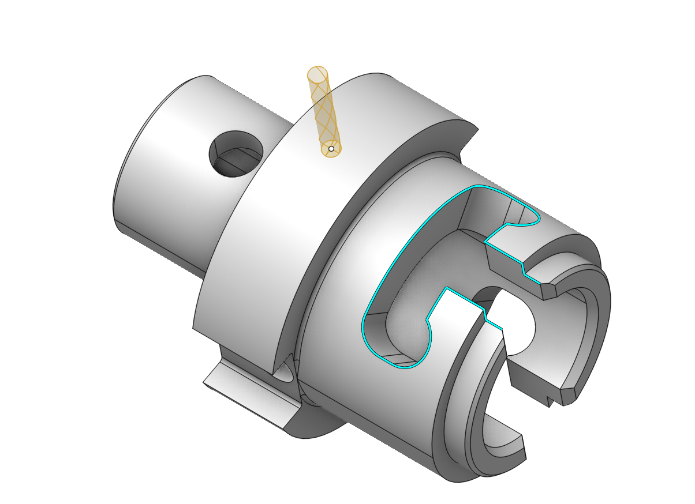 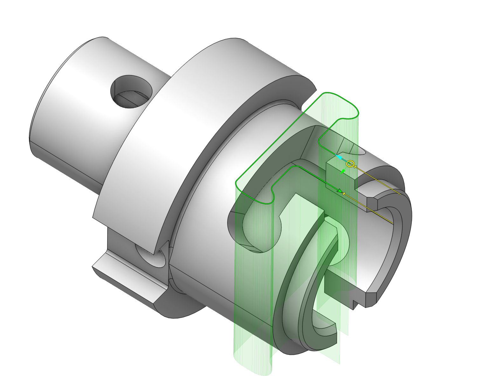 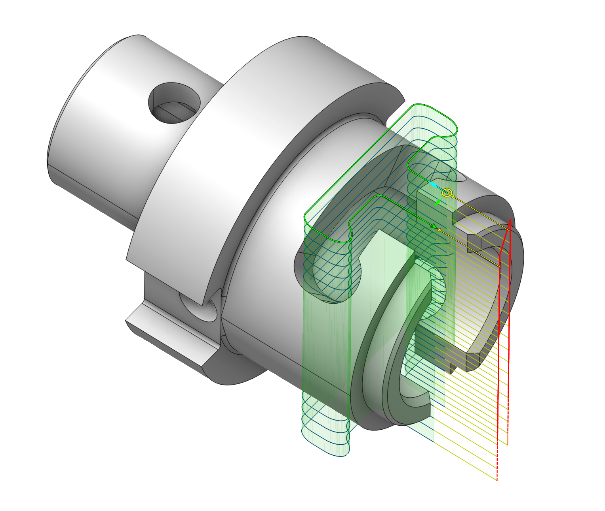

In the job assignment, we will call up the base surface window.

Double-click on the cylindrical surface of the part. The radius of the base surface will be automatically determined in the window.

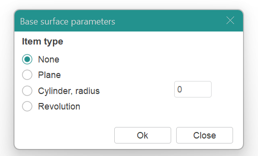

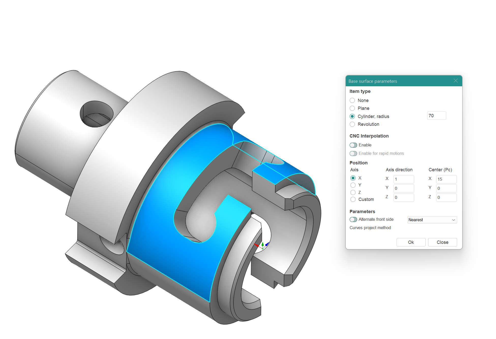

We will delete the contour and assign it again. We will get the following result. Now we need to set up the machining levels.

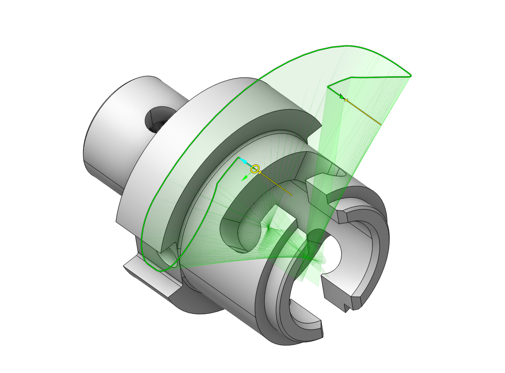

In the Strategy tab, when selecting this base surface, specify the <strong>bottom level</strong> as 0 and set the <strong>top level</strong> to 10. Set the <strong>Depth of cut</strong> to 5 mm. Calculate the toolpath.

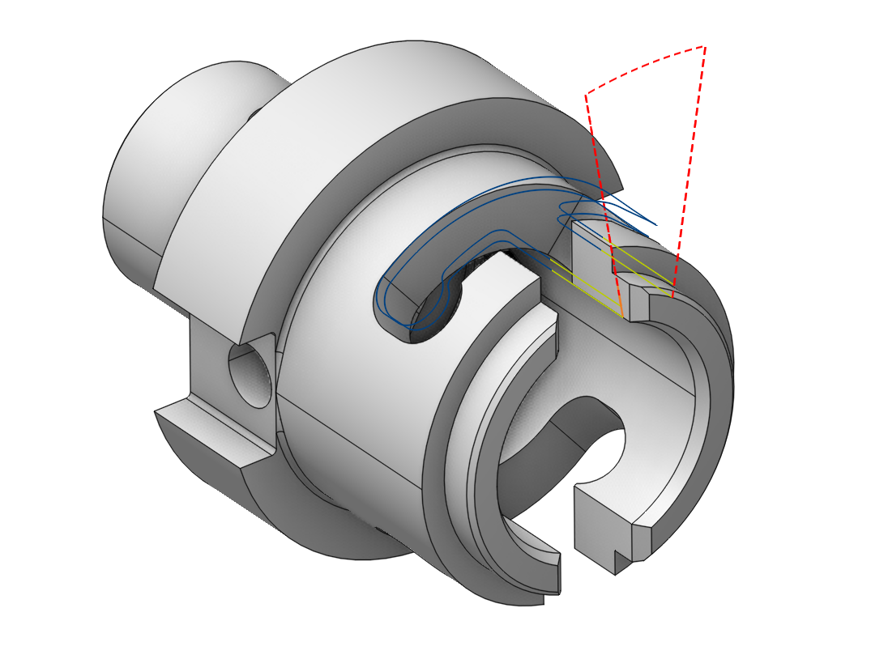

We can see that the bottom level is now on the base surface. To cut the pocket, we can change the <strong>bottom level</strong> to -10 mm.

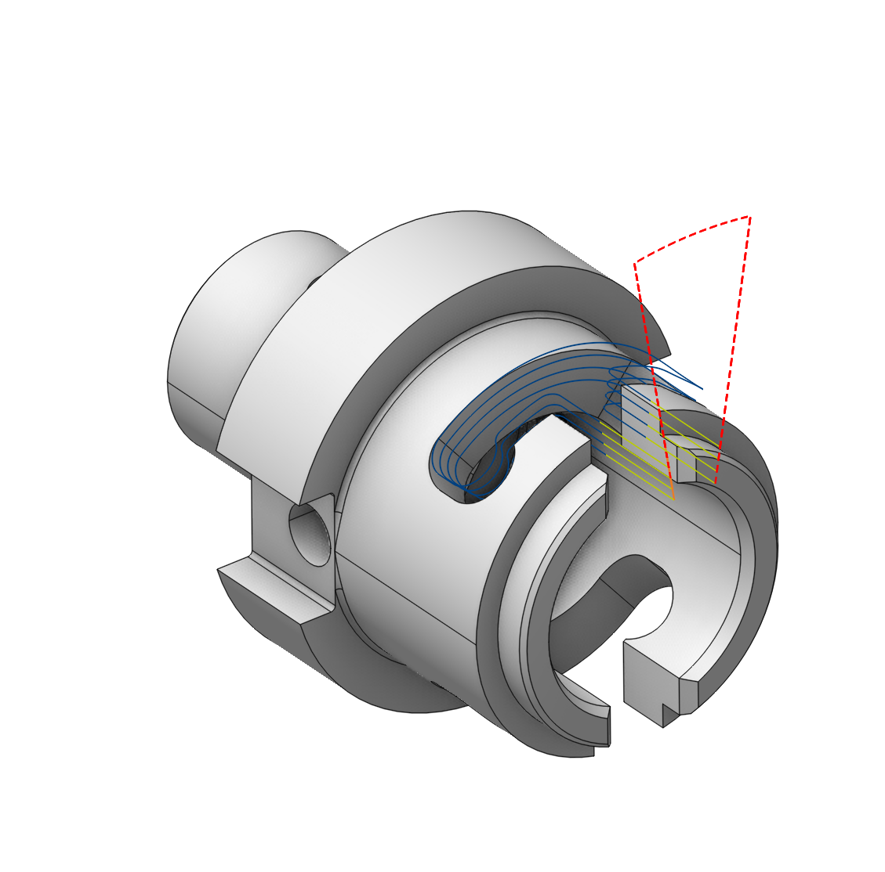

However, the CLData output is missing commands for cylindrical interpolation.

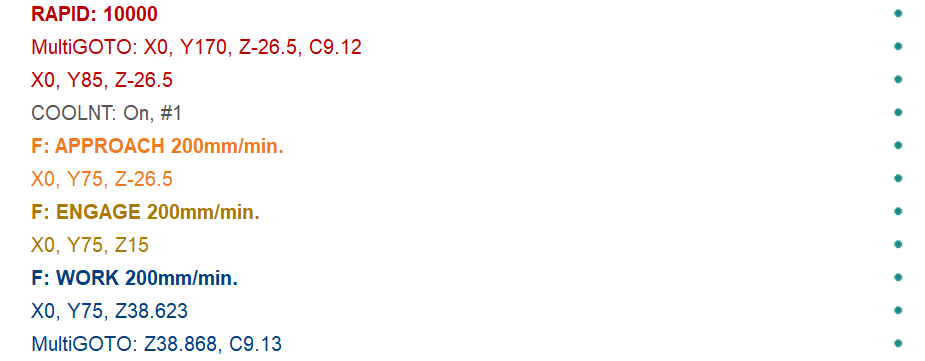

To enable it, you need to go to the base surface tab and enable the corresponding options. (It is important that the cylindrical interpolation support checkbox is also enabled in the machine configuration <strong>Control Parameters</strong> - <strong>Rotary Transformations</strong>. [Details](1021.md))

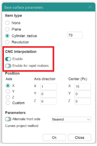 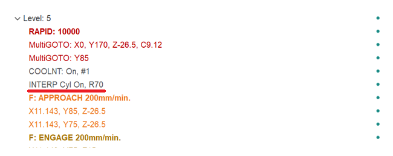

After that, the corresponding commands will appear in the CLData, which can then be processed in the post-processor. You can learn more about cylindrical interpolation in the following section [Details](10082.md).
