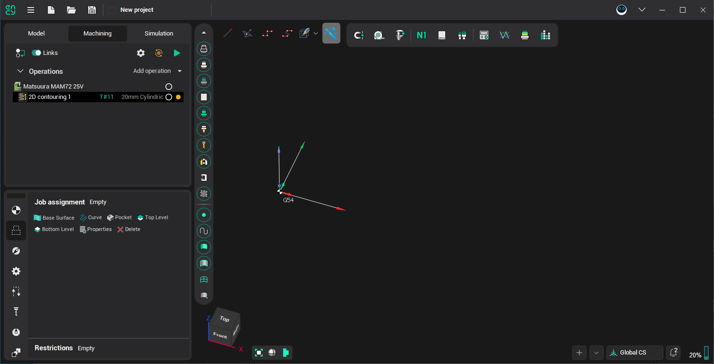
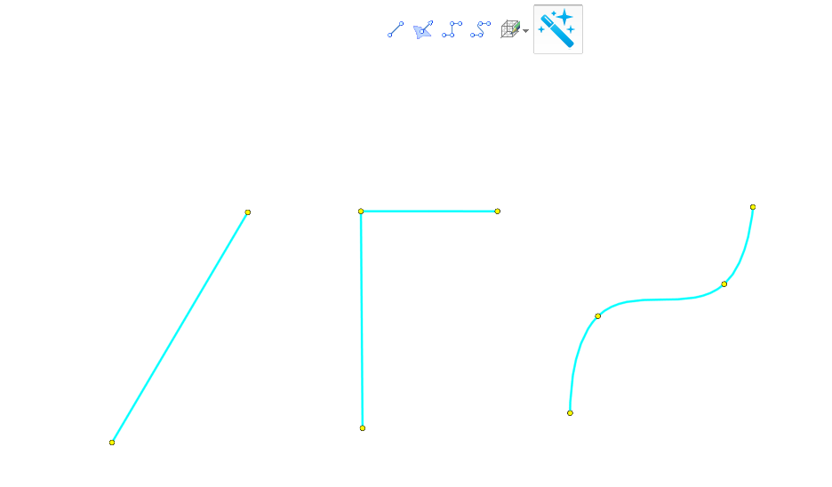
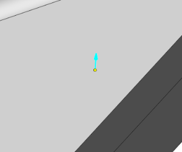
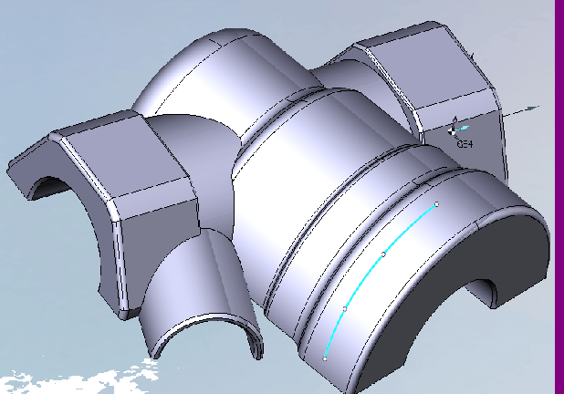
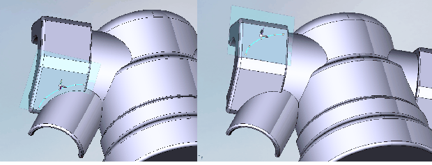

# Spline curves drawing

This feature is experimental, and still under the development. Live curve drawing toolbar added to the graphical window, which is visible while Technology mode is active.

It allows to draw auxiliary curves:

- straight lines
- polygons
- splines.

Directly on the surfaces of objects that are visible on the screen. Nodes of these curves can be dragged, deleted and added just by simple mouse click.

There are 3 drawing modes:

1. Free. Points are selected by the next rule
  1. In case, there is no snap object under the cursor, and it is the 1st point. The point will have undefined Z.
  2. In case, there is no snap object under the cursor, and it isn't the 1st point. The point will have the same Z as previous point (we will drawing at plane);
  3. In case we snap surface under cursor surface's, the nearest point will be selected.
2. On surface. Points will be selected from surface only; 
3. On plane. Points will be selected from plane only. All drawing curves are connected to this plane and will transform with plane transformation too (translate or rotate plane).
