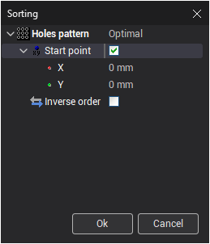
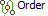
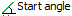
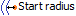
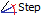
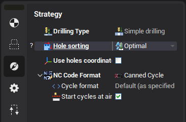

# Holes sorting

## Application Area:

The holes sorting window allows you select one of the type of sorting using some parameters to sort holes list.

### Sorting patterns

The system has four pattern of holes sorting: <strong>Rectangular</strong>, <strong>Circular (Rings)</strong>, <strong>Circular (Sectors)</strong>, <strong>Optimal</strong>.

### Rectangular

The pattern <strong>Rectangular</strong> allows you to sort the holes along XY rows. This type of sorting has the following parameters:

-  — starting position of calculation rows
-  — angle to rotate rows
-  — distance between rows
-  — direction to calculate drilling trajectories (Available values: <strong>Top-down</strong>, <strong>Bottom-up</strong>)
-  — order of moving between rows (Available values: <strong>One way</strong>, <strong>ZigZag</strong>, <strong>Optimal</strong>)
-  — change order in the opposite direction

If <strong>Start point</strong> is unchecked then the system will select first hole of drilling trajectories.

### Circular (Rings)

The pattern <strong>Circular (Rings)</strong> allows you to sort the holes along the rings located from specified center. T his type of sorting has the following parameters:

-  — center of calculation rings
-  — angle to set start position
-  — distance between center and first ring
-  — distance between rings
-  — direction to calculate drilling trajectories (Available values: <strong>Clockwise</strong>, <strong>Counter-clockwise</strong>)
-  — direction to calculate drilling trajectories (Available values: <strong>Outside to inside</strong>, <strong>Inside to outside</strong>)
-  — order of moving between rings (Available values: <strong>One way</strong>, <strong>ZigZag</strong>, <strong>Optimal</strong>)

### Circular (Sectors)

The pattern <strong>Circular (Sectors)</strong> allows you to sort the holes using sectors of a circle. T his type of sorting has the following parameters:

-  — center of calculation sectors
-  — angle to set start position
-  — distance between sectors (There are two input mode: <strong>Count</strong> and <strong>Degrees</strong>)
-  — direction to calculate drilling trajectories (Available values: <strong>Clockwise</strong>, <strong>Counter-clockwise</strong>)
-  — direction to calculate drilling trajectories (Available values: <strong>Outside to inside</strong>, <strong>Inside to outside</strong>)
-  — order of moving between sectors (Available values: <strong>One way</strong>, <strong>ZigZag</strong>, <strong>Optimal</strong>)

### Optimal

The pattern <strong>Optimal</strong> is similar to <strong>Optimal</strong> in <strong>Strategy</strong> except for configurable settings.

This type of sorting has the following parameters:

-  — starting hole to calculation optimal drilling trajectories
-  — change drilling trajectories in the opposite direction

If <strong>Start point</strong> is unchecked then the system will select first hole of drilling trajectories.
