# Job assignment for the 2.5D machining operations

For the creation of CNC programs for 2/2.5D machining consisting of flat areas, pockets, covers etc., it is not always best to construct a 3D model. On the other hand, however, it is handy to be able visualize the depth of the geometry. CAM system allows the construction of such models using 2D contours and automatically displays the volume model.

The **Volume model** is formed from 2D contours located at different heights, limited by closed contours and the walls between them. Open (unclosed) contours and points can also be used when constructing a visual model; for further reference, see below.

The '3D model' is constructed from 2D (flat) contours lying on different levels. There are two methods to add such areas: a 'cover' – "adds" material from the very bottom to the area level, and a 'hole' – removes the entire material from the top to the area level. This means that the 'side wall' for a cover exists below the 'area' level, and for a hole – above the area level. In order to construct a model you can also define the Base level, the space below which represents a body of infinite depth from which, by placing 'holes' the user can obtain a model.

All level values are defined by the absolute Z coordinate of the current [coordinate system](753.md).

For example, imagine a situation when someone is building figures from sand. The base level is comparable to the sand level, and the construction tools are the cans with the bottom form, defined by contours. The contours can be different shapes, for example as these shown below.

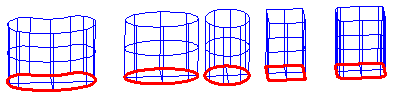

By using these forms the user can either press out holes, or by filling it with sand and turning it over, construct covers. The closed end of the can is the start; the open end extends endlessly (endlessly down for covers and up for holes).

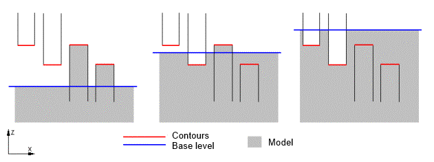

Of course, if hole-forms are located in empty space (or above the base level without other constructions), then they cannot press anything out, Likewise, cover-forms, which are located inside material (or below the base level without holes) cannot fill anything. Whereas, cover-forms located above the sand level always fill a cover, and hole-forms always press out a hole in the sand, if it exists.

When creating a figure from sand, the creation sequence is important. For example, in order to obtain a step cover, one should first create an integral cover, and then press out a step. If one tries to press out a step in the emptiness first, and then fill a cover, then the correct result will not be achieved!

The examples above show the two different results.

Left – hole created first, then the cover. Right – cover created first, then the hole.

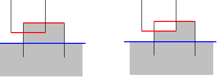

It is obvious that in the first case the hole did not reach the "sand" level, i.e. there was nothing to press out, and so the cover was untouched. In the second case, the cover was created, and then the hole pressed out a 'part' of the cover.

By default, the base level is located endlessly below the zero plane of the system. Most models can be built without the base level. For example, the user needs to create a cover for the outer border of the model at the required level, the subsequent construction of the model will be performed inside that cover. When drawing, the 3D model will not be shown below the level defined by the **Bottom level** parameter of the operation (defined on the **Parameters** page), any part of the model located below that level will not affect the machining operation.

An example of such model is shown on the picture.

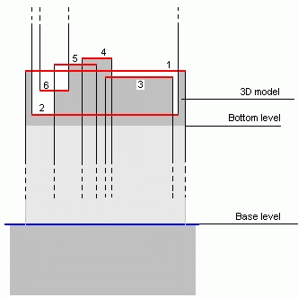

The numbers define the sequence of actions:

1. creates a cover for the outer profile of the model;
2. presses out a hole;
3. creates a cover inside that hole;
4. creates a cover higher than the level of the first cover;
5. another cover, which intersects with the one created in article 4;
6. presses out a hole in the last cover.

The properties window can be used to change the item parameters. The window can be opened by double click on the item or from the pop-up menu. The dialog is shown below:

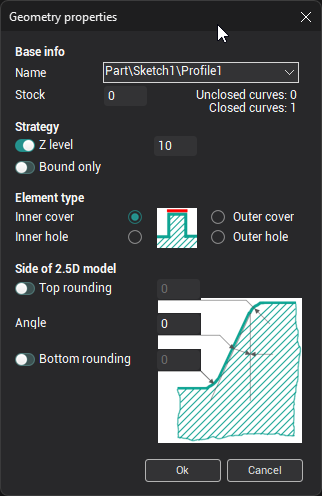

It is possible to set the wall shape in the window also. The angle defines the wall slope in degrees. The top and bottom fillets can be defined also.

Let's practice some techniques for the visual model construction.

| In the "2D Geometry" mode construct two rectangular intersecting contours; Switch to the "Machining" tab and select the "2.5D area pocketing" operation; Open the "Model" window and add the two contours into the machining list of that operation. All constructions of a visual model are performed by using the commands and parameters available on the panel shown to the right. As was said above, any contour can form both a cover and a hole. In many cases the use of a base level is not required. The user can form the visual model by using an outer contour that forms the body, and adding or removing pockets (holes) or covers; Activate the first contour, set the type to "Cover", and assign the contour level to "0". If the contour level has not been defined, then it is considered, that its level coincides with the maximum Z coordinate of that contour; Activate the second contour and set the same parameters as they are for the first one. The bottom level of the model is defined by the "Bottom level" parameter in the "Parameters" window; Assign its value equal to -20. | 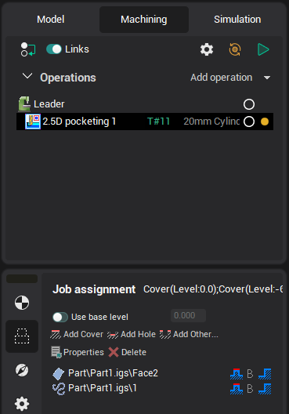 |
|---|---|
| Put a tick in the Preview box. The  button must be pressed. There should be a model similar to that shown in this picture: We can represent parameters and their conditions in a chart: 1. Contour 1 cover level 0 2. Contour 2 cover level 0 Thus, we have created one variant. Using both contours as covers, we have created a model. Both contours lie on the zero level, the bottom part of the model is at -20; | 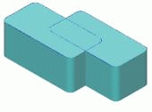 |
| The next step – selects the first contour and in the "Level" field set the value equal to 10. As the result, the contour will be located on the level 10; the visual model will change accordingly. 1. Contour 1 Cover level 10 2. Contour 2 Cover level 0 | 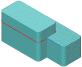 |
| The same contour can be used several times. 1. Contour 1 Cover level 10 2. Contour 2 hole level 0 3. Contour 2 Cover level 0 The result is shown on the picture | 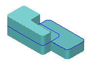 |
| Add one more contour with number 3 to the list 1. Contour 3 cover level 5 2. Contour 1 hole level 0 3. Contour 2 hole level -10 In this case, the contour 3 had first pulled the cover to level 5, then contour 2 pressed out the hole to level 0 and finally, contour 1 pressed the hole to level -10. | 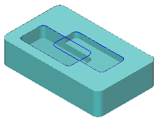 |

Some examples for the use of **Base level**.

Above we used the analogy of the **Base level** as the equivalent to the sand surface from which different forms can be built, i.e. starting from that level, we always have the possibility to press out holes.

Example for the use of **Base level**.

| Activate the Base level mode  Make the base level 0; Create a list of contours with these parameters: 1. Contour 3 hole level -10 2. Contour 1 cover level 0 3. Contour 2 hole level -5 The result should be similar to the one shown. | 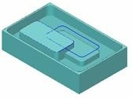 |
|---|---|

Model example with use **Outside** parameter.

Until now we have been dealing with pressing holes and pulling covers with the **Inside** parameter. Now we shall learn the application of the **Outside** parameter. Once again, if we make a comparison to the construction of sand figures, i.e. represent contours as shapes for working with sand, then, when we select the **Outside** parameter, we invert the work area of the [tool](37.md). The pictures below show the different forms created by the same contour using the **Inside** (left) and **Outside** (right) modes.

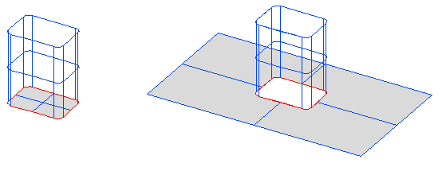

Inside Outside

Forms for pressing out holes

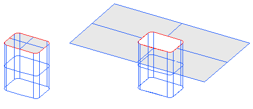

Inside Outside

Forms for pulling covers

See what happens when switching between modes

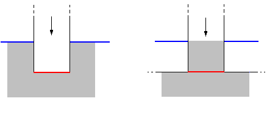

In the left picture there is the pressing of a hole by a contour set as **Inside**, on the right the pressing of a hole by a contour set as **Outside**.

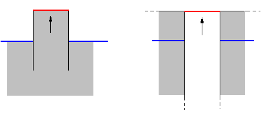

Cover pulling is shown in this picture. Left is **Inside** parameter, right is **Outside**.

Here is an example of using **Outside** parameter.

1. Create a list of contours with parameters defined as below;

| 1.Contour 1 | Cover | level 0 |   |
|---|---|---|---|
| 2.Contour 1 | Cover | level -5 | Outside |

The result should be similar to the one shown below. Besides using closed contours, points and open (unclosed) contours can be used for the creation of a model.

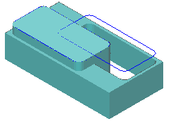

1. In 2D geometry create one closed contour, one open and one point, similar to the picture below:

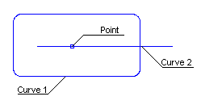

1. Create a list of elements with the parameters defined below:

| 1. Contour 1 | Cover | level 0 |   |
|---|---|---|---|
| 2. Point 1 | Hole | level -20 | additional stock 8 |
| 3. Contour 2 | Hole | level -5 | additional stock 3 |

The result should be similar to the picture below:

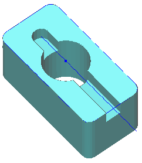

Examples of visual model construction for 2.5D machining.

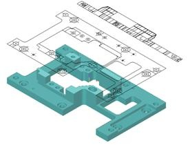

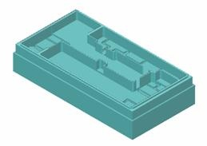
