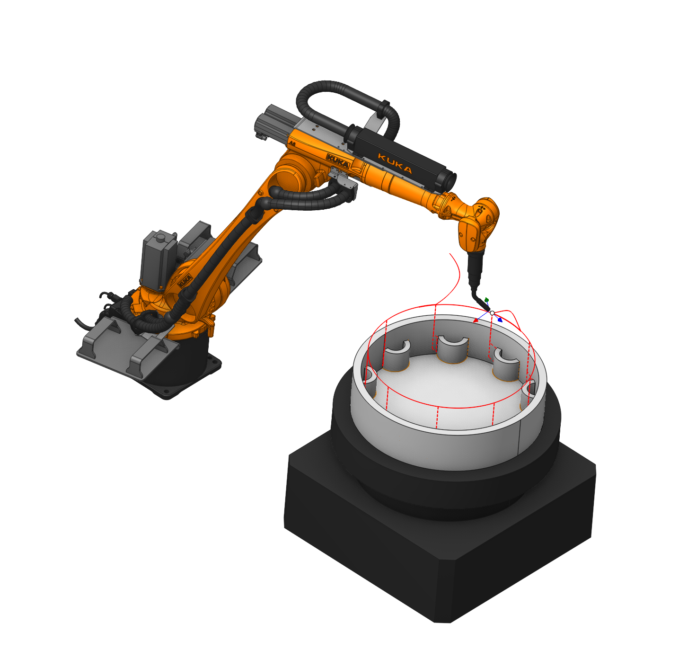
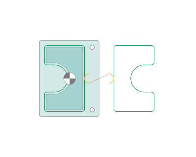
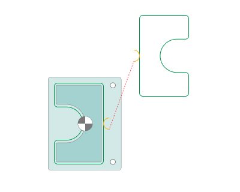
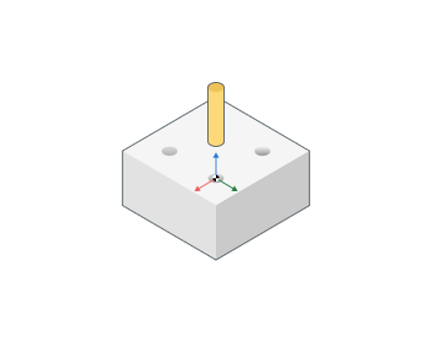
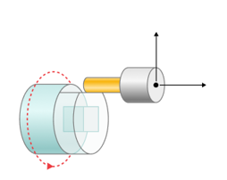
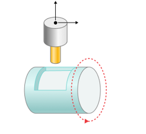

# Transformation

## Application area:

Parameter's kit of operation, which allow to execute converting of coordinates for calculated within operation the trajectory of the tool.

## Main settings:

### Part copying.

The way of output of the prototype part.

Click here to expand..

<strong>Copying method.</strong> The method of outputting processing code for a copy of the part.

<strong>Using real copies.</strong> Utilizing expanded code.

<strong>Using subtouutines.</strong> Utilizing subroutines.

<strong>Default.</strong> Using real copies

### Multiply toolpath by axis.

The <strong>Multiply toolpath</strong> feature can help with machining of repeating model fragments. You can define machining for only one of repeating parts and then just determine the amount and orientation of the same elements. <strong>Works with physical axes of equipment</strong>

Click here to expand..

<strong>Machining order.</strong>

<strong>Consistently.</strong> Repeating copies of a toolpath place along a circle, with the count and the angle step given in the appropriate field

<strong>Multiply Step.</strong> Step axle-direction in units within the given axle.

<strong>Multiply Count.</strong> Quantity of block's repetitions.

<strong>Most distant.</strong> Repeating copies of a toolpath place along a circle, with the count and the angle step given in the appropriate field. Elements are sorted more distantly from each other.

<strong>Manually.</strong> Repeating copies of a toolpath place along a circle. The count and the angle of each element are set by user.

<strong>Steps.</strong> Quantity of block's repetitions with own angle

<strong>Angle1..N.</strong> Angle of specific block's repetitions

<strong>Formalize as subroutine.</strong> The repeated block design as subprogram. Additionally you can set its name in the field. If <strong>Formalize as subroutine</strong> is disabled, then the repeated block over and over again insert in CLData with re-calculated coordinates.

### Multiply scheme.

The <strong>Multiply toolpath</strong> feature can help with machining of repeating model fragments. You can define machining for only one of repeating parts and then just determine the amount and orientation of the same elements. <strong>Works with Multiply schemes.</strong>

Click here to expand..

<strong>None.</strong> Don't use Multiply scheme.

<strong>Two dimensioanal array.</strong> Forms a two-dimensional array.

.png)

<strong>Two dimensional array (manually).</strong> Enables the formation of an array from elements with arbitrary placement.

_manually.png)

<strong>Round array.</strong> Array arranged in a circular pattern.Sequential processing.

.png)

<strong>Round array (most distant).</strong> Array arranged in a circular pattern. The algorithm aims to find the next processing element located at the maximum distance from the current position

_most_distant.png)

<strong><strong>Round array <strong>(manually).</strong></strong></strong> Array arranged in a circular pattern. Allows setting a specific angle for each element.

_manually.png)

<strong>Level array.</strong> The trajectory is copied along the tool axis.

.png)

<strong>Axis symmetry.</strong> Enables creating a mirrored copy relative to the axis.

<strong>Point symmetry.</strong> Enables creating a mirrored copy relative to the point

 

<strong>Base coordinate system.</strong> Defines the coordinate system with respect to which the transformation will be performed. It can be: Tool CS, Workpiece CS, Global CS or any other geometrical CS you have created before. Also additional translation and rotation of this CS can be defined inside Additional transformation group of parameters.

<strong>Additional transformation.</strong> Allows you to enter additional offsets along the axes

### Rotary transformations.

Allow at 3-coordinate milling processing to change the displacement of the tool in direction of one of the linear axle to the rotary motion of the billet, if it is possible to execute on the machine.

Click here to expand..

<strong>Polar.</strong> Polar interpolation changes a linear axis to the rotary one in the simple 3-axes milling process. Usually it is necessary on the lathes that has the drive mill tool. Sometimes the polar interpolation is used with another king of machines. Ordinary lathe has two linear axes, usually its are X and Z, and the spindle rotation – usually axis C. <strong>[Details](10083.md)</strong>

<strong>Rotary axis.</strong> A rotary axis, which replaces a linear axis (usually a spindle, rotary table).

<strong>Radial Coordinate.</strong> A linear axis perpendicular to the part axis.

<strong>Axial Coordinate.</strong> A linear axis coinciding with the axis of rotation of the part.

<strong>Negative Radial Coordinate. <strong>If enabled:</strong></strong> Radial coordinate outputs with POSITIVE sign.

<strong>If disabled:</strong> Radial coordinate outputs with NEGATIVE sign.

<strong>CNC interpolation. <strong>If enabled:</strong></strong> Toolpath is interpolated by CAM system with usage of the Radial and Rotary axes.

<strong><strong>If disabled:</strong></strong> Special CNC commands are used to activate/deactivate interpolation on CNC-control

<strong>Rapid Motions.</strong> Way of output (G0,G1) for rapid motions

<strong>Fast feed.</strong> It outputs linear motion (G1) for rapids inside interpolation block

<strong>Rapid feed.</strong> It outputs positioning (G0) for rapids inside interpolation block

<strong>Fast feed.</strong> Feed value that will be output if "Rapid Motions=Fast Feed"

<strong>Start from C=0. <strong><strong>If enabled:</strong></strong></strong> It sets rotary axis to ZERO POSITION before switch on the interpolation.

<strong>If disabled:</strong> it sets rotary axis to the BEST POSITION before switch on the interpolation. P.S. Some postprocessors implemented till 2023 does not support this option. Contact your PP provider or use "Zero position".

<strong>Tolerance.</strong> Characterize the deviation of transformed trajectory from ideal in millimeters (inches).

<strong>Cylindrical.</strong> The cylindrical interpolation gives the possibility to mill the side surface of cylinder by programming the unrolled curves. The unrolled curves are programmed in the [X,Y,Z] coordinates, but the cylinder milling is performed in [X,C,Z] coordinates. So the cylindrical interpolation makes the transformation [X,Y,Z] => [X,C,Z]. <strong>[Details](10082.md)</strong>

<strong>Some parameters are similar to polar interpolation.</strong>

<strong>For cylindrical interpolation, it is necessary to specify on the Job Zone tab as the Base surface Cylinder and enable interpolation.</strong>

<strong>Off.</strong> Does not output Rotary transformations.

