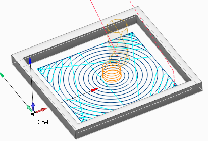
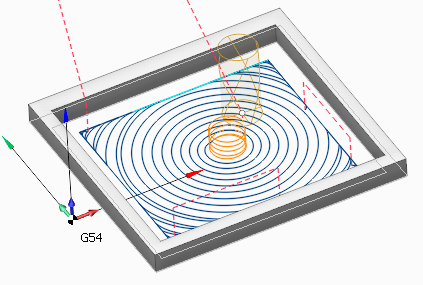

# Adaptive

The strategy is used to effectively remove large volumes of material with high feedrates, maximal cutting depths (up to the flutes length) and relatively shallow cutting widths (5% to 30% of the tool diameter). Such parameters are possible as the specified tool engagement angle (which is defined as the width of cut, or step) is guaranteed to never be exceeded by the strategy.

The material is removed in spiral-like fashion. There are no sharp corners in the toolpath. Smoothness of the toolpath is precisely controlled by the dedicated parameters for the roughing rounding radius, the finishing radius and the linking radius. Linking is done preferably in the working plane with an additional small Z clearance which helps fight heat buildup. The tool engages material using the so called 'Roll-In techniqe' which prolongs tool life. Both climb and mixed (climb and conventional) milling is available. For the mixed milling the width of cut and the feedrate of conventional passes can be set separately from the climb passes.

 

The strategy is available in the following operations:

- [Rough waterline](736.md)
- [Pocketing](256.md)
- [Pocketing 2.5D](768.md)
- [Flat land finishing](759.md)

The strategy can be enabled by selecting the corresponding option from the Machining strategy drop-down:

