# Pocketing strategies

The pocketing strategies are designed for the removing of material in the open and closed pockets.

These strategies are available in the following operations:

- [Rough waterline](736.md)
- [Pocketing](256.md)
- [Pocketing 2.5D](768.md)
- [Flat land finishing](759.md)

Seven strategies are available to select in the Machining strategy drop-down:

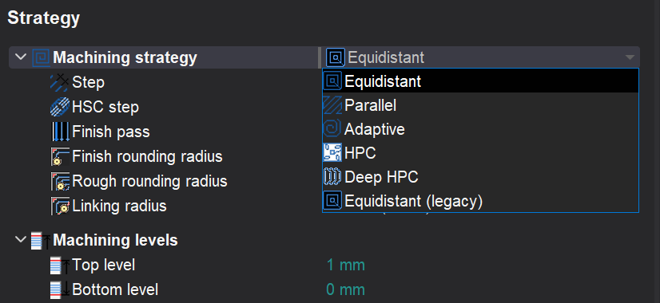

There are 6 strategies. Some items are optional and require an additional license. So many strategies are the result of long-term development. Every strategy has its own advantages and disadvantages, so no one of them can't be removed from the system.

| <strong>Strategy</strong> |   |   |
|---|---|---|
| 
<strong>Equidistant (legacy)</strong>

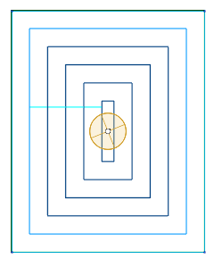
 | <strong>Advantages</strong> Fast calculation Simple tool path | <strong>Disadvantages</strong> Residual unmachined islands are possible if the step is more than 50% Uneven tool load and chip thickness Many Z motions to/from the safe plane |
| 
<strong>Equidistant</strong>

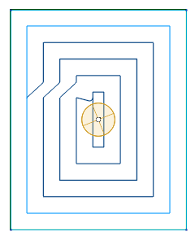
 | <strong>Advantages</strong> It's possible to define the safe distance The most of the links are performed without the climbing of the safe plane Links rounding is available | <strong>Disadvantages</strong> Residual unmachined islands is possible if the step is more than 50% Uneven tool load and chip thickness |
| 
<strong>HPC (high performance cutting)</strong>

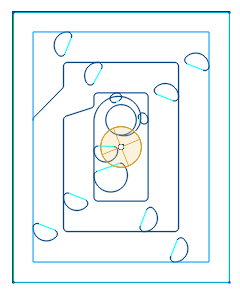
 | <strong>Advantages</strong> All advantages of the equidistant strategy Special arc is added to remove the residual unmachined islands | <strong>Disadvantages</strong> Uneven tool load and chip thickness The special arc's radius can be too small, that gives the uneven feed rate. |
| 
<strong>Deep HPC</strong>

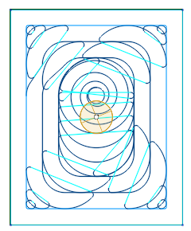
 | <strong>Advantages</strong> All advantages of the HPC strategy The even tool load | <strong>Disadvantages</strong> Tool path is longer than the HPC strategy Idle motions are possible Unstable calculation. Sometimes the tool load can be greater than required. |
| 
<strong>Adaptive</strong>

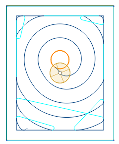
 | <strong>Advantages</strong> The even tool load The perfect tool path for the open pockets | <strong>Disadvantages</strong> The length of tool path can be longer than the length of the DeepHPC strategy with the same parameters. It's actual for the big closed pockets. |
| 
<strong>Parallel</strong>

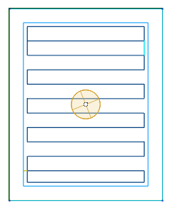
 | <strong>Advantages</strong> Fast calculation Simple tool path | <strong>Disadvantages</strong> A lot of Z-motions in the complex pockets |

## Features of Adaptive strategy

The strategy is used to effectively remove large volumes of material with high feed rates, maximal cutting depths (up to the flute's length) and relatively shallow cutting widths (5% to 30% of the tool diameter). Such parameters are possible as the specified tool engagement angle (which is defined as the width of cut, or step) is guaranteed to never be exceeded by the strategy.

The material is removed in spiral-like fashion. There are no sharp corners in the toolpath. Smoothness of the toolpath is precisely controlled by the dedicated parameters for the roughing rounding radius, the finishing radius and the linking radius. Linking is done preferably in the working plane with an additional small Z clearance, which helps fight heat buildup. The tool engages material using the so called 'Roll-In technique' which prolongs tool life. Both climb and mixed (climb and conventional) milling is available. For the mixed milling, the width of cut and the feed rate of conventional passes can be set separately from the climb passes.

## How to choose the pocketing strategy

1. The choice number one is <strong>Adaptive</strong> This strategy is not set as default, only because it requires the additional licensing. So we strongly recommend purchasing it. All other variants must be tested only if this strategy is not available or gives the improper toolpath.
2. If Adaptive is not possible, and you need the even tool load, then try <strong>Deep HPC</strong> strategy.
3. If even tool load is not necessary and the machining step is more than 50% of the tool diameter then try <strong>HPC</strong> strategy
4. If even tool load is not necessary and the machining step is less than 50% then try <strong>Equidistant</strong> strategy.
5. Use <strong>Parallel</strong> strategy at your own discretion.
6. Use <strong>Equidistant (legacy)</strong> if all other strategies give improper toolpath.

## Tool path parameters

- Back-off distance parameter

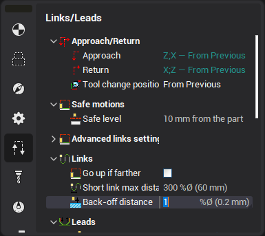

The tool can be lifted above the already machined surface when it moves to the next trochoidal arc start position.

- Rounded links in zigzag mode

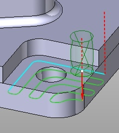 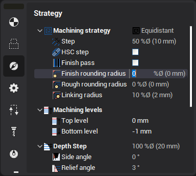

The 'Finish rounding radius', 'Rough rounding radius' and 'Linking radius' value is used for rounding of the links.

- Links on the same Z-level

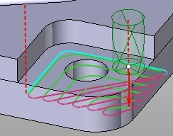

In the climb and conventional mode, the tool goes directly to the next path without retraction to the safe level. If a rapid motion is performed over an already machined surface, then the "Tool back-off distance" is used. "Idle radius" is also used to make the motion smooth.

- Safe distance

 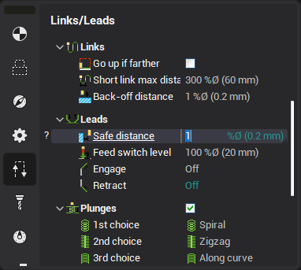

Safe distance is used to move the tool down/up from/to the safe surface.

The vertical motion is performed at this distance from the workpiece. So in version 10 there is no longer the need to enable the approaches/retractions to exclude the rapid feed collisions.

If you use a pre-drilled hole to plunge when roughing, the pre-drill tool diameter must be greater than the mill tool diameter by at least double the safe distance amount, otherwise the pre-drilled holes will not be detected.

- Rapid feed links

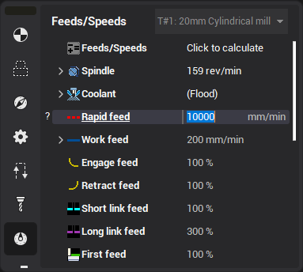

The link moves can be calculated using either the next feed or the return feed values. If the link length is less than the 'short link' distance, then the 'next feed' value is used, else the 'return feed' value is used. The return feed is set to 300% of the work feed by default, which is a non-cutting feed. If cutting is detected during a 'return feed' move when simulated, this move will be marked with an error.
