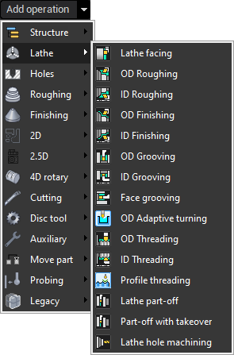

# Types of lathe machining operations

CAM system represents the machining process as a sequence of operations. The sequence can contain any number of operations of various kind. Each operation uses it's particular methods to form toolpath and accepts individual set of parameters. The list of available operations is defined by the [system configuration](261.md).

All lathe operations placed in one group "Lathe" inside the list of all operations.

