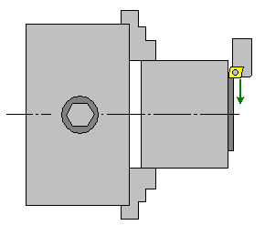
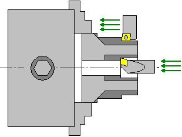
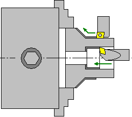
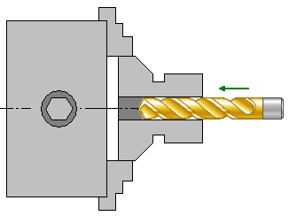
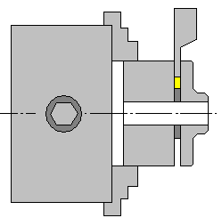
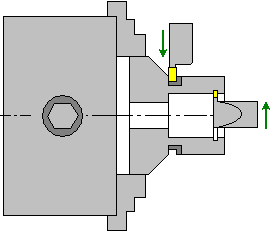
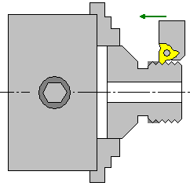

# Lathe machining operations

In CAM system lathe machining is grouped by operations:

- [Lathe facing](307.md)

- [OD Roughing, ID Roughing](316.md)

- [OD Finishing, ID Finishing](310.md)

- [Lathe hole machining](10176.md)

- [Lathe part-off](313.md)

- [OD Grooving, ID Grooving, Face grooving](312.md)

- [OD Threading, ID Threading](319.md)

All operations, which were inherited from the previous version moved to the Legacy group. See documentation for the previous version of CAM system to get more info about these operations.
