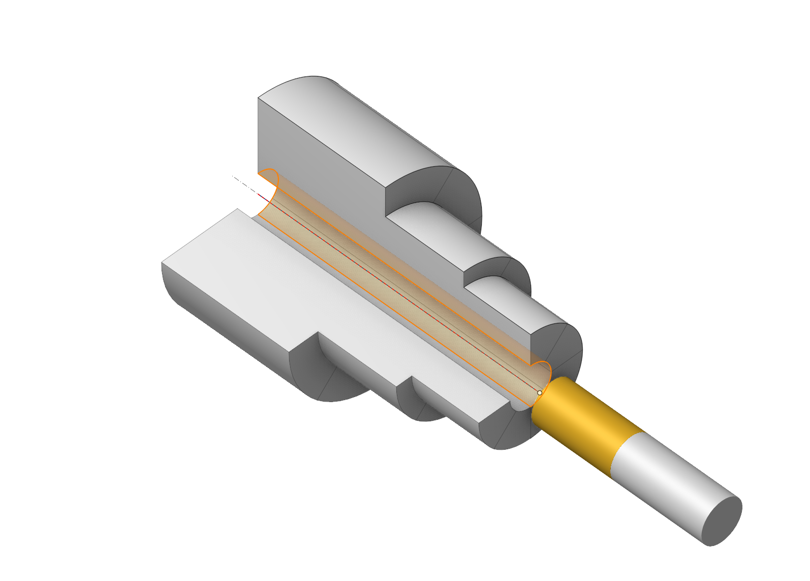

# Lathe hole machining

## Application area:

The hole machining operations are designed for drilling, centering, boring, countersinking, tapping, thread milling and hole pocketing. It can machine holes that are not lying in the same plane and that are not lying in orthogonal planes. The operation can be used both for the machining of holes in a model, or for pre-drilling of the tool plunge points for the pocketing and operations.

### Setup:

The <strong>Setup</strong> tab is used to configure the primary parameters of the project. This can involve the positioning of the part on the equipment, the coordinate system of the part, and more. [Details](1022.md)

### Job assignment:

<strong>Center.</strong> Create hole by center point.

<strong>Create.</strong> Create hole by coordinates input. [Details](706.md)

<strong>Recognize.</strong> Automatically recognize holes in the part. [Details](406.md)

<strong>Pattern.</strong> Create holes array by pattern. [Details](407.md)

<strong>Properties.</strong> Displays the properties of an element. You can also call this menu by double clicking on an item in the list. [Details](706.md)

<strong>Sorting.</strong> Sorting using some parameters to sort holes list. [Details](10158.md)

<strong>Delete.</strong> Removes an item from the list.

<strong>Restrictions.</strong> It allows you to restrict areas that should not be machined. [Details](101231.md)

### Strategy:

This parameter group works similarly to the <strong>Hole machining operation</strong>. [Details](10100.md)

### Links/Leads:

In the Links/Leads tab, you define the parameters for rapid movements. These movements include tool approach from the tool change position, engage to the start of the working stroke, retraction after the final cutting motion, transitions between working passes, and return to the tool change point. You can configure the sequence of movements along the coordinates, the trajectory of these motions, and the magnitude of displacements.

Click here to expand..

<strong>Сonsists of:</strong>

<strong>Approach/Return.</strong> This group of parameters manages the tool movements from the tool change position to the start of the engage toolpathes, and back. [Details](100116.md).

<strong>Safe motions.</strong> Defines the type of Safety Surface and the distance from the workpiece to it. This surface facilitates transitions between the processed surfaces or tool paths, and the first stage of approach or return occurs toward it. [Details](100117.md).

<strong>Advanced links settings.</strong> This group of parameters specifies the features of trajectory formation for primarily five-axis operations, considering optimal movements of rotational axes. [Details](100118.md).

<strong>Links.</strong> Defines the rules governing Entry/Exit links and links between work moves. [Details](100133.md).

<strong>Distances.</strong> Distances used in Links rules [Details](100141.md).

### Feeds/Speeds:

Using this dialogue the user can define the spindle rotation speed; the rapid feed value and the feed values for different areas of the toolpath. Spindle rotation speed can be defined as either the rotations per minute or the cutting speed. The defining value will be underlined. The second value will be recalculated relative to the defining value, with regard to the tool diameter. [Details](100142.md)

### Transformations:

Parameter's kit of operation, which allow to execute converting of coordinates for calculated within operation the trajectory of the tool. [Details](10168.md)

### Part:

A Part is a group of geometrical elements that defines the space to check for gouges. [Details](330.md)

### Workpiece:

A workpiece model of an operation defines the material to be machined. [Details](738.md)

### Fixtures:

As the Fixtures the fixing aids such as chucks, grips, clamps, etc., and the restriction areas of any other nature are usually specified. [Details](10283.md)
