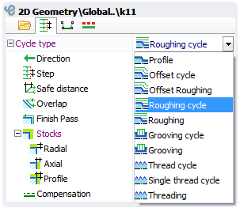

# Lathe cycles

Cycle type defines the tool path generation way based on the defined profile. The next types of the job assignment element for the lathe operations are available.

- In the "[Profile](10189.md)" mode the defined profile is output into the tool path without any additions.
- [Offset cycle](10191.md) generates the cycle ISO G73 based on the defined profile.
- [Offset Roughing](10190.md) generates the same tool path like the [ISO G73](10191.md), but it is output in the expanded mode. This mode can check current workpiece state.
- [Roughing Cycle](10193.md) generates the one of the cycles ISO G71/G72 based on the defined profile.
- [Roughing](10192.md) generates the same tool path like the [ISO G71/G72](10193.md), but it is output in the expanded mode. This mode can check current workpiece state.
- [GroovingLathe_](10195.md) mode generates the same tool path like the [ISO G74/G75](10204.md), but it is output in the expanded mode. This mode can check current workpiece state. In the future versions this mode will be improved and will check the real profile configuration.
- [Thread cycle](10197.md) - is the multi-pass threading cycle that outputs the tool path in the ISO G76.
- [Single-thread cycle](10197.md) - threading that can be performed in several passes. Every pass is generated as the separated cycle in the ISO G92 format.
- [Threading](10197.md) - threading with the expanded output format. So every motion is performed as the separate block. Work motions are synchronized with the spindle rotation. This mode is enabled by the ISO G32/G33. Expanded format allows to make the specific threads like the threads with the different taper, spirals on the face etc.
- [4-axis turning](10202.md) cycle allows to machine hard-to-reach areas of a part with just one operation by continuously changing of the tool inclination angle in the process of moving along a contour (using the 4-th axis of the machine, if available).
