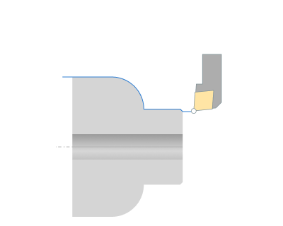

# Profile cycle

Profile cycle it is the simples cycle where the toolpath is the same with source geometrical contour defined in job assignment. Only few changes could be done:

- engage/retract joining;
- shifting by stock values;
- tool unreachable gray zones excluding;
- tool radius compensating.

See [job item properties](10208.md) page for detailed description of parameters.
