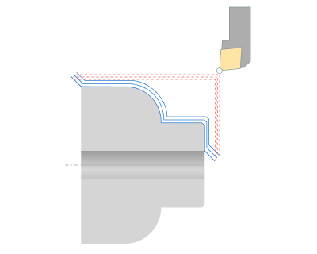
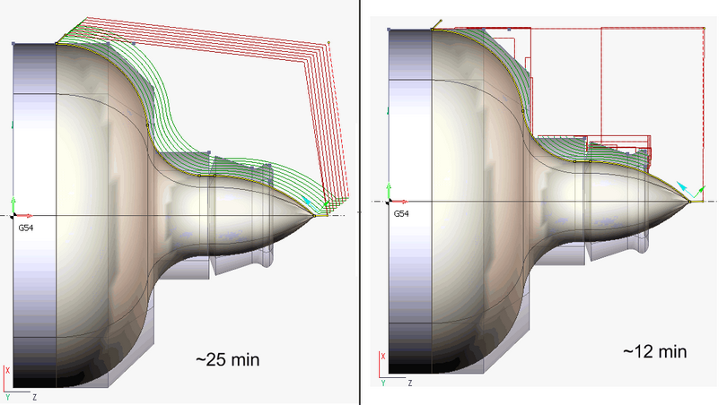
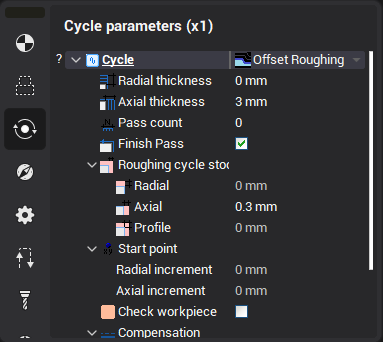
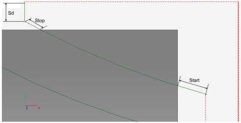
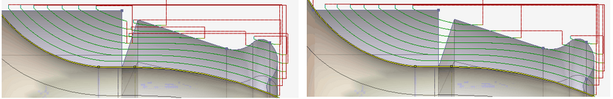
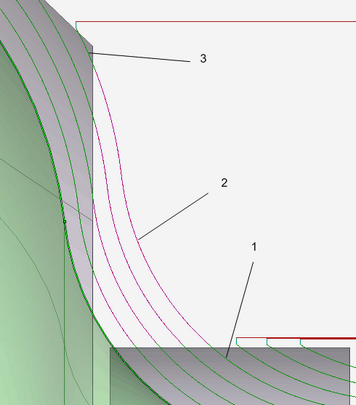
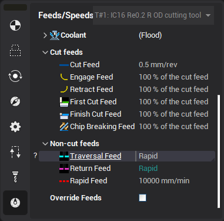

# Offset Roughing

Offset Roughing generates the same tool path like the [ISO G73](10191.md), but it is output in the expanded mode.

This mode can check current workpiece state.

Checking the current state of the workpiece can reduce machining time. In the picture is represented the item. Machining takes approximately 25 minutes.

The use of algorithms based on the current state of the workpiece will reduce the processing time of this part by 50%, excluding the tool passes through the air at the working feed.

The workpiece checking parameters can be defined in the properties window.

Sd — Safe distance

Start — Start entry amount

Stop — Stop entry amount

In some cases it is advisable to ignore the fact that the tool passes through the air, if the distance of this pass is quite small. Ignore thickness parameter allows to specify the maximum distance of the pass through the air at the working feed.

If the distance between two areas is less than Ignore thickness parameter, the system will treat them as one area.

On the left side of the picture Ignore thickness parameter is less than the distance between the areas of machining, the system treats them separately.

On the right side of the picture Ignore thickness parameter more than the distance between areas of machining, the system treats them as one area.

In some cases it is advisable to treat several areas as one, but move to the second area on the high feed with enabled interpolation (traversal feed).

Tool machines the first area (1) at the working feed, then moves to the second area (3) at traversal feed by the profile (2).

The Maximum traversal distance specifies the maximum distance that the tool can pass on the traversal feed. If the distance between areas is greater than this parameter, the system would treat them separately.

The system provides the ability to set the feed values for a particular profile.

