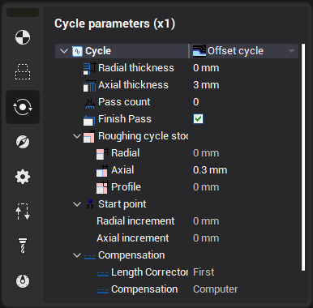
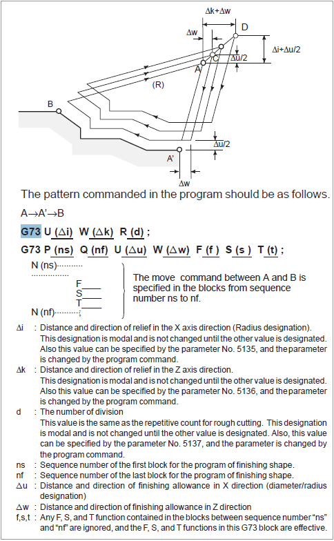

# Offset cycle (ISO G73)

Offset cycle generates the canned cycle G73 based on the defined profile. The cycle parameters can be defined in the properties window.

If "Finish pass" check box is set then the finishing cycle ISO G70 is generated just after the rough cycle.

The extract from the Fanuc Operator's manual about cycle G73 is shown below.

This feature allows you to perform repeated processing along a contour with a gradual shift of the contour. By this cutting cycle, it is possible to efficiently cut workpiece whose rough shape has already been made by a rough machining, forging or casting method, etc.

