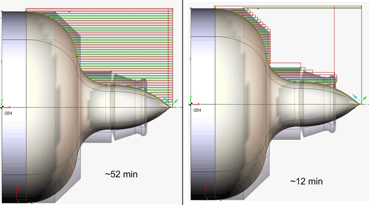
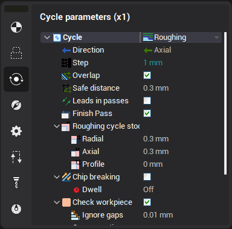
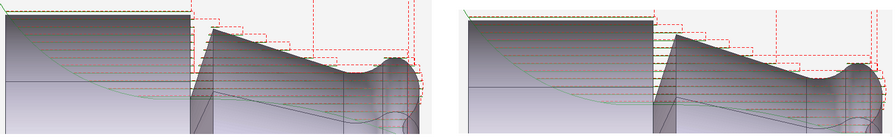
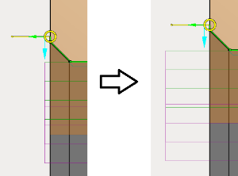
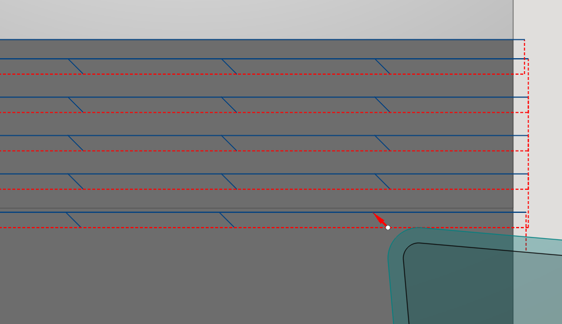

# Roughing

Roughing based on [ISO G71/G72](10193.md), but it is output in the expanded mode.

This mode can check current workpiece state.

Checking the current state of workpiece can reduce machining time. In the picture is represented the item. Machining takes approximately 52 minutes. The use of algorithms based on the current state of workpiece will reduce the processing time of this part by 80%, excluding the tool passes through the air at the working feed.

The workpiece checking parameters can be defined in the properties window..

In some cases it is advisable to ignore the fact that tool passes through the air, if the distance of this pass is quite small. Ignore thickness parameter allows to specify the maximum distance of the pass through the air at the working feed. If the distance between two areas is less than Ignore thickness parameter, the system will treat them as one area.

In the left side of the picture Ignore thickness parameter is less than the distance between the areas of machining, the system treats them separately. On the right side of the picture Ignore thickness parameter more than the distance between areas of machining, system treats them as one area.

Also this mode have <strong>Leads in passes</strong> parameter, which allows you to use engage/retract in passes from the Links/Leads tab. This is quite useful with enabled <strong>check workpiece</strong> parameter.

<strong>Chip breaking</strong> parameter helps to adjust length for cut before chip breaking. The lenght of the retract sets by <strong>safe distance</strong> parameter. <strong>Dwell parameter</strong> sets delay in seconds or revolutions instead of retract in chip breaking. Chip breaking works in overlap mode too. Chip breaking feed is set on the Speeds tab.

