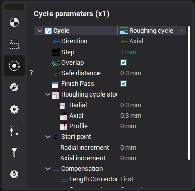
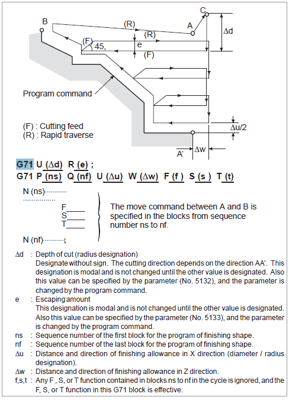
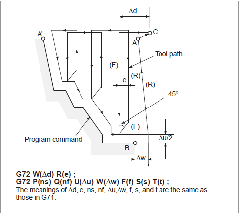

# Roughing cycle

The roughing cycle generates one from both canned cycles ISO G71 or ISO G72 based on the defined profile. The cycle parameters can be defined in the properties window. Direction property switch between G71 and G72. If "Finish pass" check box is set then the finishing cycle ISO G70 is generated just after the rough cycle.

The extract from the Fanuc Operator's manual about cycles G71/G72 is shown below.

